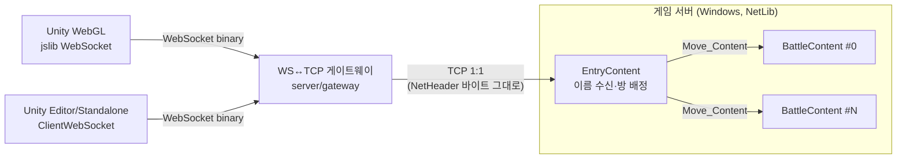
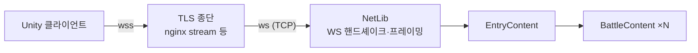
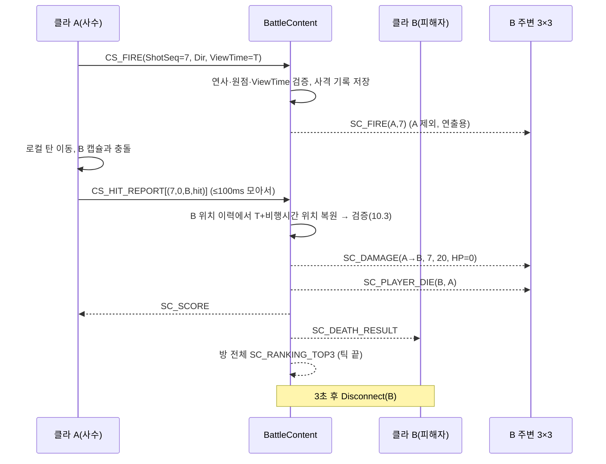

# escape_from_blockov 게임 명세서 v0.8

> 작성일: 2026-09-30
> 대상: Unity 6000.6.3f1 클라이언트(`client/escape_from_blockov`), NetLib 기반 게임 서버(`server/`), WS↔TCP 게이트웨이(1단계 한정, `server/gateway/`)
> 선행 문서: `server/ContentEchoServer/CONTENT_SERVER_LIBRARY.md`, 맵 섹터 규격(`claude/map-sector-spec.md`)
> 실행 방법: **18장** (`start_server.bat` / `stop_server.bat`)

---

## 0. 결정 사항 요약

| 항목 | 결정 |
|---|---|
| 장르/플랫폼 | 2.5D 탑다운 PvP 슈팅, Unity WebGL |
| 진입 흐름 | 로비 없음. 타이틀에서 이름 입력 → 즉시 방 배정 → 전투 |
| 방 구성 | **다중 방, 자동 배정**. 방 = `BattleContent` 인스턴스. 정원 `room_capacity` 기본 **300**(방 4개 → 1,200명) |
| 전송 | **WebSocket 단일**. 에디터/Standalone 포함 모든 클라가 WebSocket 사용 |
| 서버 연결 | 1단계: WS → **게이트웨이** → TCP → NetLib. 2단계: **NetLib에 WebSocket 탑재** 후 게이트웨이 제거(13장) |
| 클라 통신 모듈 | WebSocket 백엔드 2종(WebGL=jslib / Editor·Standalone=`ClientWebSocket`) + 공통 처리(NetHeader 파싱·수신 큐·메인 스레드 디스패치) |
| 패킷 크기 | NetLib 페이로드 한도 **127B → 512B** (12장, 구현 완료) |
| 암호화 | **사용하지 않음**. 서버 생성자에 `opt_encryption = nullptr`. 헤더 Code(119)만 검사. wss(TLS)로 전송 구간 보호 |
| 하트비트 | 서버 타임아웃 **3분**. 클라는 60초마다 `CS_HEARTBEAT` (백그라운드 탭에서도 동작하는 타이머) |
| 레이턴시 | 지연은 일단 감안. `CS_PING`/`SC_PONG`으로 RTT를 측정해 **클라 화면에 표시** (구현 완료) |
| 이동 | **클라 권위 + 서버 검증** (속도·맵 경계·엄폐물). 위반 시 위치 보정. **Shift 달리기** = 이동 속도 × `sprint_multiplier`(현재 설정 1.5) |
| 접속 인원 | 화면 상단 가운데 "접속 N명" = 서버 전체(모든 방) 접속 인원. 입장·연결 해제 시 서버가 `SC_PLAYER_COUNT` 방송 |
| 테스트 모드 | `game_config.txt`의 `test_mode: true` → 모든 플레이어를 한 섹터(기본 (0,0))에 스폰 |
| 피격 | **오토타게팅**: 사수 클라가 판정 → 모아서 보고 → 서버가 **발사 시각 기준 과거 위치로 되감아** 검증 |
| 발사 정보 | 조준 **방향 벡터 + 타임스탬프(추정 서버 시각)** 전송. 시각 동기화용 Ping/Pong |
| 시야 | 기준 섹터 + 인접 8섹터(3×3, **섹터 50m**). 브로드캐스트도 3×3 한정 (랭킹·접속 인원만 방 전체). 한 방향 최소 보장 50 → **무기 사거리 ≤ 50** |
| 엄폐물 | **BMP 이미지 1픽셀 = 1m×1m**. 검정 = 벽(이동·총알 차단), 회색 = 낮은 엄폐물(이동만 차단, 총알 통과). 서버·클라가 같은 BMP를 읽고 해시로 일치 확인(3.2) |
| 전체 맵 | 클라에서 **M** 키로 전체 맵(미니맵) 토글(3.3) |
| 카메라 | 2.5D 정사영(피치 55°). 기본 보이는 반경 25, 마우스 휠 15~**200(디버그 상한)**. 릴리스 전 재결정(3장) |
| 캐릭터 | Capsule, HP만 존재 (확장 예정) |
| 총 | **슬롯 1 특수 총(샷건·저격총, 내구도), 슬롯 2 기본 총(권총, 무한)**, 슬롯 3 붕대(최대 5). 특수 총은 에어드랍·가방에서 획득(19장) |
| 구르기 | Space: 마우스 방향으로 이동속도×3, 0.25초(약 9m), 쿨타임 3초, 무적 없음(19.3) |
| 에어드랍 | 서버 시각 5분마다, 방마다 최대 2개, 인원 최다 3×3 섹터 묶음에 투하. 방 전체 공지(19.6) |
| 가방 | 쓰러진 자리에 1분간. 특수 총·붕대를 F 1초로 열어 획득(19.7) |
| 사망 | 사망 결과창 → **타이틀 복귀**(연결 종료). 점수는 소멸 |
| 점수 | 킬 시 **+1 + floor(피해자 점수 × 0.5)**. 동점은 먼저 도달한 사람이 상위 |
| 랭킹 | 방 내 상위 3명(ID·이름·점수)을 방 전체에 송신, 화면 우상단 출력 |
| 닉네임 | 1~12자(UTF-16), 양끝 공백 제거, 중복 허용, 비면 `Guest####`. 식별은 서버 발급 PlayerID |
| 교전 밀도 | 넓은 맵에 드문 교전은 **의도된 설계** |

---

## 1. 게임 개요

- **목표**: 적을 처치해 점수를 쌓고 방 내 상위 3위 안에 드는 것. 죽으면 점수를 잃고 처음부터 다시 시작한다(slither.io식 긴장감).
- **한 판의 흐름**: 접속 → 스폰 → 탐색·이동/사격 → (처치 시 점수 흡수) → 사망 → 결과창 → 타이틀.
- **맵 성격**: 1500×1500 맵에 소수가 흩어져 있어 조우가 드물다. 조우 자체가 긴장 요소다.
- **영속성 없음**: 계정·DB·저장 없음. 서버 재시작 시 모든 상태 초기화.

---

## 2. 시스템 구성

### 2.1 1단계 (게이트웨이)



### 2.2 2단계 (NetLib 네이티브 WebSocket)



- 게이트웨이는 **바이트 투명 중계**만 한다(패킷 해석 없음).
- **WS 메시지 ↔ 패킷 계약**(1·2단계 공통, 클라 변경 없이 전환하기 위한 규칙):
  - 클라 → 서버: WS 바이너리 메시지 1개 = NetHeader 패킷 **정확히 1개**.
  - 서버 → 클라: WS 바이너리 메시지 1개 = NetHeader 패킷 **1개 이상**(경계는 보장하지 않음).
  - 수신측은 WS 메시지 경계를 신뢰하지 않고 **바이트 스트림으로 재조립**한다.

---

## 3. 월드 / 맵

기존 맵 섹터 규격을 그대로 따른다.

| 항목 | 값 |
|---|---|
| 씬 | `Assets/Scenes/TestArena.unity` (빌드 인덱스 1) |
| 단위 | 1 unit = 1 m. 평면은 X-Z, Y는 높이(게임 로직은 2D X-Z만 사용) |
| 섹터 | **50×50, 30×30개**, 월드 1500×1500. 원점 = 섹터(0,0) 좌하단 |
| 섹터 계산 | `sx = floor(x/50)`, `sy = floor(z/50)`, 인덱스 `sy*30+sx` (클라 `SectorGrid.cs`, 서버 `MapConst`/`SectorMap.h`) |
| 이동 가능 영역 | 외벽 두께 2 → `x, z ∈ [2.0, 1498.0]` (서버 클램프 기준) |
| 바닥 | 섹터 체커 무늬 쿼드 1장(`Ground`, 텍스처 30×30 1텍셀=1섹터). 메뉴 `Blockov/Map/Rebuild Sector Ground` |
| 스폰 | **49개**(7×7 격자, 섹터 2·6·10·…·26 = 200m 간격, `Spawn_NN_Sxx_yy`). 메뉴 `Blockov/Map/Export spawns.txt`로 `spawns.txt`(한 줄 `sx sy`)를 추출해 서버가 로드 |
| 엄폐물 | `map/obstacles.bmp` (3.2). 서버가 이동·총알 차단을 검증한다 |

**테스트 모드**(`test_mode: true`): 위 규칙 대신 섹터 (`test_spawn_sector_x`, `test_spawn_sector_y`)(기본 (0,0), 월드 0~50m) 안의 무작위 위치(경계에서 반지름+4m 안쪽)에 스폰하고, 엄폐물과 겹치면 가까운 빈 칸으로 옮긴다. 서버 시작 로그와 대시보드에 `[TEST MODE]`가 표시된다.

**스폰 선택 규칙(서버)**: 스폰 섹터의 3×3 안에 살아있는 플레이어가 0명인 스폰 중 무작위 → 없으면 3×3 인원이 가장 적은 스폰. 같은 스폰을 여러 명이 쓰면 섹터 중심에서 반경 `spawn_offset_radius`(20) 내 무작위 오프셋. 선택 지점이 엄폐물과 겹치면 가장 가까운 빈 칸으로 옮긴다(`ObstacleMap::FindFree`).

### 3.1 시야와 카메라

- 서버 시야(3×3 섹터)는 플레이어가 섹터 경계에 있을 때 한 방향으로 **최소 50만 보장**한다.
- **카메라 보이는 반경 `CameraViewHalfExtent` = 200 (디버그 설정)**. 클라 설정값으로 둔다.
  - 50~200 구간은 서버가 정보를 주지 않을 수 있어, 적이 화면 안에서 갑자기 나타나거나 사라질 수 있다(디버그 중 허용).
  - 릴리스 전 결정: (a) 카메라를 50 이내로 줄이거나, (b) 서버 시야를 5×5(`view_sector_radius=2`, 보장 100)로 넓힌다.
- 무기 사거리는 **≤ 50**(= 섹터 크기 × `view_sector_radius`) 유지(안 보이는 적을 맞추는 일 방지). 서버가 무기 테이블 로드 시 초과값을 이 값으로 잘라낸다.

### 3.2 엄폐물 맵 (BMP)

| 항목 | 규칙 |
|---|---|
| 파일 | `map/obstacles.bmp` (저장소 최상단 `map/`). 서버 설정 `obstacle_map`, 클라는 임포트 도구로 반영 |
| 크기 | **1500×1500 픽셀**, 1픽셀 = 월드 1m×1m 칸. 크기가 다르면 있는 부분만 읽고 나머지는 빈 칸 |
| 좌표 | 이미지 **왼쪽 아래 = 월드 (0,0)**, 오른쪽 = +X, **위쪽 = +Z**. 픽셀 (px, py_위에서부터) → 칸 `x = px`, `z = 6399 - py` |
| 형식 | 무압축 BMP 1/4/8/24/32비트 (그림판 기본 저장 형식 모두 가능) |
| 색 판정 | 밝기 `L = (299R + 587G + 114B) / 1000` |
| **벽** (Wall) | `L < 64` (검정) → 이동 차단 + 총알 차단 |
| **낮은 엄폐물** (Low) | `64 ≤ L < 224` (회색) → 이동 차단, 총알 **통과** |
| 빈 칸 | `L ≥ 224` (흰색) |
| 맵 밖 | 벽으로 취급 |
| 해시 | 1500×1500 칸 값(0/1/2)을 z 오름차순·x 오름차순으로 FNV-1a 32bit. 서버는 `SC_ENTER_GAME.MapHash`로 전달, 클라는 임포트 시 계산한 값과 비교해 다르면 화면 상단에 경고 |

**그림판으로 편집하기**
1. `map/obstacles.bmp`를 그림판으로 연다(20MB, 4비트 16색).
2. (파일 약 1.1MB, 4비트 16색) 검정(벽)·회색(낮은 엄폐물, 기본 팔레트의 회색 두 가지 모두 해당)·흰색(지우기)으로 그린다. 확대(Ctrl+휠)해서 1픽셀 단위 편집 가능. 캐릭터 지름은 1m이므로 통로는 2픽셀 이상으로 둔다.
3. **다른 이름으로 저장 → BMP 그림**(16색 또는 24비트). PNG/JPG로 저장하면 읽지 못한다.
4. 서버: 재시작하면 반영(`start_server.bat`). 시작 로그와 대시보드 `[Map]` 줄에서 벽/낮은 칸 수와 해시를 확인.
5. 클라: Unity 메뉴 **`Blockov/Map/Import Obstacles (default BMP)`** 실행(또는 `Blockov/Map/Obstacle Map Importer...` 창에서 다른 BMP 선택) → TestArena 씬의 `Obstacles` 루트와 `Resources/Map/obstacle_map.bytes`가 갱신되고 씬이 저장된다. 이후 WebGL 재빌드.
6. 서버 해시와 클라 해시(임포터 로그, 게임 화면 경고 유무)가 같아야 한다.

**클라 임포트 도구** (`Assets/Editor/ObstacleMapImporter.cs`)
- BMP → 칸 배열 → 같은 종류의 칸을 **최대 직사각형으로 병합**(그리디) → `Resources/Map/obstacle_map.bytes`(`"BKOM"`, 버전, 크기, 해시, 사각형 목록 `{type u8, x/z/w/h u16}`) 저장.
- 256m 청크 단위로 합친 메시를 `Assets/Map/Generated/ObstacleChunks.asset`에 만들고 씬 `Obstacles` 아래에 청크 오브젝트로 배치(기본 벽 높이 2.5m, 낮은 엄폐물 0.9m — 임포터 창에서 변경, 재질 `M_Obstacle_Wall`/`M_Obstacle_Low`). 이전 생성물은 휴지통으로 이동.
- 런타임(`ObstacleMap.cs`)은 `obstacle_map.bytes`를 읽어 이동·총알 비트셋을 만든다(충돌·미니맵용, 씬 메시와 독립).
- 예시 맵: `map/generate_example_map.py`(numpy, 시드 고정)로 생성. 1500×1500, 벽 26,407칸 / 낮은 엄폐물 11,765칸, 스폰 주변 반경 16 비움, 해시 `0xBCCE0A3A`. (4비트 BMP 한 행은 4바이트 정렬: 1500px → 752B)

### 3.3 전체 맵 (미니맵)

- 전투 중 **M** 키로 토글. 화면 중앙에 전체 1500×1500 맵을 800px 텍스처로 표시(벽 짙은 색·낮은 엄폐물 갈색·5섹터(250m)마다 격자선).
- 표시: 내 위치(파란 점 + 조준 방향), 시야 안의 다른 플레이어(빨간 점), 현재 카메라 영역(흰 사각형).
- 텍스처는 `ObstacleMap.BuildMinimap`으로 최초 1회 생성해 재사용.

---

## 4. 캐릭터

| 항목 | 기본값 | 비고 |
|---|---|---|
| 형태 | Capsule (높이 2, 반지름 0.5) | 판정은 X-Z 원(반지름 `CharacterRadius`) |
| 이동 속도 `MoveSpeed` | 12 u/s | 서버 설정값, 입장 응답으로 클라에 전달 |
| 최대 체력 `MaxHP` | 100 | 자연 회복 없음 |
| 조작 | WASD 이동(8방향, 정규화), **Shift 누르는 동안 달리기**(속도 × `SprintMultiplier`, 기본 1.2 → 14.4 u/s), 마우스 조준(지면 y=0 평면 레이캐스트), 좌클릭 사격(누르고 있으면 연사) | 달리기에 스태미나 제한 없음 |
| 상태 | `ALIVE` → `DEAD` | 확장 시 `SPAWN_PROTECTED`, `STUNNED` 등 추가 |

확장 대비: 서버 `GamePlayer`는 스탯을 `Stats` 구조체(MaxHP, MoveSpeed, Radius…)로 묶어 두고, 패킷은 현재 HP/MaxHP만 노출한다.

---

## 5. 무기 시스템

### 5.1 무기 정의 (`WeaponDef`)

서버가 `weapons.txt`에서 로드하는 **단일 진실 원본**. 입장 시 `SC_WEAPON_DEFS`로 클라에 전송하므로 수치 변경 시 클라 재빌드가 필요 없다. 클라는 `WeaponID → 프리팹/사운드/이펙트`만 ScriptableObject로 매핑한다.

| 필드 | 타입 | 설명 | 이번 버전 사용 |
|---|---|---|---|
| WeaponID | BYTE | 1~255 | ✔ |
| Damage | WORD | 1발(펠릿) 데미지 | ✔ |
| Range | float | 사거리(≤50) | ✔ |
| ProjectileSpeed | float | 탄속 u/s | ✔ |
| FireIntervalMs | WORD | 연사 간격 | ✔ |
| ProjectileRadius | float | 탄 반지름 | ✔ |
| MagazineSize | WORD | 0 = 무한 | 0 고정 |
| ReloadMs | WORD | 재장전 시간 | 미사용 |
| SpreadDeg | float | 확산 전체 각도 | 0 |
| Pellets | BYTE | 1발당 투사체 수 (≤8) | 1 |
| Pierce | BYTE | 관통 가능 추가 대상 수 | 0 |
| JitterDeg | float | **흔들림**: 발사마다 조준선에서 ±JitterDeg 무작위 (v0.8) | ✔ |
| Durability | WORD | 내구도(발사 1회당 1 감소, 0 → 소멸). 0 = 무한 (v0.8) | ✔ |
| Slot | BYTE | 1 = 특수 총, 2 = 기본 총 (v0.8) | ✔ |

### 5.2 기본 무기

| WeaponID | 이름 | Damage | Range | Speed | Interval | Radius |
|---|---|---|---|---|---|---|
| ID | 이름 | 슬롯 | 데미지 | 사거리 | 탄속 | 발사 간격 | 산탄 | 퍼짐(SpreadDeg 전체) | 흔들림(±) | 내구도 |
|---|---|---|---|---|---|---|---|---|---|---|
| 1 | Pistol | 2 | 20 | 32 | 100 | 250ms | 1 | 0 | 3° | 무한 |
| 2 | Shotgun | 1 | **20/발** | 25 | 100 | 1000ms | 5 | 10 (산탄마다 ±5° 무작위) | 0 | 80 |
| 3 | Sniper | 1 | 60 | 45 | 200 | 2000ms | 1 | 0 | 0 | 50 |

`weapons.txt` 열: `id name damage range speed intervalMs radius magazine reloadMs spreadDeg pellets pierce jitterDeg durability slot` — 흔들림·퍼짐·내구도 모두 이 파일에서 수정 가능. 벽(검정)에 닿으면 탄이 소멸하고, 낮은 엄폐물(회색)은 통과한다.

---

## 6. 게임 규칙

### 6.1 입장
1. 타이틀에서 이름 입력 → WebSocket 접속 → `CS_ENTER_GAME`.
2. 서버가 방 배정 후 `SC_ENTER_GAME` → `SC_PLAYER_COUNT` → `SC_WEAPON_DEFS` → `SC_CREATE_CHARACTERS`(시야 내 기존 플레이어) → `SC_RANKING_TOP3` 순으로 송신.
3. 주변(3×3) 플레이어에게 `SC_CREATE_CHARACTERS`(신규 1명).
4. 클라는 입장 직후 `CS_PING`을 연속 3회(200ms 간격) 보내 시각 동기화를 빠르게 수렴시키고, `CS_HEARTBEAT` 60초 타이머를 시작한다(8.2).

### 6.2 전투 / 피격 (오토타게팅 + 과거 위치 추정)
- 사수 클라는 발사 시 **조준 방향 벡터**와 **ViewTime**(= 자신이 화면에 그리고 있던 원격 캐릭터들의 서버 시각, 8.2)을 `CS_FIRE`로 보낸다.
- 사수 클라가 탄을 로컬 시뮬레이션하고 원격 캐릭터와의 충돌을 판정한다.
- 충돌 시 즉시 히트 마커·이펙트(예측)를 보여주고, 보고 목록에 적재 → 100ms마다 또는 **29건**이 차면 `CS_HIT_REPORT`로 일괄 송신(512B 한도).
- 서버는 **ViewTime + 탄 비행 시간** 시점의 대상 위치를 위치 이력에서 복원해 충돌 지점과 비교한다(10.3).
- **HP 감소는 서버의 `SC_DAMAGE`로만 반영**(예측하지 않음).
- 다른 사람의 탄(`SC_FIRE`)은 **연출 전용**: 관찰자 클라는 충돌 판정을 하지 않고, 사거리 도달 또는 해당 ShotSeq의 `SC_DAMAGE` 수신 시 제거.

### 6.3 사망
- HP ≤ 0이 되면 서버가:
  1. 피해자를 섹터에서 제거, 상태 `DEAD`, 이후 모든 입력 무시.
  2. 피해자 3×3에 `SC_PLAYER_DIE` (클라는 사망 연출 후 캐릭터 제거 — 별도 DELETE 불필요).
  3. 킬러 점수 갱신 → 킬러에게 `SC_SCORE`.
  4. 피해자에게 `SC_DEATH_RESULT` 송신 후 **3초 유예 뒤 `Disconnect`** (즉시 끊으면 `CancelIoEx`로 결과 패킷이 유실될 수 있음).
- 피해자 클라는 결과창(처치자 이름, 최종 점수, 킬 수, 생존 시간) → [타이틀로] → 연결 종료.

### 6.4 점수 / 랭킹
- 킬: `killer.score += 1 + floor(victim.score * 0.5)`, `killer.kills += 1`, `killer.scoreReachedTick = now`.
- 피해자 점수는 방에서 사라진다(퇴장).
- 정렬: 점수 내림차순 → `scoreReachedTick` 오름차순(먼저 달성) → PlayerID 오름차순.
- 상위 3명의 (ID, 점수, 순서) 중 하나라도 바뀌면 `rankingDirty = true` → **해당 틱 끝에 1회** 방 전체로 `SC_RANKING_TOP3` 멀티캐스트(같은 틱 내 여러 변경 병합).
- 변경 트리거: 킬, 입장(0점이라도 3명 미만일 때), 퇴장/사망.

### 6.5 퇴장
- 연결 종료(`OnRelease`) 시 섹터에서 제거, 3×3에 `SC_DELETE_CHARACTERS`, 랭킹 재계산, 방 인원 카운트 감소.

---

## 7. 네트워크 프로토콜

### 7.1 공통 규칙

```
| Code(1) | Len(2) | RandKey(1) | CheckSum(1) | Payload(Len) |
  NetHeader 5B                                 Payload = WORD Type + 본문
```

- 이 바이트열이 WebSocket 바이너리 메시지에 실린다(2장의 메시지↔패킷 계약).
- Code = 119(0x77). **암호화 미사용**: `RandKey = 0`, `CheckSum = 0`, 페이로드 평문. 서버는 Code와 Len만 검사한다.
- **리틀 엔디안**, `#pragma pack(1)`, 패딩 없음.
- **Len ≤ 512**. 수신측은 타입별 최소/정확 길이를 검증하고 불일치 시 끊는다.
- 문자열: `WCHAR Name[12]` 고정 24B, UTF-16LE, 남는 칸 0 채움(12자 꽉 차면 null 없음).
- 방향: **정규화된 2D 벡터 `(DirX, DirZ)`** (float×2). 수신측은 길이 0.9~1.1 밖이면 거부, 통과 시 재정규화.
- 조준(이동 패킷): `AimAngle` float, 도, +X축 기준 반시계(= `Atan2(z, x)`), `[0, 360)`.
- 시각: `UINT32` **서버 시각(ms)** = 서버 프로세스 시작 기준 경과 ms (`GameProtocol.h`의 `GetServerTimeMs()`, 49일 wrap 허용, 비교는 부호 있는 차이로).
- PlayerID: UINT32, 방 내 고유, 1부터 증가(0 = 없음). **sessionHandle은 클라에 노출하지 않는다.**
- 패킷 타입 범위: C→S `3000~3099`, S→C `3100~3199` (`server/GameServer/GameProtocol.h`, 클라 `NetProtocol.cs`). 서버 C++ 상수는 `PT_` 접두사(`PT_SC_MOVE` 등, windows.h 매크로 충돌 회피).
- 프로토콜 버전: `GAME_PROTOCOL_VERSION = 6` (v3: `SC_ENTER_GAME`에 `MapHash`, v4: `SprintMultiplier`, v5: `SC_PLAYER_COUNT`, v6: 아이템·구르기·컨테이너 — 19.9).

### 7.2 패킷 목록

| 값 | 이름 | 방향 | 대상 | 페이로드(B) | 상태 |
|---|---|---|---|---|---|
| 3000 | CS_ENTER_GAME | C→S | – | 30 | |
| 3001 | CS_MOVE | C→S | – | 24 | |
| 3002 | CS_FIRE | C→S | – | 29 | |
| 3003 | CS_HIT_REPORT | C→S | – | 3 + 17n (n≤29 → 496) | |
| 3004 | CS_PING | C→S | – | 6 | **구현** |
| 3005 | CS_HEARTBEAT | C→S | – | 2 | **구현** |
| 3100 | SC_ENTER_GAME | S→C | 본인 | **65** | |
| 3101 | SC_WEAPON_DEFS | S→C | 본인 | 3 + 36n (n≤14, v6) | |
| 3102 | SC_CREATE_CHARACTERS | S→C | 본인 / 3×3 | 3 + 54n (n≤9) | |
| 3103 | SC_DELETE_CHARACTERS | S→C | 본인 / 3×3 | 3 + 4n (n≤127) | |
| 3104 | SC_MOVE | S→C | 3×3(본인 제외) | 26 | |
| 3105 | SC_POSITION_CORRECT | S→C | 본인 | 12 | |
| 3106 | SC_FIRE | S→C | 3×3(본인 제외) | 28 | |
| 3107 | SC_DAMAGE | S→C | 피해자 3×3 | 18 | |
| 3108 | SC_PLAYER_DIE | S→C | 피해자 3×3 | 10 | |
| 3109 | SC_DEATH_RESULT | S→C | 피해자 | 38 | |
| 3110 | SC_SCORE | S→C | 본인 | 8 | |
| 3111 | SC_RANKING_TOP3 | S→C | 방 전체 | 3 + 33n (n≤3) | |
| 3112 | SC_KICK | S→C | 본인 | 3 | |
| 3113 | SC_PONG | S→C | 본인 | 10 | **구현** |
| 3114 | SC_PLAYER_COUNT | S→C | 방 전체 | 6 | |
| 3006~3010, 3115~3121 | 아이템·구르기·컨테이너 | | | 19.9 | v6 |

### 7.3 Client → Server

```
CS_ENTER_GAME (3000)                         // 접속 직후 1회. 10초 내 미수신 시 끊음
{
    WORD    Type
    UINT32  ProtocolVersion                  // GAME_PROTOCOL_VERSION
    WCHAR   Name[12]
}

CS_MOVE (3001)                               // 이동/조준 상태. 전송 규칙은 11.2
{
    WORD    Type
    float   PosX, PosZ                       // 현재 위치
    float   VelX, VelZ                       // 현재 속도 (정지 = 0,0)
    float   AimAngle
    UINT16  MoveSeq                          // 클라 증가 번호 (보정 응답 매칭용, wrap 허용)
}

CS_FIRE (3002)                               // 발사 1회 (Pellets개 투사체 포함)
{
    WORD    Type
    UINT32  ShotSeq                          // 클라 증가 번호, 1부터
    BYTE    WeaponID
    float   OriginX, OriginZ                 // 발사 위치
    float   DirX, DirZ                       // 사용자가 바라본 방향 (정규화, 확산 적용 전)
    UINT32  ViewTimeMs                       // 발사 순간 화면에 그려진 원격 캐릭터들의 서버 시각 (8.2)
    BYTE    SpreadSeed                       // v6: 산탄 각도 시드 (서버가 SC_FIRE.SpreadSeed로 그대로 전달, 19.2)
    BYTE    _reserved                        // 0
}

CS_HIT_REPORT (3003)                         // 누적 피격 보고
{
    WORD    Type
    BYTE    Count                            // 1..29 (512B 한도)
    {
        UINT32  ShotSeq
        BYTE    PelletIndex                  // 0..Pellets-1
        UINT32  TargetID
        float   HitX, HitZ                   // 클라가 판정한 충돌 지점
    } [Count]
}

CS_PING (3004)                               // 2초마다(앱이 활성일 때). RTT 측정 겸 시각 동기화
{
    WORD    Type
    UINT32  ClientTimeMs                     // 클라 로컬 ms (그대로 되돌려 받음)
}

CS_HEARTBEAT (3005)                          // 60초마다. 브라우저 setInterval / 스레드 타이머에서 송신
{                                            // → 탭이 백그라운드라 Unity 루프가 멈춰도 연결 유지
    WORD    Type
}
```

### 7.4 Server → Client

```
SC_ENTER_GAME (3100)
{
    WORD    Type
    BYTE    Result             // 0 OK, 1 SERVER_FULL, 2 VERSION_MISMATCH, 3 INVALID_NAME
    UINT32  MyPlayerID
    BYTE    RoomNo
    float   SpawnX, SpawnZ
    WORD    HP, MaxHP
    float   MoveSpeed
    float   CharacterRadius
    BYTE    WeaponID           // 장착 무기
    UINT32  ServerTimeMs       // 시각 동기화 초기값
    WCHAR   MyName[12]         // 서버가 정규화한 본인 이름 (공백 제거, Guest#### 치환 등)
    UINT32  MapHash            // 서버가 읽은 엄폐물 맵 해시 (3.2, 로드 실패 시 0)
    float   SprintMultiplier   // Shift 달리기 속도 배율 (설정 sprint_multiplier)
}
```
> Result ≠ 0이면 나머지 필드는 0이며, 서버는 1초 뒤 끊는다.

```
SC_WEAPON_DEFS (3101)
{
    WORD    Type
    BYTE    Count
    {
        BYTE    WeaponID
        WORD    Damage
        float   Range
        float   ProjectileSpeed
        WORD    FireIntervalMs
        float   ProjectileRadius
        WORD    MagazineSize
        WORD    ReloadMs
        float   SpreadDeg
        BYTE    Pellets
        BYTE    Pierce
        BYTE    _reserved[3]
    } [Count]                  // 30B each, 패킷당 ≤16개
}

SC_CREATE_CHARACTERS (3102)    // 시야 진입 / 입장 시 주변 목록. 9명 초과 시 여러 패킷으로 분할
{
    WORD    Type
    BYTE    Count
    {
        UINT32  PlayerID
        WCHAR   Name[12]
        float   PosX, PosZ
        float   VelX, VelZ
        float   AimAngle
        WORD    HP, MaxHP
        BYTE    WeaponID
        BYTE    _reserved
    } [Count]                  // 54B each
}

SC_DELETE_CHARACTERS (3103)    // 시야 이탈 / 퇴장
{
    WORD    Type
    BYTE    Count
    UINT32  PlayerID[Count]
}

SC_MOVE (3104)
{
    WORD    Type
    UINT32  PlayerID
    float   PosX, PosZ
    float   VelX, VelZ
    float   AimAngle
}

SC_POSITION_CORRECT (3105)     // 이동 검증 실패 시 본인에게. 클라는 즉시 스냅
{
    WORD    Type
    float   PosX, PosZ
    UINT16  MoveSeq            // 거부된 CS_MOVE의 MoveSeq
}

SC_FIRE (3106)
{
    WORD    Type
    UINT32  ShooterID
    UINT32  ShotSeq
    BYTE    WeaponID
    float   OriginX, OriginZ
    float   DirX, DirZ
    BYTE    SpreadSeed         // v6: CS_FIRE.SpreadSeed 그대로 (사수와 같은 산탄 각도)
}

SC_DAMAGE (3107)
{
    WORD    Type
    UINT32  AttackerID
    UINT32  VictimID
    UINT32  ShotSeq
    WORD    Damage
    WORD    VictimHP           // 적용 후 HP (0이면 곧 SC_PLAYER_DIE)
}

SC_PLAYER_DIE (3108)
{
    WORD    Type
    UINT32  VictimID
    UINT32  KillerID
}

SC_DEATH_RESULT (3109)         // 피해자 본인에게만
{
    WORD    Type
    WCHAR   KillerName[12]
    UINT32  FinalScore
    UINT32  Kills
    UINT32  SurvivalSec
}

SC_SCORE (3110)                // 본인 점수 변경 시
{
    WORD    Type
    UINT32  Score
    UINT16  Kills
}

SC_RANKING_TOP3 (3111)
{
    WORD    Type
    BYTE    Count              // 0..3
    {
        BYTE    Rank           // 1..3
        UINT32  PlayerID
        WCHAR   Name[12]
        UINT32  Score
    } [Count]                  // 33B each
}

SC_KICK (3112)                 // 서버가 끊기 직전 사유 통지 (best effort)
{
    WORD    Type
    BYTE    Reason             // 1 TIMEOUT, 2 INVALID_PACKET, 3 CHEAT_SUSPECT, 4 SERVER_SHUTDOWN
}

SC_PONG (3113)
{
    WORD    Type
    UINT32  ClientTimeMs       // CS_PING 값 그대로
    UINT32  ServerTimeMs       // 서버가 응답을 만든 시각
}

SC_PLAYER_COUNT (3114)         // 서버 전체 접속 인원 (모든 방 합계)
{                              // 입장 시퀀스에서 본인에게 1회 + 이후 인원이 바뀌면 각 방이 방 전체에 방송
    WORD    Type               // (방 틱마다 검사, 최소 200ms 간격으로 병합 → 대량 접속 시 폭주 방지)
    UINT32  TotalPlayers       // 방에 입장한 플레이어 수 (입장 대기·연결 중 제외, 사망 후 끊기기 전까지는 포함)
}
```

### 7.5 시퀀스



---

## 8. 시각 동기화 / 레이턴시

### 8.1 서버 시각
- `ServerTimeMs` = 서버 시작 기준 경과 ms(UINT32, `GetServerTimeMs()`). 모든 방이 같은 시계를 쓴다.
- 서버는 CS_MOVE 수신 시각을 위치 이력의 시각으로 기록한다(9.5).

### 8.2 클라 추정
- `CS_PING`을 2초마다 전송(입장 직후 200ms 간격 3회). `SC_PONG` 수신 시:
  - `rtt = now - ClientTimeMs`
  - `offsetSample = ServerTimeMs + rtt/2 - now`
  - 최근 8개 샘플 중 **RTT가 가장 작은 샘플의 offset** 채택, 급변은 초당 50ms 이내로 완만히 보정(1초 이상 차이는 즉시 스냅). 구현: `ServerClock.cs`
- `EstServerNow = localNow + offset`
- 원격 캐릭터는 **렌더 지연 `InterpDelay` = 100ms**로 보간 → 화면에 보이는 원격 캐릭터의 서버 시각은 `EstServerNow - InterpDelay`.
- **`ViewTimeMs = EstServerNow - InterpDelay`** (발사 순간 값). 이 값이 서버의 과거 위치 복원 기준이 된다.

### 8.3 레이턴시 표시 (구현)
- `LatencyHUD`가 화면 좌상단에 `Ping {마지막 RTT} ms (avg {최근 8개 평균} / min {최소})`를 표시. 평균 ≤80ms 초록, ≤150ms 노랑, 그 이상 빨강. F3으로 토글.
- 연결 전/실패 시 상태(`Connecting...`, `Disconnected + 사유`) 표시.

### 8.4 하트비트 (구현)
- 서버: 마지막 패킷 수신 후 **3분**(`HEARTBEAT_TIME_OUT = 180000`) 경과 시 끊음. 모든 패킷이 수신 시각을 갱신한다.
- 클라: 입장 후 `CS_HEARTBEAT`를 60초마다 전송. WebGL은 jslib `setInterval`, Editor/Standalone은 `System.Threading.Timer`에서 보내므로 탭 백그라운드·에디터 비활성에도 유지된다(브라우저의 백그라운드 타이머 스로틀링은 최대 분당 1회 수준이라 3분 안에 도착).

---

## 9. 서버 설계

### 9.1 클래스 구성

| 클래스 | 상속 | 역할 |
|---|---|---|
| `GameServer` | `NetLib_Server` | 설정 로드, `EntryContent` 1개 + `BattleContent` N개 생성·등록. `OnConnectionRequest`→true, `OnClientJoin`→`Move_Content(entry)`. 생성자 `opt_encryption = nullptr` |
| `EntryContent` | `NetLib_Content` (tick 50ms) | `CS_ENTER_GAME` 대기(10s 타임아웃), 버전·이름 검증, 방 선택, `GamePlayer` 생성 후 `Move_Content(room, h, player)` |
| `BattleContent` | `NetLib_Content` (tick 33ms) | 방 1개. 플레이어·섹터·랭킹·전투 판정 전부 소유 |
| `GamePlayer` | – | TLS 풀 객체. 생성 시 sessionHandle 필수 인자. 위치 이력·사격 기록 링 보유 |
| `PositionHistory` | – | 고정 링버퍼 64개 `{timeMs, x, z, vx, vz}`, `PosAt(t)` 제공(9.5) |
| `SectorMap` | – | 섹터 30×30(50m)별 플레이어 목록, 3×3 조회·diff |
| `ObstacleMap` | – | (`ObstacleMap.h/.cpp`, NetLib 의존 없음 — DummyClient도 함께 컴파일) BMP 로드(`LoadBmp`), 칸 조회, `CircleBlocked`(캐릭터 원), `SegmentBlocked`(DDA 선분, 이동/총알 모드), `FindFree`, `Hash`. 불변 전역, 모든 Content가 락 없이 읽음 |
| `WeaponTable` | – | `weapons.txt` 로드, 불변(read-only) 전역. 모든 Content가 락 없이 읽음 |

> 구현: `server/GameServer/` (별도 VS 솔루션, NetLib 소스 공유). `ContentEchoServer`는 라이브러리 예제로 남겨 둔다. GamePlayer는 TLS 풀 대신 new/delete(방 입장·퇴장 시에만 발생).

### 9.2 방 배정 (EntryContent)

- 각 `BattleContent`에 `std::atomic<int> reserved`를 둔다. `GetSessionCount()`는 ENTER 처리 전까지 늘지 않으므로 배정 판단에 쓰지 않는다.
- 선택: 방 번호 순으로 `reserved < room_capacity`인 첫 방에 `fetch_add` 후 초과면 되돌리고 다음 방 → **채우기 우선**.
- 전부 가득 → `SC_ENTER_GAME(SERVER_FULL)` 후 1초 뒤 끊음.
- `BattleContent::OnRelease`에서 `reserved--`.
- 방 수(`room_count`)는 설정값. **Content는 바쁜 루프이므로 `room_count + 1 ≤ workerTH_Pool_size - 2`** 를 권장(세션 I/O용 워커 확보). 예: 워커 8 → 방 최대 5.

### 9.3 BattleContent 처리

**OnRecv (타입별)**

| 타입 | 처리 |
|---|---|
| CS_MOVE | 길이 검사 → 상태 ALIVE 확인 → 이동 검증(10.1) → 통과: 위치 갱신, **위치 이력 기록**, 섹터 변경 처리(9.4), 3×3(본인 제외)에 `SC_MOVE` 멀티캐스트 / 실패: `SC_POSITION_CORRECT` |
| CS_FIRE | 사격 검증(10.2) → 사격 기록 링(64개)에 저장, 3×3(본인 제외)에 `SC_FIRE` |
| CS_HIT_REPORT | 항목별 오토타게팅 검증(10.3) → 통과 항목마다 데미지 적용 및 `SC_DAMAGE`, 사망 처리(6.3) |
| CS_PING | 즉시 `SC_PONG` (ServerTimeMs는 응답 생성 시각) |
| CS_HEARTBEAT | 수신 시각 갱신만 |
| 그 외 / 길이 불일치 | `SC_KICK(INVALID_PACKET)` 후 끊음 |

모든 패킷이 `lastRecvTick`을 갱신한다.

**OnUpdate(dt)**
- 1초마다: `now - lastRecvTick > heartbeat_timeout_ms(3분)` → `SC_KICK(TIMEOUT)`, 끊음. DEAD 상태로 3초 지난 세션 끊음.
- 이동 예산·사격 토큰 충전(10.1, 10.2).
- 정지 중인 플레이어는 이력이 끊기지 않도록 마지막 기록이 200ms 넘었으면 현재 위치를 이력에 한 번 더 기록.
- `rankingDirty`면 `SC_RANKING_TOP3` 방 전체 멀티캐스트.

**송신 API 사용 규칙** (라이브러리 문서 5.2)
- 본인 대상: `Packet::NetAlloc()` + `SendPacketFastWithoutIOCount` (Content 콜백 내부이므로 안전).
- 다수 대상: `Packet::Alloc()` + `SendPacketMulticast(handles, n, pkt)` 후 **호출자가 `Packet::Free`**. 핸들 배열은 `room_capacity` 크기로 멤버에 미리 확보.
- 512B 넘는 목록(CREATE 9명 초과 등)은 반드시 분할 — 직렬화 오버플로는 무음 실패.

### 9.4 섹터 / 시야 처리

- 플레이어는 정확히 하나의 섹터에 등록(ALIVE일 때만).
- 섹터 변경 시 `old3x3`, `new3x3` 계산:
  - `removed = old - new` 섹터의 플레이어들 ↔ 나: 서로에게 `SC_DELETE_CHARACTERS`
  - `added = new - old` 섹터의 플레이어들 ↔ 나: 서로에게 `SC_CREATE_CHARACTERS`
  - 이후 `SC_MOVE`는 new 3×3에 브로드캐스트.
- 3×3 관계는 대칭 → "A가 B를 본다 ⇔ B가 A를 본다". `SC_DAMAGE`를 피해자 3×3에 보내면 사수도 포함된다.
- 시야 반경은 `view_sector_radius`(기본 1 = 3×3) 설정값으로 두어 5×5 전환(3.1)을 코드 수정 없이 할 수 있게 한다.

### 9.5 위치 이력 (과거 위치 추정용)

- `GamePlayer`마다 `PositionHistory` 링 64개. 기록 시점: 스폰, 통과한 CS_MOVE(수신 시각), 위치 보정, 정지 중 200ms 주기 보충.
- 10~20Hz 기록 기준 3초 이상 보관 → `max_rewind_ms`(500) + 탄 비행 시간(≤1.7s)을 충분히 덮는다.
- `PosAt(t)`:
  - 두 기록 사이 → 선형 보간.
  - 최신 기록 이후 → 최신 위치 + 속도 × min(t − 최신 시각, 200ms).
  - 가장 오래된 기록 이전 → **판정 불가(해당 시점에 존재하지 않음)** → 피격 거부.

### 9.6 설정 (`game_config.txt`)

기존 `echo_config.txt` 키에 추가. `Parser`가 최대 10키 제한이 있으므로 파일을 분리하거나 파서 키 한도를 늘린다. `encryption`은 `false`로 두어 생성자에 `nullptr`을 넘긴다.

| 키 | 기본값 |
|---|---|
| room_count | 4 |
| room_capacity | 300 |
| battle_tick_ms | 33 |
| view_sector_radius | 1 |
| enter_timeout_ms | 10000 |
| heartbeat_timeout_ms | 180000 |
| death_disconnect_ms | 3000 |
| move_speed | 12.0 |
| character_radius | 0.5 |
| max_hp | 100 |
| max_rewind_ms | 500 |
| hit_tolerance | 1.0 |
| default_weapon_id | 1 |
| weapons_file / spawns_file | weapons.txt / spawns.txt |
| obstacle_map | `../../map/obstacles.bmp` (실행 디렉터리 `server/GameServer` 기준). 없으면 경고 후 엄폐물 없이 실행 |
| spawn_offset_radius | 20 |
| sprint_multiplier | 1.2 기본 / 현재 설정 1.5 (달리기 속도 배율, 클라에 전달) |
| test_mode | false (true면 모든 플레이어를 아래 섹터에 스폰) |
| test_spawn_sector_x / test_spawn_sector_y | 0 / 0 |

---

## 10. 서버 검증 규칙

### 10.1 이동 검증 (CS_MOVE)

- **이동 예산(토큰 버킷)**: 최고 속도 `MaxSpeed = MoveSpeed × sprint_multiplier`(달리기 포함). 매 틱 `budget += MaxSpeed × dt × 1.2`, 상한 `MaxSpeed × 1.0s`. CS_MOVE마다 `d = |new - cur|`; `d ≤ budget + 0.5`면 통과 후 `budget -= d`. TCP/WS 뭉침(여러 패킷 동시 도착)을 허용하면서 평균 속도를 제한한다.
- 좌표 NaN/Inf, 맵 밖(`[2, 1498]` 초과) → 클램프 후 보정 전송.
- **엄폐물**: 이전 위치→새 위치 선분이 벽·낮은 엄폐물 칸을 지나거나(`SegmentBlocked`, 이동 모드), 새 위치의 원(반지름 `CharacterRadius - 0.1`)이 막힌 칸과 겹치면(`CircleBlocked`) 거부 → 보정. 클라는 반지름 그대로 막으므로(11.2) 정상 이동에서는 보정이 나지 않는다.
- 보고 속도 `|Vel| ≤ MoveSpeed × sprint_multiplier × 1.1`, AimAngle 유한값.
- 실패 시 서버 위치 유지 + `SC_POSITION_CORRECT`. 5초 안에 10회 이상 → `SC_KICK(CHEAT_SUSPECT)`.

### 10.2 사격 검증 (CS_FIRE)

| 검사 | 기준 |
|---|---|
| 상태 | ALIVE |
| 무기 | WeaponID가 장착 무기와 일치 |
| ShotSeq | 직전 ShotSeq보다 커야 함 |
| 연사 | 토큰 버킷: 용량 3발, 충전 `1 / FireIntervalMs` × 1.1. 부족 시 무시 |
| 원점 | `|Origin - 서버 위치| ≤ 3.0` |
| 방향 | `|Dir|` ∈ [0.9, 1.1], 유한값 → 재정규화 |
| ViewTime | `rewind = now - ViewTime`. `rewind < -50ms`(미래) → 거부. `rewind > max_rewind_ms` → **ViewTime을 `now - max_rewind_ms`로 클램프**(고핑 유저는 보정 한도까지만 혜택) |

실패 건은 무시(연출·기록 안 함)하고 위반 카운트 증가. 통과 시 `{ShotSeq, WeaponID, Origin, Dir, ViewTime(클램프 후), recvTime, 명중 기록}`을 저장.

### 10.3 오토타게팅 피격 검증 (CS_HIT_REPORT 항목별)

기호: `W` = 무기, `S` = 사격 기록, `T` = 대상

1. `S`가 사수의 사격 기록 링에 존재 (없으면 만료/위조).
2. `PelletIndex < W.Pellets`.
3. 같은 (ShotSeq, PelletIndex)로 이미 맞춘 대상 수 `< 1 + W.Pierce`, 그리고 같은 대상 중복 아님.
4. `T` 존재, ALIVE, `T ≠ 사수`, 현재 사수와 시야(3×3) 관계.
5. **보고 시한**: `now - S.recvTime ≤ W.Range / W.ProjectileSpeed + max_rewind_ms + 200ms`.
6. **거리**: `dist = |Hit - S.Origin| ≤ W.Range + W.ProjectileRadius`.
7. **각도**: `Hit - S.Origin`과 `S.Dir` 사이 각 `≤ W.SpreadDeg / 2 + 3°` (dist < 2면 생략).
8. **과거 위치 일치**:
   - `tHit = S.ViewTime + dist / W.ProjectileSpeed × 1000`
   - `P = T.history.PosAt(tHit)` (판정 불가면 거부)
   - `|Hit - P| ≤ CharacterRadius + W.ProjectileRadius + hit_tolerance`
9. **엄폐**: `S.Origin → Hit` 선분이 **벽** 칸을 지나면 거부(`SegmentBlocked`, 총알 모드 — 낮은 엄폐물은 통과).

모두 통과 → `T.HP -= W.Damage`, `SC_DAMAGE`. 실패 항목은 조용히 무시, 위반 카운트 증가(10초 내 20회 → `SC_KICK(CHEAT_SUSPECT)`).
한 패킷 안에서 앞 항목으로 대상이 죽었으면 뒤 항목은 무시(4번에서 걸림).

**특성 / 한계**
- 사수 기준 판정(favor the shooter): 피해자 입장에서는 이미 피했다고 느낀 탄에 맞을 수 있다. 되감기 한도 `max_rewind_ms`로 제한.
- 서버 이력 시각은 "대상의 이동 패킷이 서버에 도착한 시각"이므로 대상의 편도 지연만큼 오차가 있다 → `hit_tolerance`로 흡수.
- ViewTime을 조작해도 되감기 한도(500ms) 안의 이득만 가능.

---

## 11. 클라이언트 설계

### 11.1 통신 모듈 구조 (`Assets/Scripts/Network/`, 네임스페이스 `Blockov.Net`, 구현됨)

```mermaid
flowchart TD
    subgraph WS["IWebSocket (플랫폼별 백엔드)"]
        T1["JsWebSocket<br/>WebGL: BlockovWebSocket.jslib<br/>JS 이벤트 큐를 매 프레임 폴링"]
        T2["DotNetWebSocket<br/>Editor/Standalone: ClientWebSocket<br/>백그라운드 수신 루프 + 단일 송신 루프"]
    end
    T1 & T2 -->|"WsEvent(Open/Message/Close)"| NM["NetworkManager.Update()<br/>프레임당 최대 256 이벤트"]
    NM -->|byte[]| AS["PacketAssembler<br/>스트림 재조립 → Code/Len 검사"]
    AS -->|payload| D["Dispatch: LOGIN/PONG 내부 처리<br/>그 외 PacketReceived 이벤트"]
    D --> G[게임 로직 핸들러]
    G -->|PacketWriter.ToPacket| WS
    NM -. "SetKeepAlive(CS_HEARTBEAT, 60s)" .-> WS
```

| 구성 | 파일 | 요구 사항 / 구현 |
|---|---|---|
| `IWebSocket` | `IWebSocket.cs` | `Connect(url)`, `Send(byte[])`, `Close()`, `SetKeepAlive(packet, intervalMs)`, `TryDequeue(out WsEvent)`. `WebSocketFactory.Create()`가 플랫폼별 선택 |
| `JsWebSocket` | `JsWebSocket.cs` + `Assets/Plugins/WebGL/BlockovWebSocket.jslib` | `binaryType='arraybuffer'`, JS가 이벤트를 배열에 쌓고 C#이 폴링(콜백·dynCall 불필요). 텍스트 프레임 수신 시 1003으로 닫음. 하트비트는 JS `setInterval`. `#if UNITY_WEBGL && !UNITY_EDITOR` |
| `DotNetWebSocket` | `DotNetWebSocket.cs` | `ClientWebSocket`. 수신 Task 루프(`EndOfMessage`까지 누적), 송신은 큐 + 단일 루프(동시 SendAsync 금지). 하트비트는 `System.Threading.Timer`. `#if !UNITY_WEBGL \|\| UNITY_EDITOR` |
| `PacketAssembler` | `PacketAssembler.cs` | 가변 버퍼. WS 메시지 경계를 무시하고 재조립. Code≠119, Len>512, Len<2 → 연결 종료 |
| `PacketWriter/Reader` | `PacketWriter.cs`, `PacketReader.cs` | `BinaryPrimitives` 리틀 엔디안. Writer는 512B 초과 시 예외(무음 실패 방지), Reader는 범위 초과 시 `FormatException` → 연결 종료. (`WriteName` 12자 절단·0 패딩은 CS_ENTER_GAME 구현 시 추가) |
| `NetProtocol` | `NetProtocol.cs` | `NetConst`(119, 5, 512), `PacketType` enum (서버 헤더와 1:1) |
| `NetworkManager` | `NetworkManager.cs` | `DontDestroyOnLoad` 싱글톤(Title 씬 배치). 상태 `Disconnected → Connecting → Entering → InGame`. `Connect(name)`이 CS_ENTER_GAME 전송. SC_ENTER_GAME(OK) 수신 시 `HoldDispatch=true`로 이후 패킷을 보류 → TestArena의 GameController가 준비되면 해제(씬 전환 중 패킷 순서 보존). Ping 주기·RTT 관리, `EnterGameReceived`/`PacketReceived`/`StateChanged` 이벤트. WebGL은 페이지 URL `?server=ws://host:port/`로 서버 주소 지정 |
| `LatencyHUD` | `LatencyHUD.cs` | 8.3 |
| `ServerClock` | `ServerClock.cs` | 8.2 offset 추정, `EstServerNow`, `ViewTimeMs` |

**접속 대상**: 에디터/Standalone은 `NetworkManager.serverUrl`(기본 `ws://127.0.0.1:8080/`). WebGL은 ① 페이지 URL의 `?server=` 값, ② 없으면 **페이지를 준 서버의 `/ws`** (`http://host:8090/` → `ws://host:8090/ws`, `https://domain/` → `wss://domain/ws`). `/ws`는 `serve_webgl.js`가 게이트웨이로 중계한다(18.4). HTTPS 페이지에서는 wss 필수.
**배치**: `Title` 씬에 `NetworkManager`(NetworkManager + LatencyHUD) + `TitleController`. `TestArena` 씬에 `GameController`(+런타임 `GameHUD`), Main Camera에 `CameraRig`.

### 11.2 씬 / 게임 로직

UI는 현재 IMGUI(`UiKit`)로 구현한 1차 버전이다. 한글 표시를 위해 `Assets/Resources/Fonts/NotoSansKR-Subset.otf`(Noto Sans CJK KR에서 한글 음절·자모·ASCII만 추출, 1.5MB, SIL OFL)를 포함한다. WebGL의 이름 입력은 한글 IME 문제 때문에 HTML `<input>` 오버레이(`BlockovTextInput.jslib`)를 쓴다.

| 씬/컴포넌트 | 역할 |
|---|---|
| Title (빌드 0) | 이름 입력(PlayerPrefs 기억), [시작]/Enter, 오류 메시지(SERVER_FULL, 버전 불일치, 연결 실패, 게임 중 끊김 사유) |
| TestArena (빌드 1) | 전투 |
| `LocalPlayerController` | 입력 → 즉시 이동(예측), Shift 달리기(속도 변화 시 CS_MOVE 즉시 전송), 맵 경계 클램프. 엄폐물 충돌: 0.25m 단위로 나눠 이동, 막히면 X/Z 축별로 미끄러짐(반지름 = `CharacterRadius`) |
| `RemotePlayer` | 스냅샷(수신 시 `EstServerNow` 기준 시각 부여) 버퍼 보간, 렌더 시각 `EstServerNow - 100ms`, 스냅샷 부족 시 속도 기반 외삽 최대 200ms |
| `Projectile` | 로컬 탄: 매 프레임 이동 + 원격 캡슐(원) 충돌 판정 → HitReporter. 관찰자 탄: 이동·연출만. 둘 다 벽에서 소멸(`ObstacleMap.RaycastBullet`) |
| `RuntimeMaterials` | 런타임 생성 오브젝트(캐릭터·총·탄) 공용 머티리얼 `Resources/Materials/M_RuntimeLit.mat`(URP Lit). `CreatePrimitive` 기본 머티리얼은 빌트인 Standard 셰이더라 WebGL(URP) 빌드에서 분홍색이 되므로 반드시 이것으로 교체. 색은 MaterialPropertyBlock `_BaseColor` |
| `ObstacleMap` / `ObstacleChunkSet` | 런타임 엄폐물 비트셋(충돌·총알·미니맵) / 씬 청크 메시 |
| `HitReporter` | 보고 버퍼, 첫 항목 후 100ms 또는 29건 시 flush, 탄당 대상 1회(관통 규칙 반영) |
| `GameController` | 패킷 처리 전반(CREATE/DELETE/MOVE/FIRE/DAMAGE/DIE/SCORE/RANKING/DEATH_RESULT), 로컬 플레이어·카메라 구성, 끊김 시 타이틀 복귀 |
| `CameraRig` | 정사영 사선 카메라, 로컬 플레이어 추적, 휠 줌 |
| `WeaponRegistry` | `SC_WEAPON_DEFS` 수치 + 로컬 ScriptableObject(프리팹·사운드) 결합 |
| HUD | HP 바, 내 점수/킬, 상위 3위 패널(우상단), 히트 마커, RTT 표시(`LatencyHUD`, 좌상단), 전체 맵(M, 3.3), 맵 해시 불일치 경고 |
| `DeathResultUI` | 처치자, 최종 점수, 킬, 생존 시간, [타이틀로] |

**CS_MOVE 전송 규칙**: 이동 중이거나 조준이 5° 이상 바뀌었으면 100ms마다, 속도 변화(출발·정지·방향 전환) 시 즉시 — 단 최소 간격 50ms. 정지·조준 불변이면 보내지 않는다(생존 확인은 CS_PING/CS_HEARTBEAT).

**발사**: 마우스 레이캐스트 지점 − 캐릭터 위치를 정규화한 벡터를 `Dir`로, 발사 순간 `ServerClock.ViewTimeMs`를 기록해 `CS_FIRE` 전송 후 로컬 탄 생성.

**보정 처리**: `SC_POSITION_CORRECT` 수신 시 로컬 위치를 즉시 스냅(짧은 lerp 허용), 이후 이동을 이어서 전송.

**카메라**: 2.5D 사선 시점. `CameraViewHalfExtent` = 200(디버그). 3.1 참조.

---

## 12. 라이브러리 수정 사항 (NetLib) — 구현 완료

| 대상 | 이전 | 현재 |
|---|---|---|
| `PAYLOAD_LEN_DEFAULT` (`Packet.h`) | 127 | **512** |
| `SerializeBuffer` 기본 크기 | 127 | `PACKET_BUFFER_SIZE` = 512 + 5 |
| `Session` recv `RingBuffer` | 128 | **2048** (`SESSION_RECV_BUFFER_SIZE`, `NetLibDefine.h`) |
| 컨텐츠 수신 링버퍼 (`m_recvrecvBuffer`) | 2048 | 2048 (`SESSION_CONTENT_BUFFER_SIZE`) — 틱당 세션별 누적 2047B 초과 시 끊김. CS_HIT_REPORT 구현 시 재검토 |
| 수신 스택 버퍼 `iobuf`/`serializeBuf` | 헤더 크기만큼 부족(오버플로 가능) | 헤더 + 512로 수정 |
| `SimpleEncoder` `MAX_PACKET_SIZE` | 127 | 513 |
| 암호화 `nullptr` | 헤더 Code 미초기화(모든 패킷 거부), RandKey/CheckSum 쓰레기 값 | Code 기본 0x77, RandKey/CheckSum 0 |
| `echo_config.txt` `encryption` | 무시됨(항상 켜짐) | false → `nullptr` 전달 |
| 하트비트 | 40s | 3분 |

남은 권장 수정(알려진 이슈): `NetLib_Server::Stop` 종료 시 null 역참조, `DisconnectAll` 뒤쪽 슬롯 누락, `SendPacket/SendPacketFast`의 `rand()` → `FastRand()`.

규칙: 라이브러리 수정 시 `CONTENT_SERVER_LIBRARY.md`(및 프로젝트 문서)를 함께 갱신. 소스는 CP949 + CRLF 유지.

---

## 13. WebSocket 연결 계층

### 13.1 1단계: WS↔TCP 게이트웨이 (구현: `server/gateway/index.js`)

| 항목 | 요구 사항 / 구현 |
|---|---|
| 구현 | Node.js 18+ **내장 모듈만** 사용(외부 패키지 없음, `npm install` 불필요). WebSocket 핸드셰이크·프레임 파서 직접 구현 → 2단계 NetLib 구현의 참고 코드로도 사용 |
| 실행 | `node index.js`. 환경변수 `GW_PORT`(8080) `GAME_HOST`(127.0.0.1) `GAME_PORT`(10301) `MAX_MSG`(4096) `MAX_PER_IP`(3) `ALLOWED_ORIGINS`(쉼표 구분, 비우면 전체 허용) `TRUST_XFF`(앞단 프록시 있을 때만 1) |
| 매핑 | WS 연결 1개 ↔ TCP 연결 1개. 한쪽 종료 시 다른 쪽도 종료. TCP 연결 전 도착한 메시지는 대기 후 전달 |
| 데이터 | 바이너리 프레임만 허용(텍스트 → 1003 종료), 단편화 재조립, ping→pong, close 처리, 마스크 없는 클라 프레임 거부. TCP 수신 청크는 그대로 WS 메시지 1개로 전송 |
| 보안 | `Origin` 화이트리스트, WS 메시지 최대 4KB, IP당 동시 연결 수 제한. TLS(wss)는 앞단(nginx 등)에서 종단 |
| 배치 | 게임 서버와 같은 머신 또는 같은 LAN |

**영향**: 서버가 보는 모든 접속 IP가 게이트웨이 IP가 된다 → `OnConnectionRequest`의 IP 필터는 1단계 동안 무의미. IP 기반 제한은 게이트웨이에서 수행.

### 13.2 2단계: NetLib 네이티브 WebSocket (예정)

게이트웨이를 제거하고 NetLib 세션이 직접 WebSocket을 말한다. 클라이언트와 컨텐츠 코드는 **변경 없음**(2장 메시지↔패킷 계약 유지).

| 영역 | 요구 사항 |
|---|---|
| 핸드셰이크 | 세션 상태 `HANDSHAKE → OPEN`. HTTP `GET` + `Upgrade: websocket` 파싱, `Sec-WebSocket-Key` + GUID → SHA-1 → Base64로 `101 Switching Protocols` 응답. 헤더 최대 크기·타임아웃 제한. `Origin` 검사 |
| 수신 | WS 프레임 파서를 NetHeader 파서 **앞단**에 둔다: 헤더(2~14B) 해석, 클라 마스크 해제, 바이너리 페이로드만 기존 recv 링버퍼 경로로 투입. 단편화(FIN=0/continuation) 지원, 텍스트 프레임은 끊음, 프레임 최대 크기 제한 |
| 제어 프레임 | Ping → Pong 응답, Close → Close 응답 후 종료 |
| 송신 | 서버 프레임은 마스크 없음. `WSASend` scatter-gather 시 패킷마다 WS 헤더(2~4B) 버퍼를 앞에 붙이거나, 모아 보낼 패킷들을 WS 메시지 1개로 묶어 헤더 1개. 멀티캐스트는 인코딩된 바이트가 같으므로 WS 헤더도 공유 가능 |
| 안전장치 | 기존 `max_recvPostCnt`(완성 패킷 없는 recv 10회) 규칙이 핸드셰이크·단편화와 충돌하지 않도록 WS 계층 기준으로 재정의 |
| 옵션 | 서버 설정 `transport = tcp \| websocket`으로 선택(모니터 서버 등 기존 TCP 연결 유지) |
| TLS | NetLib은 TLS를 하지 않는다 → wss는 앞단 TLS 종단(nginx `stream` + ssl 등)이 필요. 이때 실제 IP는 **PROXY protocol v1/v2** 헤더로 받아 `OnConnectionRequest`에 전달하도록 지원 |

완료 시 이 문서와 `CONTENT_SERVER_LIBRARY.md`(4장 와이어 프로토콜, 5장 인터페이스, 7장 설정)를 갱신한다.

---

## 14. 트래픽 추정 (방 1개, 최악: 전원이 한 3×3에 밀집)

| 방 인원 | SC_MOVE (10Hz, 31B) | SC_FIRE (4Hz, 33B) | 합계 |
|---|---|---|---|
| 50 | 50×10×49 ≈ 24.5k pkt/s ≈ 760 KB/s | 9.8k pkt/s ≈ 325 KB/s | ≈ 1.1 MB/s |
| 100 | 100×10×99 ≈ 99k pkt/s ≈ 3.1 MB/s | 39.6k pkt/s ≈ 1.3 MB/s | ≈ 4.4 MB/s |

- 밀집 시 비용은 **시야 내 인원의 제곱**으로 커진다. 맵이 넓고 교전이 드문 설계라 평균은 훨씬 낮지만, 100인 이상에서는 아래 최적화를 전제로 한다.
- 최적화(100인 확장 시): 틱마다 수신자별로 이동을 묶는 `SC_MOVE_BATCH`(송신 횟수 감소, 512B당 약 19명), 위치 16bit 양자화, 시야 인원 상한 시 원거리 대상 갱신 주기 낮추기.

---

## 15. 확장성 (100인 이상 대비)

| 항목 | 현재 설계 | 100인+ 시 조치 |
|---|---|---|
| 방 정원 | `room_capacity` 설정 | 값만 변경 |
| 멀티캐스트 핸들 배열 | `room_capacity` 크기 멤버 버퍼 | 자동 대응 |
| SC_CREATE_CHARACTERS | 9명 단위 분할 | 자동 대응 |
| 패킷 Count 필드 | BYTE(패킷당 ≤255) | 분할 전제이므로 문제 없음 |
| PlayerID | UINT32 | 문제 없음 |
| 스폰 | 49개 + 오프셋 공유 | 스폰 수 증설 또는 규칙 기반 무작위 스폰 |
| 트래픽 | 즉시 개별 SC_MOVE | `SC_MOVE_BATCH` 도입(14장) |
| 방 Content 수 | 바쁜 루프 → 워커 수 제약 | 방당 인원을 늘려 방 수를 줄이는 쪽이 유리 |
| `maxofsession` | 설정 | `room_count × room_capacity + 여유` |

---

## 16. 구현 순서 (제안)

1. ~~NetLib 패킷 한도 확장, GameProtocol~~ (완료)
2. ~~게이트웨이 + 클라 통신 계층 → EntryContent/BattleContent → 입장/이동 동기화~~ (완료)
3. ~~Ping/Pong, 하트비트, ServerClock, 섹터 시야 diff, 원격 보간~~ (완료)
4. ~~사격/탄 연출 → 위치 이력 → 오토타게팅 되감기 검증 → 데미지/사망/결과창~~ (완료)
5. ~~점수·랭킹 HUD~~ (완료, IMGUI 1차 버전)
6. ~~WebGL 빌드~~ (완료: `client/escape_from_blockov/Builds/WebGL`, 12.7MB, Brotli + 압축 해제 폴백). 로딩·타이틀·한글 이름 입력 확인. **브라우저에서의 WebSocket 접속·전투는 미검증**(검증 도구의 브라우저가 WebSocket을 차단) → 로컬 확인: `node Tools/serve_webgl.js` 후 Chrome에서 `http://localhost:8090/?server=ws://127.0.0.1:8080/`.
   - 검증 완료: 서버 MSVC Release x64 빌드, 실제 NetLib 서버 + Node 봇 시나리오 테스트 28항목 통과, Unity 에디터 ↔ 게이트웨이 ↔ 서버 입장·이동·상호 피격·사망·랭킹 확인.
7. ~~엄폐물(BMP) 서버 검증·클라 충돌·임포트 도구, 섹터 64m, 미니맵, 서버 모니터링, 실행 배치 파일~~ (완료, v0.5)
8. ~~더미 클라이언트(`server/DummyClient`, C++ IOCP)로 부하·검증~~ (완료: 5,000명 동시 접속, 18.5). 검증 규칙 튜닝은 계속
9. NetLib 네이티브 WebSocket(13.2) → 게이트웨이 제거.

---

## 17. 열린 이슈 / 후속 결정

| # | 내용 | 현재 가정 |
|---|---|---|
| 1 | 카메라 200 vs 시야 보장 64 | 디버그 중 200 유지. 릴리스 전 카메라 축소 또는 5×5 시야 결정 |
| 2 | 엄폐물 뒤 적의 가시성(시야 차단) | 엄폐물은 이동·총알만 막고, 시야(정보 송신)는 막지 않는다 |
| 3 | 재접속/새로고침 | 지원 안 함(새 입장) |
| 4 | 스폰 보호(무적 시간) | 없음 |
| 5 | 욕설 필터 (`INVALID_NAME`) | 코드만 예약 |
| 6 | 백그라운드 탭에서 수신 패킷이 JS 큐에 계속 쌓임 | 전투 구현 시 복귀 시점 처리(대량 드롭 후 재동기화 등) 결정 |
| 7 | 표시 RTT에 서버 Content 틱 대기(최대 33ms)가 포함됨 (CS_PING을 BattleContent Update에서 처리) | 측정용으로는 허용. 순수 네트워크 RTT가 필요하면 워커 스레드에서 즉시 응답하는 경로 필요 |
| 8 | 그래픽/UI는 임시(Capsule, IMGUI) | 아트·uGUI 교체 시점 결정 |
| 9 | Content 바쁜 루프로 유휴 시에도 CPU 사용(측정: 방 4개 기준 프로세스 약 24%) | 라이브러리 구조상 현재 허용. 필요 시 Content Update에 대기(Sleep/타이머) 도입 |

---

## 18. 실행 / 운영

### 18.1 서버 실행 (`start_server.bat`, 저장소 최상단)

| 명령 | 동작 |
|---|---|
| `start_server.bat` | 게임 서버(`server/GameServer/x64/Release/GameServer.exe`, 창 제목 **Blockov GameServer**), WS 게이트웨이(`node index.js`, 창 **Blockov Gateway**), **WebGL 웹서버**(`Tools/serve_webgl.js`, 8090, 창 **Blockov WebGL**, 게임 WS `/ws` 중계)를 각각 새 창으로 한 번에 실행. exe가 없으면 먼저 빌드 |
| `start_server.bat build` | 서버를 Release x64로 다시 빌드한 뒤 실행 (vswhere로 VS 2022의 MSBuild를 찾음) |
| `start_server.bat web` | 추가로 브라우저에서 `http://localhost:8090/`을 연다. 웹서버가 게임 WebSocket(`/ws`)도 중계하므로 **LAN·외부 접속은 8090 하나만 열면 된다**(18.4) |
| `start_server.bat build web` | 두 옵션 함께 사용 |
| `stop_server.bat` | 제목이 `Blockov`로 시작하는 창과 `GameServer.exe`를 종료 |

- 필요: Node.js 18+, (빌드 시) Visual Studio 2022(C++ 데스크톱).
- 포트: 게임 서버 TCP 10301(`game_config.txt`), 게이트웨이 ws 8080(**127.0.0.1 전용**, 배치가 `GW_HOST=127.0.0.1`, `TRUST_XFF=1` 설정), WebGL + `/ws` 8090(모든 인터페이스).
- 서버 창에서 **Q** 키로 정상 종료. 창을 닫아도 된다.
- `map/obstacles.bmp`가 없으면 경고 후 엄폐물 없이 실행.
- Unity 에디터에서 테스트할 때는 `start_server.bat`만 실행하고 Title 씬에서 플레이(기본 접속 주소 `ws://127.0.0.1:8080/`).

### 18.2 서버 콘솔 모니터링

서버 창은 1초마다 화면 맨 위에 대시보드를 다시 그린다(스크롤 없음, 빠른 편집 모드 해제). 로그는 메모리에 200줄 보관하고 최근 10줄을 대시보드 하단에 표시한다(콘솔 출력이 멈춰도 컨텐츠 스레드가 막히지 않도록 직접 printf하지 않음).

| 줄 | 항목 | 출처 |
|---|---|---|
| Uptime | 가동 시간, 포트, 프로토콜 버전 | |
| [Sessions] | 전체 세션 수, 입장 대기(EntryContent) 수 | `GetSessionCount`, `EntryContent::WaitingCount` |
| [Rooms] | 방별 인원 `#N 현재/정원` | `BattleContent::PlayerCount` |
| [Network] | **Recv/Send KB/s**, **Recv/Send pkt/s (TPS)**, Accept/s | `GetBPS_Recv/Send`(이번에 추가), `GetTPS_*` |
| [Pool] | **패킷 풀** 생성 수 | `GetPacketUseSize` |
| [CPU] | 시스템 전체 / 프로세스 CPU % (user/kernel) | `Utils/SystemMonitor` |
| [Memory] | **사용 가능 메모리 MB**, **NonPaged pool MB**, 프로세스 private MB | `SystemMonitor`(PDH) |
| [NIC] | 네트워크 어댑터 전체 송수신 KB/s (루프백 제외) | `SystemMonitor` |
| [Map] | 엄폐물 파일, 로드 상태, 벽/낮은 칸 수, 해시 | `ObstacleMap` |
| log | 최근 10줄 | `GameLog` |

### 18.3 테스트 도구 (`server/GameServer/test/`)

| 파일 | 용도 |
|---|---|
| `bot_test.js` | 입장·이동·사격·피격·사망·랭킹 시나리오 28항목 (`node bot_test.js`) |
| `obstacle_test.js` | 엄폐물 검증 8항목. `node obstacle_test.js make`로 테스트 BMP 생성 → 해당 BMP로 서버 실행 → `node obstacle_test.js run` |
| `wander_bot.js` | 배회 봇 (부하·관찰용) |
| `ws_enter_test.js` | 웹서버 `/ws` 경유 입장 테스트(브라우저와 같은 경로). 스폰 좌표·달리기 배율 출력. `node ws_enter_test.js ws://<주소>:8090/ws [이름] [동시수]`. 같은 IP 4개 이상이면 4번째부터 429(정상) |
| `StubNetLib.*` | Linux에서 컨텐츠 로직만 빌드하는 NetLib 대체(`GAME_STUB_NETLIB`) |
| `stress/game_config.txt` | 대규모 테스트용 서버 설정(방 4 x 300, 세션 1500. 더 늘리려면 `room_count`·`workerTH_Pool_size`·`maxofsession`을 함께 조정). 이 폴더에서 `..\..\x64\Release\GameServer.exe` 실행 |

※ 서버를 테스트 스크립트에서 띄울 때 표준 출력을 파일로 리다이렉트할 것(읽지 않는 파이프로 연결하면 콘솔 출력이 막힐 수 있음).

### 18.4 외부(인터넷)에서 접속하기 — 공유기 포트포워딩

구성: `브라우저 ─ http://<공인IP>:8090 ─ 공유기 ─ 이 PC:8090 (serve_webgl.js) ─ /ws ─ 127.0.0.1:8080 (게이트웨이) ─ 127.0.0.1:10301 (게임 서버)`

1. **서버 실행**: `start_server.bat` (브라우저까지 열려면 `web`). `Blockov WebGL` 창에 이 PC의 LAN 주소(예: `http://192.168.0.2:8090/`)가 표시된다.
2. **LAN 확인**: 같은 공유기에 연결된 휴대폰·다른 PC에서 LAN 주소로 접속해 입장되는지 확인.
3. **공유기 포트포워딩**: 공유기 관리 페이지(대개 기본 게이트웨이 주소, 예 `http://192.168.0.1`) → 포트포워드(NAT/가상 서버) 메뉴에서
   - 외부 포트 **8090** / 프로토콜 **TCP** → 내부 IP **이 PC의 LAN IP** / 내부 포트 **8090**
   - PC의 LAN IP가 바뀌면 규칙이 깨지므로 공유기의 **DHCP 고정 할당**(MAC 주소 고정)으로 IP를 고정한다.
4. **Windows 방화벽**: `node.exe` 인바운드 허용이 필요하다. 처음 실행 시 뜨는 허용 창에서 허용하거나, 관리자 PowerShell에서 `New-NetFirewallRule -DisplayName "Blockov Web 8090" -Direction Inbound -Protocol TCP -LocalPort 8090 -Action Allow`.
5. **외부 확인**: 휴대폰을 **Wi-Fi 끄고 LTE/5G**로 `http://<공인IP>:8090/` 접속(같은 공유기 안에서는 공인 IP 접속이 안 되는 공유기가 많음 — 헤어핀 NAT 미지원). 공인 IP는 공유기 관리 페이지나 “내 IP 확인” 사이트에서 확인.
6. 다른 사람에게는 `http://<공인IP>:8090/` 주소만 알려주면 된다(`?server=` 불필요).

**주의 / 제약**
- 공유기 WAN IP와 “내 IP 확인”의 IP가 다르면 통신사 **CGNAT**라서 포트포워딩으로 외부 접속이 불가능하다 → 터널(Cloudflare Tunnel 등)이나 클라우드 서버 필요.
- 가정용 인터넷의 공인 IP는 바뀔 수 있다(DDNS: 공유기 DDNS 기능으로 `xxx.iptime.org` 같은 고정 이름 사용 가능).
- 보안: 외부에 여는 포트는 8090 하나. 웹서버는 `Builds/WebGL` 폴더 밖 파일 요청을 거부(403)하고 GET/HEAD만 허용. 게이트웨이·게임 서버 포트(8080, 10301)는 **포워딩하지 말 것**. IP당 동시 접속 3개(게이트웨이 `MAX_PER_IP`), 필요하면 `ALLOWED_ORIGINS`로 페이지 출처 제한.
- 평문 http/ws이다(암호화 없음). 공개 서비스로 운영할 때는 도메인 + HTTPS(리버스 프록시에서 TLS 종단, `wss://domain/ws`)로 전환.
- Brotli 압축 빌드는 http에서 브라우저 자동 해제가 안 되어 Unity 로더가 JS로 해제한다(첫 로딩이 약간 느림, 동작에는 문제 없음).
- 공유기 내부 기기끼리 같은 공인 IP로 보이므로(예: 한 집에서 4명 이상) IP당 3개 제한에 걸릴 수 있다 → `MAX_PER_IP` 조정.

### 18.5 더미 클라이언트 (`server/DummyClient`)

스트레스·플레이 테스트용. 인원 수를 입력받아 더미 플레이어를 게임 서버에 **TCP 직접** 접속시킨다(게이트웨이 경유 없음). 자세한 내용은 `server/DummyClient/README.md`.

| 항목 | 내용 |
|---|---|
| 구현 | C++ Windows IOCP 콘솔(`DummyClient.sln`, Release x64). 다중 세션 전용 엔진(ConnectEx, 세션당 수신 1·송신 1, abortive close로 TIME_WAIT 없음). 서버 `GameProtocol.h`·`ObstacleMap.cpp` 공유 |
| 규모 | 한 프로세스 최대 `max_dummies`(20,000). 한 PC → 서버 한 주소는 임시 포트 수(약 16,000)가 한계 |
| 행동 | 무작위 배회(엄폐물 회피, 일부 달리기) → 시야 안 교전 거리·시야선이 확보된 가장 가까운 플레이어 발견 시 **정지 후 사격**. 리드 사격 + 탄 비행 시간 뒤 실제 명중 위치만 `CS_HIT_REPORT` (서버 되감기 검증 통과) |
| 사망 | 전환 가능: **재접속**(인원 유지) / **퇴장**. 설정 `death_mode` 또는 실행 중 `M` |
| 조작 | 시작 시 인원 입력, `C` 인원 변경, `+`/`-` 100명, `M` 사망 모드, `F` 사격, `Q` 종료 |
| 무인 실행 | `DummyClient.exe --count N --duration 초 [--server ip:port] [--leave] [--nofire]` → 5초마다 통계 한 줄 |
| 비정상 로그 | `logs/dummy_YYYYMMDD_HHMMSS.log`: 게임 중 비정상 끊김(`DISCONNECT`), 입장 실패(`ENTER_FAIL`), 접속 실패(`CONNECT_FAIL`)를 원인·오류 코드·킥 사유·접속 시간·위치와 함께 기록. 사망 후 서버 정상 종료와 인원 축소는 제외 |
| 대시보드 | 상태별 인원, 접속·입장 결과, 송수신 KB/s·pkt/s, RTT, 사격·명중 보고·확인·사망, 위치 보정·킥(0이 아니면 검증 문제), 클라 CPU·메모리 |

측정(v0.6.1 기준, 로컬 1대, 방 4 x 1250 · 섹터 64m): 5,000명 동시 게임중(이동만) 서버 송신 195k pkt/s · CPU 23%, RTT 평균 48 ms / 3,000명 사격 시 서버 확인 명중 약 1,500/s, 위치 보정·킥 0.

---

## 19. 아이템 · 구르기 · 에어드랍 · 가방 (v0.8)

### 19.1 아이템 슬롯

| 키 | 슬롯 | 내용 |
|---|---|---|
| 1 | 특수 총 | 샷건 또는 저격총 1자루(없을 수 있음). 내구도 = 남은 발사 횟수. 0이 되면 사라지고 자동으로 2번으로 전환 |
| 2 | 기본 총 | 권총(항상 보유, 무한) |
| 3 | 붕대 | 최대 5개. 입장(스폰)마다 **2개** 지급 |

- 1·2는 들고 있는 총 전환(1은 특수 총이 있을 때만). 서버가 장착 무기를 알고 있고 `CS_FIRE.WeaponID`가 장착 무기와 다르면 거부.
- 특수 총을 새로 얻으면 기존 특수 총은 **덮어쓴다**(버려짐). 장착 상태는 유지.
- 하단 가운데에 슬롯 바(무기 이름·내구도·붕대 개수·선택 표시).

### 19.2 조준선 · 흔들림
- 로컬 캐릭터에서 마우스 지면 위치까지 조준선(본인에게만 보임). 사거리 밖 구간은 흐리게.
- 발사 방향 = 조준선 방향 + 무작위 흔들림(±`JitterDeg`, 권총 3°, 특수 총 0). 산탄은 발사 방향 기준 각 산탄 ±`SpreadDeg/2` 무작위(샷건 ±5°).
- 클라는 흔들림 적용 **후** 방향을 `CS_FIRE.Dir`로 보낸다. 산탄 각도는 `CS_FIRE`의 `SpreadSeed`로 결정(관찰자는 같은 시드로 연출).
- 서버 명중 각도 허용: `SpreadDeg/2 + 3°` (Dir에 흔들림이 이미 포함되므로).
- 산탄 i(0..Pellets-1) 각도 = `(PelletRand(SpreadSeed, i) - 0.5) × SpreadDeg` (클라 공통 함수, 사수·관찰자 동일). 서버는 산탄 각도를 계산하지 않는다.
- 사격 토큰 상한 = `clamp(1 + 500 / intervalMs, 1, 3)` (권총 3, 샷건 1.5, 저격총 1.25): 무기 전환 직후 느린 무기의 연속 발사 방지. 장착하지 않은 무기의 `CS_FIRE`는 부정 카운트.

### 19.3 구르기 (Space)
- 마우스(조준) 방향으로 기본 이동속도×3(12×3 = 36 m/s) **0.25초** → 약 9m. 엄폐물(벽·낮은 엄폐물)에 닿으면 그 앞에서 멈춤(0.25m 단위 검사, 서버·클라 같은 계산).
- **쿨타임 3초**, 무적 없음, 구르는 동안 사격·붕대 불가(붕대 사용 중이면 취소). HUD의 Space 아이콘에 쿨타임 원형 표시.
- `CS_ROLL{시작 위치, 방향}` → 서버가 쿨타임·시작 위치(서버 위치와 3m 이내)·방향 검증 후 **도착점을 직접 계산**해 위치로 확정, 위치 이력에 시작(now)·도착(now+250) 기록, 3×3(본인 제외)에 `SC_ROLL`. 구르기 후 첫 `CS_MOVE`가 서버 도착점과 `1m + 구르기 종료 후 경과 시간 × 최고 속도`보다 멀면 `SC_POSITION_CORRECT`(위반 카운트 없음). 구르는 0.25초 동안의 `CS_MOVE`는 무시하되, 끝나기 100ms 이내에 도착한 것은 도착 편차로 보고 받는다.

### 19.4 붕대 (3)
- 3을 누르면 **2초 사용**(진행 게이지) 후 체력 +50(최대 100). 이동 가능. **사격·구르기·총 전환 시 취소**. 체력이 가득이거나 붕대가 0이면 사용 불가.
- `CS_USE_BANDAGE` → 서버가 2초 타이머. 완료 시 붕대 -1, `SC_HP`를 3×3에, `SC_INVENTORY`를 본인에게. 취소는 서버가 사격·구르기·전환을 받을 때 자동 처리.

### 19.5 상호작용 (F) 공통
- 대상 2.5m 이내면 화면에 "**F키를 눌러 열기**". F를 누르는 동안 대상 위에 **원형 게이지**(가방 1초 / 에어드랍 2초). **움직이면(이동 입력) 취소**, F를 떼도 취소.
- 게이지가 차면 `CS_OPEN_CONTAINER` → 서버 검증: 거리 ≤ 3m, 마지막 이동 이후 경과 ≥ (필요 시간 - 250ms). 통과 시 `SC_CONTAINER_CONTENTS`.
- 열면 **루팅 창**: 특수 총(이름·내구도)과 붕대(개수) 칸, 각 칸에 [획득] 버튼. 3m 넘게 멀어지면 자동으로 닫힘.
- `CS_TAKE_ITEM{컨테이너, 1=특수 총 | 3=붕대}`: 특수 총은 덮어쓰기, 붕대는 최대 5개까지만 가져가고 **남은 개수는 컨테이너에 유지**.
- 여러 명이 동시에 열 수 있고 같은 아이템은 **서버에 먼저 도착한 요청**만 성공. 내용이 바뀌면 그 컨테이너를 열어 둔 모두에게 `SC_CONTAINER_CONTENTS` 갱신.

### 19.6 에어드랍
- **서버 시각 5분마다**(업타임 5:00, 10:00, …, `airdrop_interval_ms` 300000) 방마다 생성 시도. 방에 이미 **2개**(`airdrop_max`)면 그 회차는 건너뜀. 살아있는 플레이어가 없으면 생성 안 함.
- 위치: 모든 3×3 섹터 묶음(가운데 섹터 기준) 중 살아있는 인원이 가장 많은 묶음(동점 무작위). 기존 에어드랍 섹터와 체비셰프 거리 3 미만인 묶음은 제외(다른 묶음). 가운데 섹터 안 무작위 빈 자리.
- 내용물: 특수 총 무작위 1종(최대 내구도) + 붕대 5개. 여는 시간 2초. **비면 즉시 제거**, 그 전에는 계속 유지.
- 생성 시 방 전체에 `SC_AIRDROP(IsNew=1)` → 화면 상단 공지 "에어드랍 투하! 섹터 (x,y)" 6초. 입장한 플레이어는 기존 에어드랍을 `SC_AIRDROP(IsNew=0)`로 받는다. 에어드랍은 시야와 무관하게 방 전체가 알고, **전체 맵(M)에 정확한 위치** 표시.

### 19.7 가방
- 플레이어(더미 포함)가 쓰러지면 그 자리에 **항상** 가방 생성: 그 플레이어의 특수 총(남은 내구도)과 붕대 전부. 여는 시간 1초. 생성 후 **1분** 뒤 제거(비어도 1분 유지).
- 가방은 캐릭터처럼 **섹터 시야(3×3)** 로 보인다: 생성·제거 시 가방 위치의 3×3에 `SC_CONTAINER_CREATE/DELETE`, **플레이어가 섹터를 옮기면 새로 보이게 된/안 보이게 된 가방을 CREATE/DELETE**, 입장 시 시야 안 가방 목록.

### 19.8 HUD
- **조작법(하단 오른쪽)**: 키보드 키캡(W A S D, Shift, Space, 1 2 3, F, M)과 마우스 그림(왼쪽 버튼 = 사격, 이동 = 조준, 휠 = 줌)으로 표시. 해당 입력이 눌린 동안 그림이 반투명. Space에 구르기 쿨타임 원형 표시.
- **전체 맵(M)**: 각 섹터에 반투명 숫자로 섹터 번호 `x,y`. **적 표시 제거**(내 위치·카메라 영역·에어드랍만).
- 에어드랍 공지(상단), 슬롯 바(하단 가운데), 붕대 진행 게이지, 상호작용 문구·원형 게이지, 루팅 창.

### 19.9 프로토콜 v6

| 값 | 이름 | 방향 | 본문 (Type 제외) | 크기 |
|---|---|---|---|---|
| 3006 | CS_ROLL | C→S | float StartX, StartZ, DirX, DirZ | 18 |
| 3007 | CS_SWITCH_WEAPON | C→S | BYTE Slot (1, 2) | 3 |
| 3008 | CS_USE_BANDAGE | C→S | – | 2 |
| 3009 | CS_OPEN_CONTAINER | C→S | UINT32 ContainerId | 6 |
| 3010 | CS_TAKE_ITEM | C→S | UINT32 ContainerId, BYTE Item (1 특수 총, 3 붕대) | 7 |
| 3115 | SC_INVENTORY | S→C 본인 | BYTE Equipped(1·2), BYTE SpecialWeaponId(0=없음), WORD Durability, BYTE Bandages | 7 |
| 3116 | SC_ROLL | S→C 3×3(본인 제외) | UINT32 PlayerId, float StartX, StartZ, EndX, EndZ | 22 |
| 3117 | SC_HP | S→C 3×3 | UINT32 PlayerId, WORD Hp | 8 |
| 3118 | SC_CONTAINER_CREATE | S→C 3×3 | BYTE Count, {UINT32 Id, BYTE Type(1 가방, 2 에어드랍), float X, Z}[n] | 3 + 13n |
| 3119 | SC_CONTAINER_DELETE | S→C 3×3·방 | BYTE Count, UINT32 Id[n] | 3 + 4n |
| 3120 | SC_CONTAINER_CONTENTS | S→C 연 사람 | UINT32 Id, BYTE SpecialWeaponId, WORD Durability, BYTE Bandages | 10 |
| 3121 | SC_AIRDROP | S→C 방 전체 | UINT32 Id, float X, Z, BYTE SectorX, SectorY, BYTE IsNew | 17 |

- `SC_WEAPON_DEFS` 항목 36B: 기존 필드 + `float JitterDeg, WORD Durability, BYTE Slot, BYTE _reserved[2]` (`_reserved[3]` 대체).
- 입장 시퀀스: `SC_ENTER_GAME` → `SC_PLAYER_COUNT` → `SC_WEAPON_DEFS` → `SC_INVENTORY` → `SC_CREATE_CHARACTERS` → `SC_CONTAINER_CREATE`(시야 안 가방) → `SC_AIRDROP`(기존, IsNew=0) → `SC_RANKING_TOP3`.
- 설정(`game_config.txt`): `airdrop_interval_ms`(300000), `airdrop_max`(2), `bag_lifetime_ms`(60000), `start_bandages`(2), `max_bandages`(5), `bandage_heal`(50), `bandage_ms`(2000), `roll_ms`(250), `roll_speed_mult`(3.0), `roll_cooldown_ms`(3000), `interact_range`(2.5), `bag_open_ms`(1000), `airdrop_open_ms`(2000).

### 19.9.1 구현 메모 (v0.8 구현 완료)
- 서버: `BattleContent`(`HandleRoll/Switch/Bandage/Open/Take`, 가방 섹터별 목록 `m_bagCells`, `TryAirdrop`), 무기표 15열(`jitterDeg durability slot`, 생략 시 0 0 2).
- 클라: `LocalPlayerController`(1·2·3·Space·조준선·흔들림), `ContainerManager`(가방·에어드랍·F 게이지·루팅 창), `GameHUD`(슬롯 바·조작법·공지·전체 맵 섹터 번호). 구르기·붕대·상호작용 시간과 거리는 서버 설정을 받지 않고 `GameSession` 상수(0.25초/×3/쿨 3초, 붕대 2초, 2.5m·3m, 1초/2초)로 가진다 → 서버 설정을 바꾸면 함께 바꿀 것.
- 테스트: `server/GameServer/test/item_test.js` + `test/item` 설정(에어드랍 3초, 가방 8초) — 무기표·인벤토리·전환·붕대(취소 포함)·구르기(쿨타임·보정)·가방(생성·열기 조건·획득·만료)·에어드랍(위치 규칙·최대 2·동시 열기·먼저 온 요청·빈 드랍 제거)·특수 총 사격.

### 19.10 더미 클라이언트
- 붕대 사용·아이템 획득 없음(권총만). **구르기 사용**: 교전 중 쿨타임마다 초당 30% 확률로 적의 옆 방향, 배회 중 쿨타임마다 10% 확률로 진행 방향.
- 특수 총을 가진 더미(1%)는 **보류**(서버 권한 문제로 추후 결정).

---

## 변경 이력
- v0.8 (2026-10-01): 아이템 슬롯(1 특수 총 / 2 권총 / 3 붕대), 샷건·저격총(내구도), 조준선·흔들림(무기표 `jitterDeg`), 구르기(Space, 쿨 3초), 붕대(2초, +50), 에어드랍(5분, 방당 2개, 인원 최다 묶음, 공지·맵 표시), 가방(사망 위치, 1분, 섹터 시야), F 상호작용(원형 게이지·루팅 창), 조작법 HUD, 전체 맵 섹터 번호·적 표시 제거. 프로토콜 v6 (19장).
- v0.7 (2026-10-01): **방 정원 300**(`maxofsession` 1500), **섹터 50m · 30×30 (월드 1500m)**, 스폰 49개(7×7), 예시 맵 1500×1500 재생성, 무기 사거리 상한 50(사용자 무기: 사거리 32·탄속 100), `spawn_offset_radius` 20. 프로토콜 v5: **`SC_PLAYER_COUNT`(3114)** — 서버 전체 접속 인원을 입장·해제 시 방송, 클라 화면 상단 "접속 N명". 더미 클라이언트 비정상 이벤트 로그 파일.
- v0.6.1 (2026-09-30): 더미 클라이언트(`server/DummyClient`, 18.5)와 대규모 테스트 서버 설정(`test/stress`) 추가. 서버 `ObstacleMap`을 `ObstacleMap.h/.cpp`로 분리(동작 변화 없음).
- v0.6 (2026-09-30): **Shift 달리기**(×`sprint_multiplier` 1.2, 서버 속도·이동 예산 검증을 달리기 최고 속도 기준으로), 프로토콜 v4(`SC_ENTER_GAME.SprintMultiplier`, 65B), **테스트 모드**(`test_mode` → 모든 플레이어를 섹터 (0,0)에 스폰), `start_server.bat`이 WebGL 웹서버까지 한 번에 실행(`web`은 브라우저 열기만), WebGL에서 캐릭터·총·탄이 **분홍색**으로 나오던 문제 수정(`CreatePrimitive` 기본 머티리얼 → `RuntimeMaterials` URP Lit 에셋).
- v0.5.1 (2026-09-30): 외부 접속(18.4). `serve_webgl.js`가 0.0.0.0에서 대기하고 `/ws`를 게이트웨이로 중계(X-Forwarded-For 전달) → 포트 하나로 페이지+게임. WebGL 클라는 `?server=` 없으면 `ws(s)://<페이지 주소>/ws`로 접속. 게이트웨이 `GW_HOST`(배치에서 127.0.0.1) 추가, FIN만 받고 닫히지 않던 half-open 연결 누수(IP당 접속 수가 반환되지 않음) 수정.
- v0.5 (2026-09-30): 섹터 128m/50×50 → **64m/100×100**(시야 3×3 유지, 무기 사거리 64), **BMP 엄폐물 맵**(검정=벽, 회색=낮은 엄폐물, 서버 이동·총알 검증, 클라 충돌·탄 소멸, Unity 임포트 도구, 예시 맵), 전체 맵 **M** 키, 프로토콜 v3(`SC_ENTER_GAME.MapHash`, 61B), 서버 콘솔 모니터링 대시보드, `start_server.bat`/`stop_server.bat`(18장).
- v0.4 (2026-09-30): 서버 `server/GameServer`(Entry/Battle Content, 검증 규칙 전부) 및 Unity 클라(Title/TestArena, 이동·사격·보간·피격 보고·HUD·결과창) 구현 반영. 서버 패킷 상수 `PT_` 접두사, NetLib `OnRecv` 길이 인자 추가, 카메라 기본 줌 25(최대 200), 한글 폰트·WebGL 입력 오버레이, 구현 순서 진행 상황 갱신.
- v0.3 (2026-09-30): 페이로드 한도 1024 → **512B**로 확정·구현(CS_HIT_REPORT n≤29, SC_CREATE_CHARACTERS n≤9, SC_WEAPON_DEFS n≤16), **암호화 미사용**(서버 `nullptr`, RandKey/CheckSum 0), 하트비트 타임아웃 30s → **3분** + `CS_HEARTBEAT(3005)` 60초 주기 추가, RTT 표시(`LatencyHUD`) 구현, 클라 통신 모듈·게이트웨이 구현 현황 반영(JsWebSocket은 폴링 방식으로 변경, 게이트웨이는 무의존 Node.js).
- v0.2 (2026-09-30): 전송을 WebSocket 단일로 변경(select/TCP 클라 제거), NetLib 네이티브 WebSocket 2단계 계획 추가, 카메라 반경 200(디버그), 발사 시 방향 벡터 + ViewTime 전송 및 서버 과거 위치 되감기 검증, Ping/Pong 시각 동기화(CS_HEARTBEAT → CS_PING/SC_PONG), 교전 희소는 의도된 설계로 명시, 100인+ 확장성 절 추가. 프로토콜 버전 2.
- v0.1 (2026-09-30): 최초 작성.
