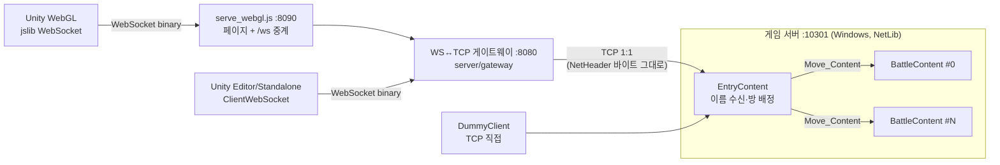
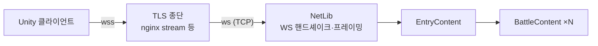

# escape_from_blockov 게임 명세서 v0.14

> 작성일: 2026-10-01
> 대상: Unity 6000.6.3f1 클라이언트(`client/escape_from_blockov`), NetLib 기반 게임 서버(`server/GameServer`), WS↔TCP 게이트웨이(`server/gateway`), 더미 클라이언트(`server/DummyClient`)
> 선행 문서: `server/ContentEchoServer/CONTENT_SERVER_LIBRARY.md`, 맵 섹터 규격(`claude/map-sector-spec.md`)
> 이 문서는 **현재 동작**을 기술한다. 버전별 변경 내역은 맨 끝 「변경 이력」에만 짧게 남긴다.

---

## 0. 요약

| 항목 | 내용 |
|---|---|
| 장르/플랫폼 | 2.5D 탑다운 PvP 슈팅, Unity WebGL |
| 진입 흐름 | 로비 없음. 타이틀에서 이름 입력 → 즉시 방 배정 → 전투 |
| 방 구성 | 다중 방 자동 배정. 방 = `BattleContent` 인스턴스. 정원 `room_capacity` 300, 방 4개 |
| 전송 | WebSocket 단일(에디터/Standalone 포함). 서버까지는 게이트웨이가 WS↔TCP 중계 |
| 패킷 | NetHeader 5B + 페이로드 ≤ 512B, 암호화 없음(Code 119만 검사), 프로토콜 v7 |
| 하트비트 | 서버 타임아웃 3분, 클라 60초마다 `CS_HEARTBEAT` |
| 레이턴시 | `CS_PING`/`SC_PONG`(2초)으로 RTT 측정·시각 동기화, 화면 좌상단 표시 |
| 이동 | 클라 권위 + 서버 검증(속도·맵 경계·엄폐물). 위반 시 위치 보정. Shift 달리기 ×1.5 |
| 구르기 | Space: 키보드 이동 방향으로 이동속도×3, 0.25초(약 9m), 쿨타임 3초, 엄폐물 앞 정지, 무적 없음 |
| 피격 | 오토타게팅: 사수 클라가 판정·보고 → 서버가 발사 시각 기준 과거 위치로 되감아 검증 |
| 시야 | 기준 섹터 + 인접 8섹터(3×3, 섹터 50m). 브로드캐스트도 3×3 한정(랭킹·접속 인원·에어드랍만 방 전체) |
| 엄폐물 | BMP 1픽셀 = 1m. 검정 = 벽(이동·총알 차단), 회색 = 낮은 엄폐물(이동만 차단), 빨강 = 파괴 가능한 엄폐물(체력 10~100, 파괴되면 30초 동안 반 블럭 = 낮은 엄폐물, 약 3,000개) |
| 무기 | 슬롯 1 특수 무기(샷건·저격총, 내구도), 슬롯 2 기본 무기(권총, 무한), 슬롯 3 붕대(최대 5) |
| 에어드랍 | 1분 주기, 투하 30초 전에 예정 위치를 방 전체에 공개(전체 맵에 위치·남은 초), 방 인원 30명당 1개(최대 4), 첫 입장 즉시 생성, 특수 무기를 가져가면 즉시 제거 |
| 가방 | 쓰러진 자리에 30초. 특수 무기(남은 내구도)·붕대 |
| 전체 맵 | M 토글, 구역 번호 1~100, 휠 줌·드래그, Esc 닫기 |
| 스폰 | 주변 3×3 섹터 인원이 가장 적은 섹터 안 무작위 위치. 스폰 이펙트(빛 기둥 + 바닥 링) |
| 사운드 | 무기별 발사, 명중, 피격, 처치, 엄폐물 피격·파괴, 스폰. 다른 사람 발사 소리는 거리 감쇠·좌우 방향 |
| 사망 | 결과창 → 타이틀 복귀(연결 종료). 점수 소멸 |
| 점수/랭킹 | 킬 시 +1 + floor(피해자 점수 × 0.5). 방 내 상위 3명 우상단 표시 |
| 닉네임 | 1~12자(UTF-16), 양끝 공백 제거, 중복 허용, 비면 `Guest####`. 식별은 서버 발급 PlayerID |
| 교전 밀도 | 넓은 맵에 드문 교전은 의도된 설계 |

---

## 1. 게임 개요

- **목표**: 적을 처치해 점수를 쌓고 방 내 상위 3위 안에 드는 것. 죽으면 점수를 잃고 처음부터 다시 시작한다(slither.io식 긴장감).
- **한 판의 흐름**: 접속 → 스폰 → 탐색·이동/사격·아이템 획득 → (처치 시 점수 흡수) → 사망 → 결과창 → 타이틀.
- **맵 성격**: 1500×1500m 맵에 소수가 흩어져 있어 조우가 드물다. 에어드랍이 인원이 많은 곳에 떨어져 조우를 유도한다.
- **영속성 없음**: 계정·DB·저장 없음. 서버 재시작 시 모든 상태 초기화.

---

## 2. 시스템 구성

### 2.1 현재 구성 (게이트웨이)



### 2.2 목표 구성 (NetLib 네이티브 WebSocket, 14.2)



- 게이트웨이는 **바이트 투명 중계**만 한다(패킷 해석 없음).
- **WS 메시지 ↔ 패킷 계약**(두 구성 공통):
  - 클라 → 서버: WS 바이너리 메시지 1개 = NetHeader 패킷 **정확히 1개**.
  - 서버 → 클라: WS 바이너리 메시지 1개 = NetHeader 패킷 **1개 이상**(경계는 보장하지 않음).
  - 수신측은 WS 메시지 경계를 신뢰하지 않고 **바이트 스트림으로 재조립**한다.
- 서버는 사람 클라와 더미 클라를 구분하지 않는다(같은 프로토콜, 같은 검증).

---

## 3. 월드 / 맵

| 항목 | 값 |
|---|---|
| 씬 | `Assets/Scenes/TestArena.unity` (빌드 인덱스 1) |
| 단위 | 1 unit = 1 m. 평면은 X-Z, Y는 높이(게임 로직은 2D X-Z만 사용) |
| 섹터 | **50×50m, 30×30개**, 월드 1500×1500. 원점 = 섹터(0,0) 좌하단 |
| 섹터 계산 | `sx = floor(x/50)`, `sy = floor(z/50)`, 인덱스 `sy*30+sx` (클라 `SectorGrid.cs`, 서버 `MapConst`/`SectorMap.h`) |
| 이동 가능 영역 | 외벽 두께 2 → `x, z ∈ [2.0, 1498.0]` |
| 바닥 | 섹터 체커 무늬 쿼드 1장(`Ground`, 텍스처 30×30, 1텍셀 = 1섹터). 메뉴 `Blockov/Map/Rebuild Sector Ground` |
| 스폰 | 고정 지점 없음. 서버가 인원 분포로 정한다(아래) |
| 엄폐물 | `map/obstacles.bmp` (3.3) |

**스폰 선택(서버)**: 900개 섹터마다 그 섹터와 인접 8섹터(3×3, 시야 범위)의 살아있는 인원을 세어 **가장 적은 섹터들 중 무작위** 1개 → 그 섹터 안 무작위 위치(경계에서 4m 안쪽). 그 지점이 엄폐물과 겹치면 가장 가까운 빈 칸으로 옮긴다(`ObstacleMap::FindFree`). 입장한 본인과 시야 안 플레이어에게 스폰 이펙트가 재생된다(12.4).

**테스트 모드**(`test_mode: true`): 섹터 (`test_spawn_sector_x`, `test_spawn_sector_y`)(기본 (0,0)) 안의 무작위 위치(경계에서 반지름+4m 안쪽)에 스폰하고, 엄폐물과 겹치면 가까운 빈 칸으로 옮긴다. 서버 시작 로그와 대시보드에 `[TEST MODE]`가 표시된다.

### 3.1 시야

- 서버 시야(3×3 섹터, `view_sector_radius` 1)는 플레이어가 섹터 경계에 있을 때 한 방향으로 **최소 50m**를 보장한다.
- 무기 사거리는 **≤ 50**(= 섹터 크기 × `view_sector_radius`). 서버가 무기 테이블 로드 시 초과값을 50으로 자른다(안 보이는 적을 맞추는 일 방지).
- 엄폐물은 이동·총알만 막고 시야(정보 송신)는 막지 않는다.

### 3.2 카메라

- 2.5D 정사영 사선 카메라(피치 55°), 로컬 플레이어 추적.
- 보이는 반경 기본 25. 디버그용으로 `[` 줌인 / `]` 줌아웃(누르는 동안 연속, 초당 약 ×2.5, 범위 15~200)이 있으며 화면 조작 안내에는 표시하지 않는다(16장 열린 이슈 1).
- 50~200 구간은 서버가 정보를 주지 않을 수 있어 적이 화면 안에서 나타나거나 사라질 수 있다(디버그 중 허용).

### 3.3 엄폐물 맵 (BMP)

| 항목 | 규칙 |
|---|---|
| 파일 | `map/obstacles.bmp` (저장소 최상단 `map/`). 서버 설정 `obstacle_map`, 클라는 임포트 도구로 반영 |
| 크기 | **1500×1500 픽셀**, 1픽셀 = 월드 1m×1m 칸. 크기가 다르면 있는 부분만 읽고 나머지는 빈 칸 |
| 좌표 | 이미지 **왼쪽 아래 = 월드 (0,0)**, 오른쪽 = +X, 위쪽 = +Z. 픽셀 (px, 위에서부터 py) → 칸 `x = px`, `z = 1499 - py` |
| 형식 | 무압축 BMP 1/4/8/24/32비트 (그림판 기본 저장 형식 모두 가능) |
| 색 판정 | 밝기 `L = (299R + 587G + 114B) / 1000` |
| **벽** (Wall) | `L < 64` (검정) → 이동 차단 + 총알 차단 |
| **낮은 엄폐물** (Low) | `64 ≤ L < 224` (회색) → 이동 차단, 총알 통과 |
| **파괴 가능** (Destructible) | `R ≥ 150` 이고 `G ≤ 100`, `B ≤ 100` (빨강, 밝기 판정보다 먼저) → 멀쩡할 때 이동·총알 차단, 파괴되면 낮은 엄폐물(3.6). 체력 단계 `level = 1 + (R − 150) × 9 / 105`(정수 나눗셈, 1~10), 체력 = level × 10 |
| 빈 칸 | `L ≥ 224` (흰색) |
| 맵 밖 | 벽으로 취급 |
| 해시 | 1500×1500 칸 값을 z 오름차순·x 오름차순으로 FNV-1a 32bit. 칸 값 = 빈 칸 0, 낮은 엄폐물 1, 벽 2, 파괴 가능 `3 + level × 16`. 서버가 `SC_ENTER_GAME.MapHash`로 전달, 클라는 임포트 시 계산한 값과 비교해 다르면 화면 상단에 "맵 데이터가 서버와 다릅니다" 경고. 서버가 맵을 못 읽으면 해시 0(엄폐물 없이 실행)이라 경고가 뜬다 |

**파괴 가능한 엄폐물 색** (G = B = 40 기준, 그림판 '색 편집'에서 빨강 값만 입력)

| 체력 | 10 | 20 | 30 | 40 | 50 | 60 | 70 | 80 | 90 | 100 |
|---|---|---|---|---|---|---|---|---|---|---|
| R | 150 | 162 | 174 | 186 | 198 | 210 | 222 | 234 | 246 | 255 |

- **같은 색(같은 R)으로 상하좌우가 이어진 칸 묶음 = 엄폐물 1개**. 서로 다른 엄폐물로 두려면 한 칸 이상 띄우거나 색을 다르게 한다.
- 엄폐물 번호(id)는 z 오름차순·x 오름차순으로 칸을 훑다가 처음 만나는 묶음부터 0, 1, 2, … (서버·클라 동일).

**그림판으로 편집하기**
1. `map/obstacles.bmp`(약 1.1MB, 4비트 16색, 빨강 10단계를 넣은 전용 팔레트)를 그림판으로 연다.
2. 검정(벽)·회색(낮은 엄폐물)·빨강(파괴 가능, 위 표)·흰색(지우기)으로 그린다. 확대(Ctrl+휠)해서 1픽셀 단위 편집 가능. 캐릭터 지름이 1m이므로 통로는 2픽셀 이상.
3. **다른 이름으로 저장 → 24비트 비트맵**. 16색으로 저장하면 그림판 기본 팔레트로 바뀌어 빨강 단계가 사라진다. PNG/JPG는 읽지 못한다.
4. 서버: 재시작하면 반영. 시작 로그와 대시보드 `[Map]` 줄에서 벽/낮은 칸 수와 해시를 확인(`NOT LOADED`면 경로 문제).
5. 클라: Unity 메뉴 **`Blockov/Map/Import Obstacles (default BMP)`**(또는 `Blockov/Map/Obstacle Map Importer...` 창에서 다른 BMP 선택) → TestArena 씬의 `Obstacles` 루트와 `Resources/Map/obstacle_map.bytes` 갱신, 씬 저장. 이후 WebGL 재빌드.
6. 서버 해시와 클라 해시(임포터 로그, 게임 화면 경고 유무)가 같아야 한다.

**클라 임포트 도구** (`Assets/Editor/ObstacleMapImporter.cs`)
- BMP → 칸 배열 → 같은 칸 값끼리 **최대 직사각형으로 병합**(그리디) → `Resources/Map/obstacle_map.bytes`(`"BKOM"`, 버전 2, 크기, 해시, 사각형 목록 `{type u8, x/z/w/h u16, cover u16}`, 엄폐물 목록 `{maxHp u8}`). 파괴 가능 사각형은 속한 엄폐물 id를 가진다.
- 벽·낮은 엄폐물은 256m 청크 단위로 합친 메시를 `Assets/Map/Generated/ObstacleChunks.asset`에 만들고 씬 `Obstacles` 아래에 배치(벽 높이 2.5m, 낮은 엄폐물 0.9m — 임포터 창에서 변경, 재질 `M_Obstacle_Wall`/`M_Obstacle_Low`). 이전 생성물은 휴지통으로 이동.
- 파괴 가능한 엄폐물은 높이가 바뀌므로 정적 메시에 넣지 않는다. 씬의 `Covers` 오브젝트(`CoverManager`)가 실행 시 `obstacle_map.bytes`를 읽어 엄폐물마다 상자를 만든다(멀쩡 2.0m, 반 블럭 1.0m, 재질 `Resources/Materials/M_Cover`).
- 런타임(`ObstacleMap.cs`)은 `obstacle_map.bytes`로 이동·총알 판정 격자를 만든다(충돌·전체 맵용, 씬 메시와 독립).
- 예시 맵: `map/generate_example_map.py`(numpy·scipy, 시드 고정). 1500×1500, 벽 23,709칸 / 낮은 엄폐물 11,765칸 / 파괴 가능 10,339칸 = 3,000개(기존 벽 일부를 바꾼 750개 + 빈 곳의 상자 2,250개), 해시 `0xC89DE93F`.

### 3.4 구역 번호

- 섹터 3×3(150m)을 한 **구역**으로 묶어 10×10 = 100개.
- 번호는 왼쪽 위(북서)가 1, 오른쪽으로 증가, 행 단위로 아래로: `번호 = (9 - ⌊sy/3⌋) × 10 + ⌊sx/3⌋ + 1` (1~100).
- 화면의 모든 위치 표기(에어드랍 공지·전체 맵·루팅 창·디버그 줄)는 `구역 37` 형식이다. 서버는 패킷·로그에서 섹터 (sx, sy)를 쓰고 변환은 클라가 한다(`GameSession.RegionNumber/RegionLabel`).

### 3.5 전체 맵 (M)

- 전투 중 **M**으로 토글, **Esc**로 닫기(루팅 창도 함께 닫힘). 열 때마다 1배·내 위치 기준으로 초기화.
- 전체 1500×1500 맵을 텍스처(1px = 1m, `ObstacleMap.BuildMinimap`, 최초 1회 생성)로 표시: 벽 짙은 색, 낮은 엄폐물 갈색, 섹터 경계 가는 선, 구역 경계 굵은 선, 구역 가운데에 반투명 큰 구역 번호.
- 표시 대상: 내 위치(파란 사각형), 현재 카메라 영역(흰 사각형), 에어드랍(주황 사각형, 방 전체의 정확한 위치), **에어드랍 투하 예정 위치**(주황 테두리 원 + 남은 초 `0:25`, 6.4), 파괴 가능한 엄폐물(빨강, 정적 표시). 다른 플레이어와 조준 방향은 표시하지 않는다.
- 조작: **휠로 1~8배 줌**(마우스가 가리키는 지점 고정), **좌클릭 드래그로 이동**. 맵이 열려 있는 동안 사격하지 않는다.

### 3.6 파괴 가능한 엄폐물

| 항목 | 규칙 |
|---|---|
| 정의 | BMP 빨강 칸 묶음 1개 = 엄폐물 1개(3.3). 체력 10~100(색으로 지정). 방마다 상태를 따로 가진다 |
| 멀쩡할 때 | 이동·총알 차단(벽과 같음). 높이 2.0m 상자 |
| 피해 | 탄(산탄 1개)이 맞으면 그 무기의 데미지만큼 체력 감소. 탄은 엄폐물에서 멈춘다. 판정은 사수 클라가 보고하고 서버가 검증(11.3) |
| 파괴 | 체력 0 → **반 블럭 상태**: 높이 1.0m, 낮은 엄폐물처럼 이동은 막고 총알은 통과 |
| 재생 | 파괴 시각 + `cover_regen_ms`(30초) 뒤 체력 최대로 복구. 그 순간 엄폐물 칸에 플레이어가 겹쳐 있으면 비켜설 때까지 대기(반 블럭도 이동을 막으므로 보통은 생기지 않음) |
| 표시 | 맞으면 그 위에 체력 바 3초. 파괴된 동안 그 위에 **재생 게이지**(막대, 남은 초): 서버가 알려준 파괴 시각을 기준으로 클라가 1초마다 갱신. 30초가 지나도 재생되지 않으면 게이지가 찬 채로 '대기' |
| 동기화 | 체력 변화는 엄폐물 주변 3×3 플레이어에게(`SC_COVER_HP`), 파괴·재생은 방 전체에(`SC_COVER_STATE`). 입장 시 파괴된 엄폐물 목록을 받는다 |
| 이동 판정 | 멀쩡·반 블럭 모두 이동을 막으므로 이동 검증·클라 충돌·더미 이동은 상태와 무관하다 |

---

## 4. 캐릭터 · 조작

| 항목 | 값 | 비고 |
|---|---|---|
| 형태 | Capsule (높이 2, 반지름 0.5) | 판정은 X-Z 원(반지름 `CharacterRadius`) |
| 이동 속도 `MoveSpeed` | 12 m/s | 서버 설정, 입장 응답으로 전달 |
| 달리기 | Shift 누르는 동안 × `SprintMultiplier`(1.5 → 18 m/s), 스태미나 없음 | 서버 설정, 입장 응답으로 전달 |
| 최대 체력 `MaxHP` | 100 | 자연 회복 없음(붕대로만 회복) |
| 상태 | `ALIVE` → `DEAD` | |

서버 `GamePlayer`는 스탯을 `Stats` 구조체(MaxHP, MoveSpeed, Radius…)로 묶고, 패킷은 현재 HP/MaxHP만 노출한다.

### 4.1 조작

| 입력 | 동작 |
|---|---|
| WASD | 8방향 이동(정규화) |
| Shift | 달리기 |
| 마우스 이동 | 조준(지면 y=0 평면 레이캐스트) |
| 좌클릭 | 사격(누르고 있으면 연사) |
| Space | 구르기 (4.2) |
| 1 / 2 | 특수 무기 / 기본 무기 장착 (5.4) |
| 3 | 붕대 사용 (6.2) |
| F (누르고 있기) | 가방·에어드랍 열기 (6.3) |
| M / Esc | 전체 맵 열기·닫기 (3.5) |
| `[` / `]` | 카메라 줌인 / 줌아웃 (디버그, 화면 안내 없음, 3.2) |
| F3 | 레이턴시 표시 토글 |

### 4.2 구르기 (Space)

- 방향: **키보드 이동 입력 방향**(WASD 8방향). 이동 키를 누르지 않았으면 마지막으로 움직였던 방향, 입장 후 한 번도 움직이지 않았으면 조준 방향.
- 이동속도 × `roll_speed_mult`(3) = 36 m/s로 `roll_ms`(0.25초) → 약 9m. 벽·낮은 엄폐물에 닿으면 그 앞에서 멈춘다(0.25m 단위 검사, 서버·클라 같은 계산).
- 쿨타임 `roll_cooldown_ms`(3초), 무적 없음. 구르는 동안 사격·붕대 불가(붕대 사용 중이면 취소).
- 서버 처리: `CS_ROLL{시작 위치, 방향}` → 쿨타임·시작 위치(서버 위치와 3m 이내)·방향 검증 → **도착점을 서버가 계산**해 위치로 확정, 위치 이력에 시작(now)·도착(now+250) 기록, 3×3(본인 제외)에 `SC_ROLL`.
  - 구르는 0.25초 동안의 `CS_MOVE`는 무시하되, 끝나기 100ms 이내에 도착한 것은 도착 편차로 본다.
  - 구르기 후 첫 `CS_MOVE`가 서버 도착점과 `1m + 구르기 종료 후 경과 시간 × 최고 속도`보다 멀면 `SC_POSITION_CORRECT`(위반으로 세지 않음).
- 연출: 구르는 0.25초 동안 캐릭터(캡슐+총)가 진행 방향으로 몸 중심 기준 앞으로 한 바퀴(360°) 회전, 지나간 자리에 먼지 잔상 4개(회색 구, 0.5초 동안 작아지며 사라짐). 로컬은 `CS_ROLL` 전송 시, 원격은 `SC_ROLL` 수신 후 보간 지연(100ms) 뒤에 재생.

### 4.3 조준선

- 캐릭터에서 마우스 방향으로 **20m 고정 길이**(본인에게만 보임). 벽(총알이 막히는 칸)에 닿으면 그 지점에서 끊긴다. 낮은 엄폐물은 통과.
- 전체 맵이 열려 있으면 표시하지 않는다.

---

## 5. 무기

### 5.1 무기 정의 (`WeaponDef`)

서버가 `weapons.txt`에서 로드하는 **단일 진실 원본**. 입장 시 `SC_WEAPON_DEFS`로 클라에 보내므로 수치 변경 시 클라 재빌드가 필요 없다. 클라는 `WeaponID → 프리팹/사운드/이펙트`만 매핑한다.

| 필드 | 타입 | 설명 |
|---|---|---|
| WeaponID | BYTE | 1~255 |
| Damage | WORD | 1발(산탄 1개) 데미지 |
| Range | float | 사거리(≤50) |
| ProjectileSpeed | float | 탄속 m/s |
| FireIntervalMs | WORD | 연사 간격 |
| ProjectileRadius | float | 탄 반지름 |
| MagazineSize | WORD | 0 = 무한 (현재 0 고정) |
| ReloadMs | WORD | 재장전 시간 (미사용) |
| SpreadDeg | float | 산탄 퍼짐 전체 각도 |
| Pellets | BYTE | 1발당 투사체 수 (≤8) |
| Pierce | BYTE | 관통 가능 추가 대상 수 |
| JitterDeg | float | 흔들림: 발사마다 조준 방향에서 ±JitterDeg 무작위 |
| Durability | WORD | 내구도(발사 1회당 1 감소, 0 → 소멸). 0 = 무한 |
| Slot | BYTE | 1 = 특수 무기, 2 = 기본 무기 |

`weapons.txt` 한 줄: `id name damage range speed intervalMs radius magazine reloadMs spreadDeg pellets pierce jitterDeg durability slot` (마지막 3열 생략 시 0 0 2).

### 5.2 무기표

| ID | 이름 | 슬롯 | 데미지 | 사거리 | 탄속 | 발사 간격 | 산탄 | 퍼짐(전체) | 흔들림(±) | 내구도 |
|---|---|---|---|---|---|---|---|---|---|---|
| 1 | Pistol | 2 기본 무기 | 20 | 32 | 100 | 250ms | 1 | 0 | 3° | 무한 |
| 2 | Shotgun | 1 특수 무기 | 20/발 | 25 | 130 | 1000ms | 5 | 12° (±6°) | 0 | 40 |
| 3 | Sniper | 1 특수 무기 | 60 | 45 | 200 | 2000ms | 1 | 0 | 0 | 30 |

탄 반지름은 모두 0.2. 탄은 벽에 닿으면 소멸하고 낮은 엄폐물은 통과한다.

### 5.3 발사 방향 · 흔들림 · 산탄

- 발사 방향 = 조준 방향 + 무작위 흔들림(±`JitterDeg`). 클라는 흔들림을 적용한 **후의** 방향을 `CS_FIRE.Dir`로 보낸다.
- 산탄 i(0..Pellets-1)의 각도 = `(PelletRand(SpreadSeed, i) - 0.5) × SpreadDeg` (Dir 기준). `SpreadSeed`는 `CS_FIRE`에 실려 `SC_FIRE`로 그대로 전달되므로 사수·관찰자가 같은 산탄을 그린다. 서버는 산탄 각도를 계산하지 않고 각도 허용치로 검증한다(11.3).
- `PelletRand` (클라 C#·더미 C++ 공통, 32비트 부호 없는 연산):
  ```
  h = ((seed+1)*73856093) ^ ((i+1)*19349663)
  h ^= h >> 13;  h *= 0x5bd1e995;  h ^= h >> 15
  return (h & 0xFFFF) / 65536
  ```

### 5.4 장착 · 전환 · 내구도

- 1 = 특수 무기(가지고 있을 때만), 2 = 기본 무기. 서버가 장착 무기를 알고 있으며 `CS_FIRE.WeaponID`가 장착 무기와 다르면 거부한다.
- 특수 무기는 발사 1회(산탄 수와 무관)마다 내구도 1 감소, 0이 되면 사라지고 자동으로 기본 무기로 전환된다.
- 사격 토큰 상한 = `clamp(1 + 500 / intervalMs, 1, 3)` (권총 3, 샷건 1.5, 저격총 1.25): 전환 직후 느린 무기의 연속 발사를 막는다.

---

## 6. 아이템

### 6.1 슬롯

| 키 | 슬롯 | 내용 |
|---|---|---|
| 1 | 특수 무기 | 샷건 또는 저격총 1자루(없을 수 있음). 내구도 = 남은 발사 횟수 |
| 2 | 기본 무기 | 권총(항상 보유, 무한) |
| 3 | 붕대 | 최대 `max_bandages`(5)개. 입장(스폰)마다 `start_bandages`(2)개 |

- 특수 무기를 새로 얻으면 기존 특수 무기는 **덮어쓴다**(버려짐). 장착 상태는 유지.
- 하단 가운데 슬롯 바에 무기 이름·내구도·붕대 개수·선택 표시.

### 6.2 붕대 (3)

- `bandage_ms`(2초) 사용(진행 게이지) 후 체력 +`bandage_heal`(30), 최대 100.
- 사용 중에는 **달리기 불가, 걷기 속도의 절반**(6 m/s, 클라 처리 — 서버 속도 검증 범위 안). 사격·구르기·무기 전환 시 취소. 체력이 가득이거나 붕대가 0이면 사용 불가.
- `CS_USE_BANDAGE` → 서버 타이머. 완료 시 붕대 -1, 3×3에 `SC_HP`, 본인에게 `SC_INVENTORY`. 취소는 서버가 사격·구르기·전환을 받을 때 처리한다.

### 6.3 상호작용 (F)

- 대상(가방·에어드랍)이 `interact_range`(2.5m) 이내면 가장 가까운 것을 대상으로 "F키를 눌러 열기" 표시.
- F를 누르는 동안 대상 위에 원형 게이지(가방 `bag_open_ms` 1초 / 에어드랍 `airdrop_open_ms` 2초). 이동 입력·구르기·F 떼기로 취소.
- 게이지가 차면 `CS_OPEN_CONTAINER` → 서버 검증: 거리 ≤ 3m, 마지막 이동 이후 경과 ≥ (필요 시간 - 250ms). 통과 시 `SC_CONTAINER_CONTENTS`.
- **루팅 창**: 특수 무기(이름·남은 내구도)와 붕대(개수) 칸, 각 칸에 [획득] 버튼. 3m 넘게 멀어지거나 F·Esc를 누르면 닫힘.
- `CS_TAKE_ITEM{컨테이너, 1=특수 무기 | 3=붕대}`:
  - 특수 무기: 컨테이너에 표시된 **내구도 그대로** 획득(덮어쓰기).
  - 붕대: 최대 5개까지만 가져가고 남은 개수는 컨테이너에 유지.
- 여러 명이 동시에 열 수 있고 같은 아이템은 **서버에 먼저 도착한 요청**만 성공. 내용이 바뀌면 그 컨테이너를 열어 둔 모두에게 `SC_CONTAINER_CONTENTS` 갱신.

### 6.4 에어드랍

| 항목 | 규칙 |
|---|---|
| 주기 | 방마다 `airdrop_interval_ms`(1분). 방에 플레이어가 있는 동안만 타이머가 돈다 |
| 예고 | 투하 `airdrop_notice_ms`(30초) 전에 그 회차의 개수·위치를 정하고 방 전체에 `SC_AIRDROP_FORECAST`(투하 시각 + 위치들) 송신. 클라는 전체 맵에 예정 위치와 남은 초를 표시하고, 받은 투하 시각을 기준으로 1초마다 갱신한다. 정해진 위치·개수는 투하 시각에 그대로 생성(그 사이 인원 변화와 무관). 방이 비면 예고 취소 |
| 즉시 생성 | 빈 방(0명)에 첫 플레이어가 들어오면 그 순간 1회차를 예고 없이 생성하고 주기 타이머를 그때부터 시작. 방이 비면 타이머 정지(남은 에어드랍은 유지) |
| 최대 개수(방마다) | `min(airdrop_max(4), ceil(방 인원 / airdrop_players_per(30)))`, 최소 1 → 1~30명 1개, 31~60명 2개, 61~90명 3개, 91명 이상 4개 |
| 회차당 개수 | 예고 시점의 남은 자리(최대 - 현재)가 1 이상이면 1~남은 자리 중 균등 무작위, 0이면 그 회차는 예고·투하 없음 |
| 위치 | 예고 시점에 하나씩 배치: 모든 3×3 섹터 묶음(가운데 섹터 기준) 중 살아있는 인원이 가장 많은 묶음(동점 무작위), 기존·예정 에어드랍 섹터와 체비셰프 거리 3 미만인 묶음 제외. 가운데 섹터 안 무작위 빈 자리 |
| 내용물 | 특수 무기 무작위 1종(최대 내구도) + 붕대 5개. 여는 시간 2초 |
| 제거 | 누군가 **특수 무기를 가져가면 즉시 제거**(남은 붕대도 사라짐). 붕대만 가져가면 비었을 때 제거 |
| 알림 | 생성 시 방 전체에 `SC_AIRDROP(IsNew=1)` → 화면 상단 공지 "에어드랍 투하!" 6초(위치 표기 없음, 위치는 전체 맵에서 확인). 입장한 플레이어는 기존 에어드랍을 `SC_AIRDROP(IsNew=0)`로 받는다. 시야와 무관하게 방 전체가 알고 전체 맵에 정확한 위치 표시 |
| 표시 | 주황색(월드 상자·신호 기둥, 전체 맵 마커, 공지 배경, 루팅 창 테두리) |

### 6.5 가방

- 플레이어(더미 포함)가 쓰러지면 그 자리에 **항상** 가방 생성: 그 플레이어의 특수 무기(남은 내구도)와 붕대 전부. 여는 시간 1초.
- 생성 후 `bag_lifetime_ms`(**30초**) 뒤 제거(비어도 30초 유지).
- 가방은 캐릭터처럼 **섹터 시야(3×3)** 로 보인다: 생성·제거 시 가방 위치의 3×3에 `SC_CONTAINER_CREATE/DELETE`, 플레이어가 섹터를 옮기면 새로 보이게 된/안 보이게 된 가방을 CREATE/DELETE, 입장 시 시야 안 가방 목록.

---

## 7. 게임 규칙

### 7.1 입장
1. 타이틀에서 이름 입력 → WebSocket 접속 → `CS_ENTER_GAME`.
2. 서버가 방 배정·스폰 위치 결정(3장) 후 본인에게 입장 시퀀스(8.5) 송신, 주변(3×3) 플레이어에게 `SC_CREATE_CHARACTERS`(신규 1명, `Flags`의 스폰 비트 = 1 → 스폰 이펙트).
3. 클라는 입장 직후 `CS_PING`을 200ms 간격 3회 보내 시각 동기화를 수렴시키고 `CS_HEARTBEAT` 60초 타이머를 시작한다.

### 7.2 전투 / 피격 (오토타게팅 + 과거 위치)
- 사수 클라는 발사 시 **발사 방향 벡터**와 **ViewTime**(= 자신이 화면에 그리고 있던 원격 캐릭터들의 서버 시각, 9.2)을 `CS_FIRE`로 보낸다.
- 사수 클라가 탄(산탄 각각)을 로컬 시뮬레이션하고 원격 캐릭터·멀쩡한 파괴 가능 엄폐물과의 충돌을 판정한다. 엄폐물에 맞으면 탄은 멈추고 엄폐물 피격으로 보고한다.
- 충돌 시 즉시 히트 마커(예측)를 보여주고 보고 목록에 적재 → 첫 항목 후 100ms 또는 29건이 차면 `CS_HIT_REPORT`로 일괄 송신.
- 서버는 **ViewTime + 탄 비행 시간** 시점의 대상 위치를 위치 이력에서 복원해 충돌 지점과 비교한다(11.3).
- **HP 감소는 서버의 `SC_DAMAGE`로만 반영**(예측하지 않음).
- 다른 사람의 탄(`SC_FIRE`)은 **연출 전용**: 관찰자는 충돌 판정을 하지 않고, 사거리 도달·벽 충돌 또는 해당 ShotSeq의 `SC_DAMAGE` 수신 시 제거.

### 7.3 사망
- HP ≤ 0이면 서버가:
  1. 피해자를 섹터에서 제거, 상태 `DEAD`, 이후 모든 입력 무시. 그 자리에 가방 생성(6.5).
  2. 피해자 3×3에 `SC_PLAYER_DIE` (클라는 사망 연출 후 캐릭터 제거).
  3. 킬러 점수 갱신 → 킬러에게 `SC_SCORE`.
  4. 피해자에게 `SC_DEATH_RESULT` 송신 후 `death_disconnect_ms`(3초) 뒤 끊음(즉시 끊으면 결과 패킷이 유실될 수 있음).
- 피해자 클라는 결과창(처치자 이름, 최종 점수, 킬 수, 생존 시간) → [타이틀로] → 연결 종료.

### 7.4 점수 / 랭킹
- 킬: `killer.score += 1 + floor(victim.score * 0.5)`, `killer.kills += 1`, `killer.scoreReachedTick = now`. 피해자 점수는 사라진다.
- 정렬: 점수 내림차순 → `scoreReachedTick` 오름차순(먼저 달성) → PlayerID 오름차순.
- 상위 3명의 (ID, 점수, 순서)가 바뀌면 해당 틱 끝에 1회 방 전체로 `SC_RANKING_TOP3`(같은 틱 내 변경 병합). 트리거: 킬, 입장(3명 미만일 때), 퇴장/사망.

### 7.5 퇴장
- 연결 종료 시 섹터에서 제거, 3×3에 `SC_DELETE_CHARACTERS`, 랭킹 재계산, 방 인원 감소, 접속 인원 방송.

---

## 8. 네트워크 프로토콜

### 8.1 공통 규칙

```
| Code(1) | Len(2) | RandKey(1) | CheckSum(1) | Payload(Len) |
  NetHeader 5B                                 Payload = WORD Type + 본문
```

- 이 바이트열이 WebSocket 바이너리 메시지에 실린다(2장의 메시지↔패킷 계약).
- Code = 119(0x77). **암호화 미사용**: `RandKey = 0`, `CheckSum = 0`, 페이로드 평문. 서버는 Code와 Len만 검사한다.
- **리틀 엔디안**, `#pragma pack(1)`, 패딩 없음.
- **Len ≤ 512**. 수신측은 타입별 최소/정확 길이를 검증하고 불일치 시 끊는다.
- 문자열: `WCHAR Name[12]` 고정 24B, UTF-16LE, 남는 칸 0 채움(12자 꽉 차면 null 없음).
- 방향: **정규화된 2D 벡터 `(DirX, DirZ)`** (float×2). 수신측은 길이 0.9~1.1 밖이면 거부, 통과 시 재정규화.
- 조준(이동 패킷): `AimAngle` float, 도, +X축 기준 반시계(= `Atan2(z, x)`), `[0, 360)`.
- 시각: `UINT32` **서버 시각(ms)** = 서버 프로세스 시작 기준 경과 ms (`GameProtocol.h`의 `GetServerTimeMs()`, 49일 wrap 허용, 비교는 부호 있는 차이로).
- PlayerID: UINT32, 방 내 고유, 1부터 증가(0 = 없음). **sessionHandle은 클라에 노출하지 않는다.**
- 패킷 타입 범위: C→S `3000~3099`, S→C `3100~3199` (`server/GameServer/GameProtocol.h`, 클라 `NetProtocol.cs`). 서버 C++ 상수는 `PT_` 접두사(`PT_SC_MOVE` 등, windows.h 매크로 충돌 회피).
- 프로토콜 버전: `GAME_PROTOCOL_VERSION = 7`. 버전이 다르면 입장 거부(`VERSION_MISMATCH`).

### 8.2 패킷 목록

| 값 | 이름 | 방향 | 대상 | 페이로드(B) | 상태 |
|---|---|---|---|---|---|
| 3000 | CS_ENTER_GAME | C→S | – | 30 | |
| 3001 | CS_MOVE | C→S | – | 24 | |
| 3002 | CS_FIRE | C→S | – | 29 | |
| 3003 | CS_HIT_REPORT | C→S | – | 3 + 17n (n≤29 → 496) | |
| 3004 | CS_PING | C→S | – | 6 | |
| 3005 | CS_HEARTBEAT | C→S | – | 2 | |
| 3100 | SC_ENTER_GAME | S→C | 본인 | **65** | |
| 3101 | SC_WEAPON_DEFS | S→C | 본인 | 3 + 36n (n≤14) | |
| 3102 | SC_CREATE_CHARACTERS | S→C | 본인 / 3×3 | 3 + 54n (n≤9) | |
| 3103 | SC_DELETE_CHARACTERS | S→C | 본인 / 3×3 | 3 + 4n (n≤127) | |
| 3104 | SC_MOVE | S→C | 3×3(본인 제외) | 26 | |
| 3105 | SC_POSITION_CORRECT | S→C | 본인 | 12 | |
| 3106 | SC_FIRE | S→C | 3×3(본인 제외) | 28 | |
| 3107 | SC_DAMAGE | S→C | 피해자 3×3 | 18 | |
| 3108 | SC_PLAYER_DIE | S→C | 피해자 3×3 | 10 | |
| 3109 | SC_DEATH_RESULT | S→C | 피해자 | 38 | |
| 3110 | SC_SCORE | S→C | 본인 | 8 | |
| 3111 | SC_RANKING_TOP3 | S→C | 방 전체 | 3 + 33n (n≤3) | |
| 3112 | SC_KICK | S→C | 본인 | 3 | |
| 3113 | SC_PONG | S→C | 본인 | 10 | |
| 3114 | SC_PLAYER_COUNT | S→C | 방 전체 | 6 | |
| 3006~3010, 3115~3121 | 아이템·구르기·컨테이너 | | | 8.5 | |
| 3122~3124 | 파괴 가능 엄폐물·에어드랍 예고 | | | 8.5 | |

### 8.3 Client → Server

```
CS_ENTER_GAME (3000)                         // 접속 직후 1회. 10초 내 미수신 시 끊음
{
    WORD    Type
    UINT32  ProtocolVersion                  // GAME_PROTOCOL_VERSION
    WCHAR   Name[12]
}

CS_MOVE (3001)                               // 이동/조준 상태. 전송 규칙은 12.2
{
    WORD    Type
    float   PosX, PosZ                       // 현재 위치
    float   VelX, VelZ                       // 현재 속도 (정지 = 0,0)
    float   AimAngle
    UINT16  MoveSeq                          // 클라 증가 번호 (보정 응답 매칭용, wrap 허용)
}

CS_FIRE (3002)                               // 발사 1회 (Pellets개 투사체 포함)
{
    WORD    Type
    UINT32  ShotSeq                          // 클라 증가 번호, 1부터
    BYTE    WeaponID
    float   OriginX, OriginZ                 // 발사 위치
    float   DirX, DirZ                       // 사용자가 바라본 방향 (정규화, 확산 적용 전)
    UINT32  ViewTimeMs                       // 발사 순간 화면에 그려진 원격 캐릭터들의 서버 시각 (9.2)
    BYTE    SpreadSeed                       // 산탄 각도 시드 (서버가 SC_FIRE.SpreadSeed로 그대로 전달, 5.3)
    BYTE    _reserved                        // 0
}

CS_HIT_REPORT (3003)                         // 누적 피격 보고
{
    WORD    Type
    BYTE    Count                            // 1..29 (512B 한도)
    {
        UINT32  ShotSeq
        BYTE    PelletIndex                  // 0..Pellets-1
        UINT32  TargetID                     // 플레이어 ID, 또는 0x80000000 | CoverId (파괴 가능 엄폐물 피격)
        float   HitX, HitZ                   // 클라가 판정한 충돌 지점
    } [Count]
}

CS_PING (3004)                               // 2초마다(앱이 활성일 때). RTT 측정 겸 시각 동기화
{
    WORD    Type
    UINT32  ClientTimeMs                     // 클라 로컬 ms (그대로 되돌려 받음)
}

CS_HEARTBEAT (3005)                          // 60초마다. 브라우저 setInterval / 스레드 타이머에서 송신
{                                            // → 탭이 백그라운드라 Unity 루프가 멈춰도 연결 유지
    WORD    Type
}
```

### 8.4 Server → Client

```
SC_ENTER_GAME (3100)
{
    WORD    Type
    BYTE    Result             // 0 OK, 1 SERVER_FULL, 2 VERSION_MISMATCH, 3 INVALID_NAME
    UINT32  MyPlayerID
    BYTE    RoomNo
    float   SpawnX, SpawnZ
    WORD    HP, MaxHP
    float   MoveSpeed
    float   CharacterRadius
    BYTE    WeaponID           // 장착 무기
    UINT32  ServerTimeMs       // 시각 동기화 초기값
    WCHAR   MyName[12]         // 서버가 정규화한 본인 이름 (공백 제거, Guest#### 치환 등)
    UINT32  MapHash            // 서버가 읽은 엄폐물 맵 해시 (3.2, 로드 실패 시 0)
    float   SprintMultiplier   // Shift 달리기 속도 배율 (설정 sprint_multiplier)
}
```
> Result ≠ 0이면 나머지 필드는 0이며, 서버는 1초 뒤 끊는다.

```
SC_WEAPON_DEFS (3101)
{
    WORD    Type
    BYTE    Count
    {
        BYTE    WeaponID
        WORD    Damage
        float   Range
        float   ProjectileSpeed
        WORD    FireIntervalMs
        float   ProjectileRadius
        WORD    MagazineSize
        WORD    ReloadMs
        float   SpreadDeg
        BYTE    Pellets
        BYTE    Pierce
        float   JitterDeg
        WORD    Durability     // 0 = 무한
        BYTE    Slot           // 1 특수 무기, 2 기본 무기
        BYTE    _reserved[2]
    } [Count]                  // 36B each, 패킷당 ≤14개
}

SC_CREATE_CHARACTERS (3102)    // 시야 진입 / 입장 시 주변 목록. 9명 초과 시 여러 패킷으로 분할
{
    WORD    Type
    BYTE    Count
    {
        UINT32  PlayerID
        WCHAR   Name[12]
        float   PosX, PosZ
        float   VelX, VelZ
        float   AimAngle
        WORD    HP, MaxHP
        BYTE    WeaponID
        BYTE    Flags          // bit0 = 방금 스폰함(스폰 이펙트 재생)
    } [Count]                  // 54B each
}

SC_DELETE_CHARACTERS (3103)    // 시야 이탈 / 퇴장
{
    WORD    Type
    BYTE    Count
    UINT32  PlayerID[Count]
}

SC_MOVE (3104)
{
    WORD    Type
    UINT32  PlayerID
    float   PosX, PosZ
    float   VelX, VelZ
    float   AimAngle
}

SC_POSITION_CORRECT (3105)     // 이동 검증 실패 시 본인에게. 클라는 즉시 스냅
{
    WORD    Type
    float   PosX, PosZ
    UINT16  MoveSeq            // 거부된 CS_MOVE의 MoveSeq
}

SC_FIRE (3106)
{
    WORD    Type
    UINT32  ShooterID
    UINT32  ShotSeq
    BYTE    WeaponID
    float   OriginX, OriginZ
    float   DirX, DirZ
    BYTE    SpreadSeed         // CS_FIRE.SpreadSeed 그대로 (사수와 같은 산탄 각도)
}

SC_DAMAGE (3107)
{
    WORD    Type
    UINT32  AttackerID
    UINT32  VictimID
    UINT32  ShotSeq
    WORD    Damage
    WORD    VictimHP           // 적용 후 HP (0이면 곧 SC_PLAYER_DIE)
}

SC_PLAYER_DIE (3108)
{
    WORD    Type
    UINT32  VictimID
    UINT32  KillerID
}

SC_DEATH_RESULT (3109)         // 피해자 본인에게만
{
    WORD    Type
    WCHAR   KillerName[12]
    UINT32  FinalScore
    UINT32  Kills
    UINT32  SurvivalSec
}

SC_SCORE (3110)                // 본인 점수 변경 시
{
    WORD    Type
    UINT32  Score
    UINT16  Kills
}

SC_RANKING_TOP3 (3111)
{
    WORD    Type
    BYTE    Count              // 0..3
    {
        BYTE    Rank           // 1..3
        UINT32  PlayerID
        WCHAR   Name[12]
        UINT32  Score
    } [Count]                  // 33B each
}

SC_KICK (3112)                 // 서버가 끊기 직전 사유 통지 (best effort)
{
    WORD    Type
    BYTE    Reason             // 1 TIMEOUT, 2 INVALID_PACKET, 3 CHEAT_SUSPECT, 4 SERVER_SHUTDOWN
}

SC_PONG (3113)
{
    WORD    Type
    UINT32  ClientTimeMs       // CS_PING 값 그대로
    UINT32  ServerTimeMs       // 서버가 응답을 만든 시각
}

SC_PLAYER_COUNT (3114)         // 서버 전체 접속 인원 (모든 방 합계)
{                              // 입장 시퀀스에서 본인에게 1회 + 이후 인원이 바뀌면 각 방이 방 전체에 방송
    WORD    Type               // (방 틱마다 검사, 최소 200ms 간격으로 병합 → 대량 접속 시 폭주 방지)
    UINT32  TotalPlayers       // 방에 입장한 플레이어 수 (입장 대기·연결 중 제외, 사망 후 끊기기 전까지는 포함)
}
```

### 8.5 아이템 · 구르기 · 컨테이너 패킷

| 값 | 이름 | 방향 | 본문 (Type 제외) | 크기 |
|---|---|---|---|---|
| 3006 | CS_ROLL | C→S | float StartX, StartZ, DirX, DirZ | 18 |
| 3007 | CS_SWITCH_WEAPON | C→S | BYTE Slot (1, 2) | 3 |
| 3008 | CS_USE_BANDAGE | C→S | – | 2 |
| 3009 | CS_OPEN_CONTAINER | C→S | UINT32 ContainerId | 6 |
| 3010 | CS_TAKE_ITEM | C→S | UINT32 ContainerId, BYTE Item (1 특수 무기, 3 붕대) | 7 |
| 3115 | SC_INVENTORY | S→C 본인 | BYTE Equipped(1·2), BYTE SpecialWeaponId(0=없음), WORD Durability, BYTE Bandages | 7 |
| 3116 | SC_ROLL | S→C 3×3(본인 제외) | UINT32 PlayerId, float StartX, StartZ, EndX, EndZ | 22 |
| 3117 | SC_HP | S→C 3×3 | UINT32 PlayerId, WORD Hp | 8 |
| 3118 | SC_CONTAINER_CREATE | S→C 3×3 | BYTE Count, {UINT32 Id, BYTE Type(1 가방, 2 에어드랍), float X, Z}[n] | 3 + 13n |
| 3119 | SC_CONTAINER_DELETE | S→C 3×3·방 전체(에어드랍) | BYTE Count, UINT32 Id[n] | 3 + 4n |
| 3120 | SC_CONTAINER_CONTENTS | S→C 연 사람 | UINT32 Id, BYTE SpecialWeaponId, WORD Durability, BYTE Bandages | 10 |
| 3121 | SC_AIRDROP | S→C 방 전체 | UINT32 Id, float X, Z, BYTE SectorX, SectorY, BYTE IsNew | 17 |
| 3122 | SC_COVER_HP | S→C 엄폐물 3×3 | WORD CoverId, BYTE Hp (0이면 곧 SC_COVER_STATE) | 5 |
| 3123 | SC_COVER_STATE | S→C 방 전체 | BYTE Count, {WORD CoverId, BYTE Destroyed(1 파괴 / 0 재생), UINT32 DestroyedAtMs(서버 시각), WORD RegenSec}[n] (n ≤ 56) | 3 + 9n |
| 3124 | SC_AIRDROP_FORECAST | S→C 방 전체 | UINT32 DropAtMs(서버 시각), BYTE Count(0 = 예고 없음), {float X, Z}[n] | 7 + 8n |

**입장 시퀀스**(본인에게, 이 순서): `SC_ENTER_GAME` → `SC_PLAYER_COUNT` → `SC_WEAPON_DEFS` → `SC_INVENTORY` → `SC_CREATE_CHARACTERS`(시야 안 플레이어) → `SC_CONTAINER_CREATE`(시야 안 가방) → `SC_AIRDROP`(기존 에어드랍, IsNew=0) → `SC_AIRDROP_FORECAST`(예고 중이면) → `SC_COVER_STATE`(파괴된 엄폐물 전부) → `SC_RANKING_TOP3`.

### 8.6 사격·피격 시퀀스


---

## 9. 시각 동기화 / 레이턴시

### 9.1 서버 시각
- `ServerTimeMs` = 서버 시작 기준 경과 ms(UINT32, `GetServerTimeMs()`). 모든 방이 같은 시계를 쓴다.
- 서버는 CS_MOVE 수신 시각을 위치 이력의 시각으로 기록한다(10.5).

### 9.2 클라 추정
- `CS_PING`을 2초마다 전송(입장 직후 200ms 간격 3회). `SC_PONG` 수신 시:
  - `rtt = now - ClientTimeMs`
  - `offsetSample = ServerTimeMs + rtt/2 - now`
  - 최근 8개 샘플 중 **RTT가 가장 작은 샘플의 offset** 채택, 급변은 초당 50ms 이내로 완만히 보정(1초 이상 차이는 즉시 스냅). `ServerClock.cs`
- `EstServerNow = localNow + offset`
- 원격 캐릭터는 **렌더 지연 `InterpDelay` = 100ms**로 보간 → 화면에 보이는 원격 캐릭터의 서버 시각은 `EstServerNow - InterpDelay`.
- **`ViewTimeMs = EstServerNow - InterpDelay`** (발사 순간 값). 이 값이 서버의 과거 위치 복원 기준이 된다.

### 9.3 레이턴시 표시
- `LatencyHUD`가 화면 좌상단에 `Ping {마지막 RTT} ms (avg {최근 8개 평균} / min {최소})`를 표시. 평균 ≤80ms 초록, ≤150ms 노랑, 그 이상 빨강. F3으로 토글.
- 연결 전/실패 시 상태(`Connecting...`, `Disconnected + 사유`) 표시.

### 9.4 하트비트
- 서버: 마지막 패킷 수신 후 **3분**(`HEARTBEAT_TIME_OUT = 180000`) 경과 시 끊음. 모든 패킷이 수신 시각을 갱신한다.
- 클라: 입장 후 `CS_HEARTBEAT`를 60초마다 전송. WebGL은 jslib `setInterval`, Editor/Standalone은 `System.Threading.Timer`에서 보내므로 탭 백그라운드·에디터 비활성에도 유지된다(브라우저의 백그라운드 타이머 스로틀링은 최대 분당 1회 수준이라 3분 안에 도착).

---

## 10. 서버 설계

### 10.1 클래스 구성 (`server/GameServer/`)

| 클래스 | 상속 | 역할 |
|---|---|---|
| `GameServer` | `NetLib_Server` | 설정 로드, `EntryContent` 1개 + `BattleContent` N개 생성·등록. `OnConnectionRequest`→true, `OnClientJoin`→`Move_Content(entry)`. 생성자 `opt_encryption = nullptr` |
| `EntryContent` | `NetLib_Content` (tick 50ms) | `CS_ENTER_GAME` 대기(10초), 버전·이름 검증, 방 선택, `GamePlayer` 생성 후 `Move_Content(room, h, player)` |
| `BattleContent` | `NetLib_Content` (tick 33ms) | 방 1개. 플레이어·섹터·랭킹·전투 판정·아이템·컨테이너·에어드랍·파괴 가능 엄폐물 상태 전부 소유. 방마다 단일 스레드 |
| `GamePlayer` | – | 플레이어 상태, 인벤토리, 위치 이력·사격 기록 링, 위반 카운터. 방 입장·퇴장 시 new/delete |
| `PositionHistory` | – | 고정 링버퍼 64개 `{timeMs, x, z, vx, vz}`, `PosAt(t)` (10.5) |
| `SectorMap` | – | 섹터 30×30(50m)별 플레이어 목록, 3×3 조회·diff |
| `ObstacleMap` | – | `ObstacleMap.h/.cpp`(NetLib 의존 없음, DummyClient도 함께 컴파일). BMP 로드, 칸 조회, 파괴 가능 엄폐물 목록(칸 묶음·최대 체력·칸→id), `CircleBlocked`, `SegmentBlocked`(DDA, 이동/총알 모드, 총알은 방의 파괴 상태를 받아 판정), `FindFree`, `Hash`. 불변 전역, 락 없이 읽음 |
| `WeaponTable` | – | `weapons.txt` 로드, 불변 전역 |
| `GameLogBuffer` | – | 게임 로그 메모리 버퍼(200줄) + 파일 기록 (11.5) |

`ContentEchoServer`는 NetLib 예제로 남아 있고 `GameServer`는 별도 VS 솔루션에서 NetLib 소스를 공유한다. 소스 인코딩은 CP949 + CRLF.

### 10.2 방 배정 (EntryContent)

- 각 `BattleContent`에 `std::atomic<int> reserved`. `GetSessionCount()`는 ENTER 처리 전까지 늘지 않으므로 배정 판단에 쓰지 않는다.
- 방 번호 순으로 `reserved < room_capacity`인 첫 방에 `fetch_add`, 초과면 되돌리고 다음 방 → **채우기 우선**.
- 전부 가득 → `SC_ENTER_GAME(SERVER_FULL)` 후 1초 뒤 끊음. `BattleContent::OnRelease`에서 `reserved--`.
- Content는 바쁜 루프이므로 `room_count + 1 ≤ workerTH_Pool_size - 2`를 권장(세션 I/O용 워커 확보).

### 10.3 BattleContent 처리

**OnRecv (타입별)**

| 타입 | 처리 |
|---|---|
| CS_MOVE | 길이 검사 → ALIVE 확인 → 이동 검증(11.1) → 통과: 위치 갱신, 위치 이력 기록, 섹터 변경 처리(10.4), 3×3(본인 제외)에 `SC_MOVE` / 실패: `SC_POSITION_CORRECT` |
| CS_FIRE | 사격 검증(11.2) → 사격 기록 링(64개) 저장, 내구도 감소, 3×3(본인 제외)에 `SC_FIRE` |
| CS_HIT_REPORT | 항목별 검증(11.3) → 통과 항목마다 데미지·`SC_DAMAGE`, 사망 처리(7.3) |
| CS_ROLL | 4.2 |
| CS_SWITCH_WEAPON / CS_USE_BANDAGE | 5.4 / 6.2 |
| CS_OPEN_CONTAINER / CS_TAKE_ITEM | 6.3 |
| CS_PING | 즉시 `SC_PONG` |
| CS_HEARTBEAT | 수신 시각 갱신만 |
| 그 외 / 길이 불일치 | `SC_KICK(INVALID_PACKET)` 후 끊음 |

모든 패킷이 `lastRecvTick`을 갱신한다.

**OnUpdate**
- 1초마다 하트비트 타임아웃 검사, DEAD 후 3초 지난 세션 끊음.
- 이동 예산·사격 토큰 충전(11.1, 11.2), 붕대 타이머, 가방 만료, 에어드랍 예고·투하(6.4), 파괴된 엄폐물 재생(3.6, 0.5초마다).
- 정지 중인 플레이어는 마지막 이력 기록이 200ms 넘었으면 현재 위치를 이력에 한 번 더 기록.
- `rankingDirty`면 `SC_RANKING_TOP3` 방 전체, 접속 인원 변경 시 `SC_PLAYER_COUNT`(최소 200ms 간격 병합).

**송신 API 규칙** (라이브러리 문서 5.2)
- 본인 대상: `Packet::NetAlloc()` + `SendPacketFastWithoutIOCount`.
- 다수 대상: `Packet::Alloc()` + `SendPacketMulticast(handles, n, pkt)` 후 호출자가 `Packet::Free`. 핸들 배열은 `room_capacity` 크기로 미리 확보.
- 512B 넘는 목록(CREATE 9명 초과 등)은 반드시 분할 — 직렬화 오버플로는 무음 실패.

### 10.4 섹터 / 시야 처리

- 플레이어는 ALIVE일 때 정확히 하나의 섹터에 등록.
- 섹터 변경 시 `old3x3`, `new3x3` 계산:
  - `removed = old - new` 섹터의 플레이어들 ↔ 나: 서로에게 `SC_DELETE_CHARACTERS`, 그 섹터의 가방은 나에게 `SC_CONTAINER_DELETE`.
  - `added = new - old` 섹터의 플레이어들 ↔ 나: 서로에게 `SC_CREATE_CHARACTERS`, 그 섹터의 가방은 나에게 `SC_CONTAINER_CREATE`.
- 3×3 관계는 대칭("A가 B를 본다 ⇔ B가 A를 본다"). `SC_DAMAGE`를 피해자 3×3에 보내면 사수도 포함된다.
- 시야 반경은 `view_sector_radius`(기본 1 = 3×3) 설정값이다.

### 10.5 위치 이력 (과거 위치 추정용)

- `GamePlayer`마다 링 64개. 기록 시점: 스폰, 통과한 CS_MOVE(수신 시각), 위치 보정, 구르기 시작·도착, 정지 중 200ms 주기 보충.
- 3초 이상 보관 → `max_rewind_ms`(500) + 탄 비행 시간을 충분히 덮는다.
- `PosAt(t)`: 두 기록 사이 → 선형 보간 / 최신 기록 이후 → 최신 위치 + 속도 × min(경과, 200ms) / 가장 오래된 기록 이전 → 판정 불가(피격 거부).

### 10.6 설정 (`game_config.txt`)

`"key": value` 형식(JSON 유사), 키 수 제한 없음. 상대 경로는 작업 폴더(10.7) 기준.

| 키 | 값 | 설명 |
|---|---|---|
| port | 10301 | TCP 포트 |
| workerTH_Pool_size / concurrentTH_size | 8 / 8 | NetLib 워커 |
| maxofsession | 1500 | 최대 세션 |
| sendbuf | 1000 | 세션 송신 큐 상한(초과 시 끊음) |
| zerocopy | true | |
| room_count / room_capacity | 4 / 300 | |
| battle_tick_ms / entry_tick_ms | 33 / 50 | |
| view_sector_radius | 1 | 3×3 시야 |
| enter_timeout_ms | 10000 | |
| heartbeat_timeout_ms | 180000 | |
| death_disconnect_ms | 3000 | |
| move_speed / sprint_multiplier | 12.0 / 1.5 | |
| character_radius / max_hp | 0.5 / 100 | |
| max_rewind_ms / hit_tolerance | 500 / 1.0 | |
| default_weapon_id | 1 | 기본 무기 |
| weapons_file | weapons.txt | |
| obstacle_map | `../../map/obstacles.bmp` | `server/GameServer` 기준. 못 읽으면 경고 후 엄폐물 없이 실행 |
| airdrop_interval_ms / airdrop_notice_ms / airdrop_max / airdrop_players_per | 60000 / 30000 / 4 / 30 | 6.4 (예고 시간이 주기보다 길면 주기만큼) |
| cover_regen_ms | 30000 | 3.6 |
| bag_lifetime_ms | 30000 | 6.5 |
| start_bandages / max_bandages / bandage_heal / bandage_ms | 2 / 5 / 30 / 2000 | 6.2 |
| roll_ms / roll_speed_mult / roll_cooldown_ms | 250 / 3.0 / 3000 | 4.2 |
| interact_range / bag_open_ms / airdrop_open_ms | 2.5 / 1000 / 2000 | 6.3 |
| test_mode / test_spawn_sector_x / test_spawn_sector_y / test_spawn_radius | false / 0 / 0 / -1 | 3장. 반경 -1 = 섹터 전체, 0 = 섹터 중심, >0 = 중심에서 그 반경 안 |

클라는 구르기·붕대·상호작용 수치를 서버에서 받지 않고 `GameSession` 상수로 같은 값을 가진다(16장 열린 이슈 10).

### 10.7 작업 폴더 자동 맞춤

- 서버는 작업 폴더에 `game_config.txt`가 없으면 실행 파일 폴더, 그 위, 그 위의 위 순서로 찾아 **처음 발견한 폴더로 작업 폴더를 옮긴다**(콘솔에 `working directory -> ...`). 따라서 `x64\Release\GameServer.exe`를 직접 실행해도 `server/GameServer` 기준 상대 경로(맵·무기·로그·덤프)가 맞는다.
- 더미 클라이언트도 같은 방식으로 `dummy_config.txt`를 찾는다(17.5).

### 10.8 크래시 덤프

- 서버와 더미 클라이언트는 `server/ContentEchoServer/Utils/CrashDump.h`(NetLib 유틸)를 쓴다. 프로그램 시작 시 정적 객체가 처리기를 등록한다.
- 잡는 예외: 처리되지 않은 SEH 예외(접근 위반 등, `SetUnhandledExceptionFilter`), CRT 잘못된 인자·순수 가상 호출·CRT 보고, `abort()`(SIGABRT), `std::terminate`(처리되지 않은 C++ 예외 포함).
- 덤프 파일: 작업 폴더 `dumps/Dump_YYYYMMDD_HHMMSS_<pid>.dmp`, 전체 메모리 덤프(`MiniDumpWithFullMemory`). 같은 날 여러 번 죽어도 덮어쓰지 않는다. 한 프로세스에서 덤프는 한 번만 쓴다(동시에 여러 스레드가 죽어도).
- 덤프 직전에 등록된 콜백을 호출한다: 서버는 게임 로그(11.5)에 `[crash] exception 0x<코드> -> dumps/...` 한 줄을 남긴다(로그 잠금을 기다리지 않음). 더미는 이벤트 로그에 `CRASH`를 남긴다.
- 덤프 분석: Visual Studio로 `.dmp`를 열고 같은 빌드의 `.pdb`(x64\Release)를 기호 경로에 둔다.

---

## 11. 서버 검증 · 연결 종료

### 11.1 이동 검증 (CS_MOVE)

- **이동 예산(토큰 버킷)**: `MaxSpeed = MoveSpeed × sprint_multiplier`. 매 틱 `budget += MaxSpeed × dt × 1.2`, 상한 `MaxSpeed × 1.0s`. CS_MOVE마다 `d = |new - cur|`; `d ≤ budget + 0.5`면 통과 후 `budget -= d`. 여러 패킷이 뭉쳐 도착해도 평균 속도를 제한한다.
- 좌표 NaN/Inf, 맵 밖(`[2, 1498]` 초과) → 클램프 후 보정.
- **엄폐물**: 이전 위치→새 위치 선분이 벽·낮은 엄폐물 칸을 지나거나(`SegmentBlocked` 이동 모드), 새 위치의 원(반지름 `CharacterRadius - 0.1`)이 막힌 칸과 겹치면(`CircleBlocked`) 거부.
- 보고 속도 `|Vel| ≤ MaxSpeed × 1.1`, AimAngle 유한값.
- 실패 시 서버 위치 유지 + `SC_POSITION_CORRECT`, 이동 위반 카운트(11.4).

### 11.2 사격 검증 (CS_FIRE)

| 검사 | 기준 |
|---|---|
| 상태 | ALIVE, 구르는 중 아님 |
| 무기 | WeaponID = 장착 무기 |
| ShotSeq | 직전 ShotSeq보다 커야 함 |
| 연사 | 토큰 버킷: 상한 `clamp(1 + 500/intervalMs, 1, 3)`, 충전 `1 / FireIntervalMs × 1.1`. 부족 시 무시 |
| 원점 | `|Origin - 서버 위치| ≤ 3.0` |
| 방향 | `|Dir|` ∈ [0.9, 1.1], 유한값 → 재정규화 |
| ViewTime | `rewind = now - ViewTime`. `rewind < -50ms`(미래) → 거부. `rewind > max_rewind_ms` → `now - max_rewind_ms`로 클램프 |

실패 건은 무시(연출·기록 안 함). 통과 시 `{ShotSeq, WeaponID, Origin, Dir, ViewTime, recvTime, 명중 기록}` 저장.

### 11.3 오토타게팅 피격 검증 (CS_HIT_REPORT 항목별)

기호: `W` = 무기, `S` = 사격 기록, `T` = 대상

1. `S`가 사수의 사격 기록 링에 존재.
2. `PelletIndex < W.Pellets`.
3. 같은 (ShotSeq, PelletIndex)로 맞춘 대상 수 `< 1 + W.Pierce`, 같은 대상 중복 아님.
4. `T` 존재, ALIVE, `T ≠ 사수`, 사수와 시야(3×3) 관계.
5. **보고 시한**: `now - S.recvTime ≤ W.Range / W.ProjectileSpeed + max_rewind_ms + 200ms`.
6. **거리**: `|Hit - S.Origin| ≤ W.Range + W.ProjectileRadius`.
7. **각도**: `Hit - S.Origin`과 `S.Dir` 사이 각 `≤ W.SpreadDeg / 2 + 3°` (거리 < 2면 생략).
8. **과거 위치**: `tHit = S.ViewTime + dist / W.ProjectileSpeed × 1000`, `P = T.history.PosAt(tHit)`(판정 불가면 거부), `|Hit - P| ≤ CharacterRadius + W.ProjectileRadius + hit_tolerance`.
9. **엄폐**: `S.Origin → Hit` 선분이 벽 칸이나 멀쩡한 파괴 가능 엄폐물 칸을 지나면 거부(총알 모드 — 낮은 엄폐물·반 블럭 통과).

모두 통과 → `T.HP -= W.Damage`, `SC_DAMAGE`. 한 패킷 안에서 앞 항목으로 대상이 죽었으면 뒤 항목은 4번에서 걸린다.

**파괴 가능 엄폐물 피격**(`TargetID = 0x80000000 | CoverId`): 1·2·5·6·7번은 위와 같고, 이어서
- 같은 (ShotSeq, PelletIndex)로 이미 엄폐물을 맞췄으면 거부(탄은 엄폐물에서 멈춤, `hit:dup-target`).
- CoverId가 맵에 없으면 `hit:value`. 이미 파괴된 엄폐물이면 세지 않는 거부.
- 엄폐물이 사수의 시야(3×3) 밖이면 세지 않는 거부.
- 충돌 지점이 엄폐물 칸에서 `ProjectileRadius + 0.75m` 넘게 떨어져 있으면 `hit:position`.
- `S.Origin → Hit` 선분이 벽이나 그 엄폐물이 아닌 다른 멀쩡한 파괴 가능 엄폐물을 지나면 `hit:wall`.
- 통과 → 엄폐물 체력 -= `W.Damage`, 주변 3×3에 `SC_COVER_HP`. 0이 되면 파괴(3.6), 방 전체에 `SC_COVER_STATE`.

**세지 않는 거부**(정상 플레이에서도 생김, `ignored-hit`로만 집계): 대상이 이미 죽음·퇴장(4), 시야 밖(4), 보고 시한 초과(5), 대상 이력이 아직 없는 시각(8), 사격 기록이 없지만 seq ≤ 마지막 사격(서버가 거부했거나 오래된 사격). 그 밖의 거부(보낸 적 없는 미래 seq 포함)는 부정 카운트(11.4).

**특성 / 한계**
- 사수 기준 판정: 피해자는 이미 피했다고 느낀 탄에 맞을 수 있다. 되감기 한도 `max_rewind_ms`로 제한.
- 서버 이력 시각은 대상의 이동 패킷 도착 시각이라 대상의 편도 지연만큼 오차가 있다 → `hit_tolerance`로 흡수.
- ViewTime을 조작해도 되감기 한도(500ms) 안의 이득만 가능.

### 11.4 서버가 연결을 끊는 조건

| 단계 | 조건 | 처리 |
|---|---|---|
| NetLib | 헤더 Code ≠ 119, Len > 512 | 즉시 끊음 |
| NetLib | 완성 패킷 없이 recv 완료 10회 연속(`max_recvPostCnt`) | 즉시 끊음 |
| NetLib | 한 Content 틱 동안 세션 수신 누적 > 2047B | 즉시 끊음 |
| NetLib | 세션 송신 큐 > `sendbuf`(1000개) | 즉시 끊음 |
| 입장 | 접속 후 `enter_timeout_ms`(10초) 안에 CS_ENTER_GAME 없음 | `SC_KICK(TIMEOUT)` 후 0.3초 |
| 입장 | 입장 전 다른 패킷·길이 불일치 | `SC_KICK(INVALID_PACKET)` 후 0.3초 |
| 입장 | 버전 불일치 / 만원 | `SC_ENTER_GAME(Result)` 후 1초 |
| 게임 | 알 수 없는 타입·패킷별 길이 불일치 | `SC_KICK(INVALID_PACKET)` 후 0.3초 |
| 게임 | 마지막 수신 후 `heartbeat_timeout_ms`(3분) | `SC_KICK(TIMEOUT)` 후 0.3초 |
| 게임 | **이동 위반 5초 안에 10회** | `SC_KICK(CHEAT_SUSPECT)` 후 0.3초 |
| 게임 | **부정 행위 10초 안에 20회** | `SC_KICK(CHEAT_SUSPECT)` 후 0.3초 |
| 게임 | 사망 | `SC_DEATH_RESULT` 후 3초 |

`SC_KICK.Reason`: 1 TIMEOUT, 2 INVALID_PACKET, 3 CHEAT_SUSPECT, 4 SERVER_SHUTDOWN.

위반 종류(`ViolationKind`, `GamePlayer.h`):

| 카운터 | 종류 |
|---|---|
| 이동(5초 10회) | `move:value`(NaN 등), `move:speed`, `move:blocked`(엄폐물), `move:budget`, `roll:cooldown` |
| 부정(10초 20회) | 사격 `fire:weapon`, `fire:seq`, `fire:value`, `fire:dir`, `fire:origin>3m`, `fire:viewtime-future`, `fire:rate` / 명중 `hit:no-shot(future-seq)`, `hit:weapon`, `hit:pellet`, `hit:pierce`, `hit:dup-target`, `hit:self`, `hit:value`, `hit:range`, `hit:angle`, `hit:position`, `hit:wall` / 기타 `roll:dir`, `switch:slot`, `take:item` |

구르기 후 첫 이동 보정(4.2), 구르는 중 너무 이른 사격, 세지 않는 명중 거부(11.3)는 카운트하지 않는다.

> 참고: 클라(또는 더미)와 서버의 엄폐물 맵이 다르면(예: 한쪽이 맵을 못 읽음) 정상 이동이 `move:blocked`로 거부되어 킥된다. 서버는 `[Map]` 줄, 클라는 맵 해시 경고, 더미는 `MAP_MISMATCH`로 확인한다.

### 11.5 게임 로그

- 서버 게임 로그는 메모리(200줄, 대시보드 하단 최근 10줄)와 **파일** `syslogs/game_YYYYMMDD_HHMMSS.log`(작업 폴더 기준, 실행마다 새 파일, 다른 프로그램이 읽는 중에도 기록 가능)에 남는다.
- 기록 항목: 방·입장 시작, 입장 거부, 무기표 경고, 스폰 위치 실패, 에어드랍 예고·생성·건너뜀, 킥 상세, 크래시(10.8). 플레이어 입장·퇴장(정상 종료)은 기록하지 않는다.
- **킥 상세** 한 줄:
  `[room <n>] kick player <id> CHEAT_SUSPECT: move <기간 내 횟수>/5s last <종류>, cheat <횟수>/10s last <종류> | <종류별 누적> | ignored-hit <세지 않은 거부 수>, in-game <ms>`

---

## 12. 클라이언트 설계

### 12.1 통신 모듈 (`Assets/Scripts/Network/`, 네임스페이스 `Blockov.Net`)

```mermaid
flowchart TD
    subgraph WS["IWebSocket (플랫폼별 백엔드)"]
        T1["JsWebSocket<br/>WebGL: BlockovWebSocket.jslib<br/>JS 이벤트 큐를 매 프레임 폴링"]
        T2["DotNetWebSocket<br/>Editor/Standalone: ClientWebSocket<br/>백그라운드 수신 루프 + 단일 송신 루프"]
    end
    T1 & T2 -->|"WsEvent(Open/Message/Close)"| NM["NetworkManager.Update()<br/>프레임당 최대 256 이벤트"]
    NM -->|byte[]| AS["PacketAssembler<br/>스트림 재조립 → Code/Len 검사"]
    AS -->|payload| D["Dispatch: LOGIN/PONG 내부 처리<br/>그 외 PacketReceived 이벤트"]
    D --> G[게임 로직 핸들러]
    G -->|PacketWriter.ToPacket| WS
    NM -. "SetKeepAlive(CS_HEARTBEAT, 60s)" .-> WS
```

| 구성 | 파일 | 내용 |
|---|---|---|
| `IWebSocket` | `IWebSocket.cs` | `Connect(url)`, `Send(byte[])`, `Close()`, `SetKeepAlive(packet, intervalMs)`, `TryDequeue(out WsEvent)`. `WebSocketFactory.Create()`가 플랫폼별 선택 |
| `JsWebSocket` | `JsWebSocket.cs` + `Assets/Plugins/WebGL/BlockovWebSocket.jslib` | `binaryType='arraybuffer'`, JS가 이벤트를 배열에 쌓고 C#이 폴링. 텍스트 프레임 수신 시 1003으로 닫음. 하트비트는 JS `setInterval` |
| `DotNetWebSocket` | `DotNetWebSocket.cs` | `ClientWebSocket`. 수신 Task 루프, 송신 큐 + 단일 루프. 하트비트는 `System.Threading.Timer` |
| `PacketAssembler` | `PacketAssembler.cs` | WS 메시지 경계를 무시하고 재조립. Code≠119, Len>512, Len<2 → 연결 종료 |
| `PacketWriter/Reader` | `PacketWriter.cs`, `PacketReader.cs` | 리틀 엔디안. Writer는 512B 초과 시 예외, Reader는 범위 초과 시 `FormatException` → 연결 종료 |
| `NetProtocol` | `NetProtocol.cs` | `NetConst`(119, 5, 512), `PacketType` enum (서버 헤더와 1:1) |
| `NetworkManager` | `NetworkManager.cs` | `DontDestroyOnLoad` 싱글톤. 상태 `Disconnected → Connecting → Entering → InGame`. SC_ENTER_GAME(OK) 수신 시 이후 패킷을 보류했다가 TestArena의 GameController가 준비되면 해제(씬 전환 중 순서 보존) |
| `LatencyHUD` / `ServerClock` | | 9.3 / 9.2 |

**접속 대상**: 에디터/Standalone은 `NetworkManager.serverUrl`(기본 `ws://127.0.0.1:8080/`). WebGL은 ① 페이지 URL의 `?server=` 값, ② 없으면 **페이지를 준 서버의 `/ws`** (`http://host:8090/` → `ws://host:8090/ws`, `https://domain/` → `wss://domain/ws`).

### 12.2 씬 / 게임 로직

UI는 IMGUI(`UiKit`). 한글 표시를 위해 `Assets/Resources/Fonts/NotoSansKR-Subset.otf`(한글 음절·자모·ASCII, SIL OFL)를 쓰고, 라벨은 글자 영역을 잘라내지 않는다(줄 높이에 맞춘 사각형, Overflow). WebGL 이름 입력은 HTML `<input>` 오버레이(`BlockovTextInput.jslib`).

| 씬/컴포넌트 | 역할 |
|---|---|
| Title (빌드 0) | 이름 입력(PlayerPrefs 기억), [시작]/Enter, 오류 메시지(SERVER_FULL, 버전 불일치, 연결 실패, 게임 중 끊김 사유) |
| TestArena (빌드 1) | 전투 |
| `GameSession` | 입장 정보·서버 설정값, 클라 상수(구르기·붕대·상호작용), 구역 번호 변환 |
| `LocalPlayerController` | 입력 → 즉시 이동(예측), 달리기·붕대 감속, 엄폐물 충돌(0.25m 단위, 막히면 축별 미끄러짐), 구르기, 무기 전환·붕대, 조준선, 사격(흔들림·산탄 시드) |
| `RemotePlayer` | 스냅샷 버퍼 보간(렌더 시각 `EstServerNow - 100ms`), 부족 시 속도 외삽 최대 200ms |
| `CharacterView` / `DustPuff` | 캐릭터 외형(캡슐+총), 구르기 회전 연출 / 먼지 잔상 |
| `Projectile` | 로컬 탄: 이동 + 원격 캐릭터 충돌 판정 → HitReporter. 관찰자 탄: 연출만. 둘 다 벽에서 소멸 |
| `HitReporter` | 보고 버퍼, 첫 항목 후 100ms 또는 29건 시 flush |
| `ContainerManager` | 가방·에어드랍 표시, 에어드랍 예고, F 게이지, 루팅 창 상태 |
| `CoverManager` | 파괴 가능 엄폐물 상자 생성(씬 `Covers`), 파괴·재생 상태와 높이, 체력 바·재생 게이지 정보 |
| `SoundManager` / `SpawnEffect` | 효과음 재생(거리 감쇠·팬) / 스폰 이펙트 (12.4) |
| `GameController` | 패킷 처리 전반, 로컬 플레이어·카메라 구성, 끊김 시 타이틀 복귀 |
| `CameraRig` | 정사영 사선 카메라, `[` `]` 줌 |
| `WeaponRegistry` | `SC_WEAPON_DEFS` 수치 + 로컬 표현 결합 |
| `RuntimeMaterials` | 런타임 생성 오브젝트 공용 머티리얼 `Resources/Materials/M_RuntimeLit.mat`(URP Lit, 색은 `_BaseColor` MaterialPropertyBlock). `CreatePrimitive` 기본 머티리얼은 WebGL(URP)에서 분홍색이 되므로 반드시 교체 |
| `ObstacleMap` / `ObstacleChunkSet` | 런타임 엄폐물 비트셋 / 씬 청크 메시 |
| `DeathResultUI` | 처치자, 최종 점수, 킬, 생존 시간, [타이틀로] |

**CS_MOVE 전송 규칙**: 이동 중이거나 조준이 5° 이상 바뀌었으면 100ms마다, 속도 변화(출발·정지·방향 전환) 시 즉시 — 최소 간격 50ms. 정지·조준 불변이면 보내지 않는다.

**보정 처리**: `SC_POSITION_CORRECT` 수신 시 로컬 위치를 즉시 스냅하고 이후 이동을 이어서 보낸다.

### 12.3 HUD

| 위치 | 내용 |
|---|---|
| 좌상단 | RTT(`LatencyHUD`) |
| 상단 가운데 | "접속 N명"(서버 전체), 에어드랍 공지(주황, 6초), 맵 해시 불일치 경고 |
| 우상단 | 상위 3위 패널 |
| 하단 | HP 바, 내 점수/킬 |
| 하단 가운데 | 슬롯 바(1 특수 무기 이름·내구도 / 2 기본 무기 / 3 붕대 개수·+30), 붕대 진행 게이지 |
| 하단 오른쪽 | 조작법: 키캡(W A S D, Shift, Space, 1 2 3, F, M)과 마우스 그림(왼쪽 버튼 사격, 이동 조준, 휠 지도 줌). 눌린 입력은 반투명, Space에 구르기 쿨타임 원형. 디버그 줌 `[` `]`은 표시하지 않는다 |
| 월드 위 | 히트 마커, 상호작용 문구·원형 게이지, 조준선, 파괴 가능 엄폐물의 체력 바(맞은 뒤 3초)·재생 게이지(파괴된 동안, 남은 초) |
| 화면 중앙 | 루팅 창(6.3), 전체 맵(3.5, 에어드랍 예정 위치·남은 초 포함) |

### 12.4 연출 · 사운드

**스폰 이펙트** (`SpawnEffect`): 스폰 위치에 하늘색 반투명 빛 기둥이 내려앉고 바닥에 링이 퍼지며 약 1초 뒤 사라진다. 스폰 소리. 로컬은 입장 직후, 원격은 `SC_CREATE_CHARACTERS`의 스폰 비트가 1일 때(시야 진입은 0).

**사운드** (`SoundManager`, `Resources/Audio/*.wav` — 스크립트로 합성한 효과음, 같은 이름으로 교체 가능)

| 소리 | 파일 | 재생 시점 | 음량 |
|---|---|---|---|
| 권총 / 샷건 / 저격총 발사 | `sfx_pistol`, `sfx_shotgun`, `sfx_sniper` | 내 발사(로컬 즉시), 다른 사람 발사(`SC_FIRE`) | 내 것 최대, 다른 사람은 거리 감쇠 |
| 명중 | `sfx_hit` | 내가 쏜 탄의 피해가 서버에서 확인됨(`SC_DAMAGE`, 공격자 = 나) | 최대 |
| 피격 | `sfx_hurt` | 내가 피해를 입음(`SC_DAMAGE`, 피해자 = 나) | 최대 |
| 처치 | `sfx_kill` | 내가 적을 처치(`SC_PLAYER_DIE`, 처치자 = 나) | 최대 |
| 엄폐물 피격 / 파괴 | `sfx_cover_hit`, `sfx_cover_break` | 내 탄이 엄폐물에 맞음 / 엄폐물 파괴(`SC_COVER_STATE`) | 피격 최대, 파괴는 거리 감쇠 |
| 스폰 | `sfx_spawn` | 스폰 이펙트와 함께 | 거리 감쇠 |

- **거리 감쇠**: 거리 d(m)에서 음량 = 1 (d ≤ 10), `1 − log10(d / 10)` (10 < d < 100), 0 (d ≥ 100). 브로드캐스트 범위(3×3 섹터) 밖의 소리는 오지 않는다.
- **방향감**: 카메라 오른쪽 방향 기준으로 소리 위치가 왼쪽/오른쪽이면 스테레오 팬 최대 ±0.8 (`팬 = clamp(가로 거리 / 30, −0.8, 0.8)`).
- 같은 소리가 한 프레임에 여러 번 오면(산탄 등) 한 번만 재생하고, 동시에 재생되는 소리는 최대 16개.

---

## 13. NetLib 요구값

| 대상 | 값 |
|---|---|
| `PAYLOAD_LEN_DEFAULT` (`Packet.h`) | 512 |
| `SerializeBuffer` 기본 크기 | `PACKET_BUFFER_SIZE` = 512 + 5 |
| `Session` recv `RingBuffer` | 2048 (`SESSION_RECV_BUFFER_SIZE`, `NetLibDefine.h`) |
| 컨텐츠 수신 링버퍼 | 2048 (`SESSION_CONTENT_BUFFER_SIZE`) — 틱당 세션별 누적 2047B 초과 시 끊김 |
| 수신 스택 버퍼 `iobuf`/`serializeBuf` | 헤더 + 512 |
| `SimpleEncoder` `MAX_PACKET_SIZE` | 513 |
| 암호화 `nullptr` | 헤더 Code 기본 0x77, RandKey/CheckSum 0 |
| `echo_config.txt` `encryption` | false → `nullptr` 전달 |
| 하트비트 | 3분 |

알려진 이슈: `NetLib_Server::Stop` 종료 시 null 역참조, `DisconnectAll` 뒤쪽 슬롯 누락, `SendPacket/SendPacketFast`의 `rand()`.

규칙: 라이브러리 수정 시 `CONTENT_SERVER_LIBRARY.md`(및 프로젝트 문서)를 함께 갱신. 소스는 CP949 + CRLF 유지. `windows.h` 매크로와 겹치는 식별자(`near`, `far`, `min`, `max`, `IGNORE`, `ERROR` 등)는 쓰지 않는다.

---

## 14. WebSocket 연결 계층

### 14.1 WS↔TCP 게이트웨이 (`server/gateway/index.js`)

| 항목 | 내용 |
|---|---|
| 구현 | Node.js 18+ 내장 모듈만 사용(외부 패키지 없음). WebSocket 핸드셰이크·프레임 파서 직접 구현 |
| 실행 | `node index.js`. 환경변수 `GW_PORT`(8080) `GW_HOST` `GAME_HOST`(127.0.0.1) `GAME_PORT`(10301) `MAX_MSG`(4096) `MAX_PER_IP`(3) `ALLOWED_ORIGINS`(쉼표 구분, 비우면 전체 허용) `TRUST_XFF`(앞단 프록시 있을 때만 1) |
| 매핑 | WS 연결 1개 ↔ TCP 연결 1개. 한쪽 종료 시 다른 쪽도 종료. TCP 연결 전 도착한 메시지는 대기 후 전달 |
| 데이터 | 바이너리 프레임만 허용(텍스트 → 1003 종료), 단편화 재조립, ping→pong, close 처리, 마스크 없는 클라 프레임 거부. TCP 수신 청크는 그대로 WS 메시지 1개로 전송 |
| 보안 | `Origin` 화이트리스트, WS 메시지 최대 4KB, IP당 동시 연결 수 제한. TLS(wss)는 앞단에서 종단 |

서버가 보는 접속 IP는 모두 게이트웨이 IP다 → IP 기반 제한은 게이트웨이에서 한다.

### 14.2 NetLib 네이티브 WebSocket (예정)

게이트웨이를 제거하고 NetLib 세션이 직접 WebSocket을 말한다. 클라이언트와 컨텐츠 코드는 변경 없음(2장 메시지↔패킷 계약 유지).

| 영역 | 요구 사항 |
|---|---|
| 핸드셰이크 | 세션 상태 `HANDSHAKE → OPEN`. HTTP `GET` + `Upgrade: websocket` 파싱, `Sec-WebSocket-Key` + GUID → SHA-1 → Base64로 `101 Switching Protocols`. 헤더 최대 크기·타임아웃 제한. `Origin` 검사 |
| 수신 | WS 프레임 파서를 NetHeader 파서 앞단에: 헤더 해석, 마스크 해제, 바이너리 페이로드만 기존 recv 경로로. 단편화 지원, 텍스트 프레임은 끊음, 프레임 최대 크기 제한 |
| 제어 프레임 | Ping → Pong, Close → Close 응답 후 종료 |
| 송신 | 서버 프레임은 마스크 없음. 패킷마다 WS 헤더(2~4B)를 붙이거나 모아 보낼 패킷들을 WS 메시지 1개로 묶음. 멀티캐스트는 WS 헤더 공유 가능 |
| 안전장치 | `max_recvPostCnt` 규칙을 WS 계층 기준으로 재정의 |
| 옵션 | 서버 설정 `transport = tcp \| websocket` |
| TLS | NetLib은 TLS를 하지 않는다 → wss는 앞단 TLS 종단 필요. 실제 IP는 PROXY protocol v1/v2로 받아 `OnConnectionRequest`에 전달 |

---

## 15. 트래픽 · 확장성

**최악 추정**(방 1개, 전원이 한 3×3에 밀집):

| 방 인원 | SC_MOVE (10Hz, 31B) | SC_FIRE (4Hz, 33B) | 합계 |
|---|---|---|---|
| 50 | ≈ 24.5k pkt/s ≈ 760 KB/s | 9.8k pkt/s ≈ 325 KB/s | ≈ 1.1 MB/s |
| 100 | ≈ 99k pkt/s ≈ 3.1 MB/s | 39.6k pkt/s ≈ 1.3 MB/s | ≈ 4.4 MB/s |

밀집 시 비용은 시야 내 인원의 제곱으로 커진다. 더 큰 밀집이 필요해지면 수신자별 이동 묶음(`SC_MOVE_BATCH`), 위치 16bit 양자화, 원거리 대상 갱신 주기 낮추기를 도입한다.

| 항목 | 현재 | 인원 증가 시 |
|---|---|---|
| 방 정원 | `room_capacity` 설정 | 값만 변경 |
| 멀티캐스트 핸들 배열 | `room_capacity` 크기 | 자동 대응 |
| 목록 패킷 | 512B 단위 분할, Count BYTE | 자동 대응 |
| 스폰 | 49개 + 오프셋 공유 | 스폰 증설 또는 규칙 기반 무작위 |
| 방 Content 수 | 바쁜 루프 → 워커 수 제약 | 방당 인원을 늘려 방 수를 줄이는 쪽이 유리 |
| `maxofsession` | 설정 | `room_count × room_capacity + 여유` |

---

## 16. 열린 이슈

| # | 내용 | 현재 가정 |
|---|---|---|
| 1 | 카메라 반경 200 vs 시야 보장 50 | 디버그 중 200 유지. 릴리스 전 카메라 축소 또는 5×5 시야(`view_sector_radius` 2, 사거리 상한도 함께 변경) 결정 |
| 2 | 엄폐물 뒤 적의 가시성 | 엄폐물은 시야(정보 송신)를 막지 않는다 |
| 3 | 재접속/새로고침 | 지원 안 함(새 입장) |
| 4 | 스폰 보호(무적 시간) | 없음 |
| 5 | 욕설 필터 (`INVALID_NAME`) | 코드만 예약 |
| 6 | 백그라운드 탭에서 수신 패킷이 JS 큐에 쌓임 | 복귀 시점 처리 방식 미정 |
| 7 | 표시 RTT에 서버 Content 틱 대기(최대 33ms) 포함 | 측정용으로 허용 |
| 8 | 그래픽/UI는 임시(Capsule, IMGUI) | 아트·uGUI 교체 시점 미정 |
| 9 | Content 바쁜 루프로 유휴 시에도 CPU 사용(방 4개 약 24%) | 라이브러리 구조상 허용 |
| 10 | 클라 구르기·붕대·상호작용 수치는 서버 설정을 받지 않는 상수 | 서버 설정을 바꾸면 `GameSession` 상수도 함께 바꾼다 |

---

## 17. 실행 / 운영

### 17.1 서버 실행 (`start_server.bat`, 저장소 최상단)

| 명령 | 동작 |
|---|---|
| `start_server.bat` | 게임 서버(`server/GameServer/x64/Release/GameServer.exe`, 창 제목 **Blockov GameServer**), WS 게이트웨이(창 **Blockov Gateway**), WebGL 웹서버(`Tools/serve_webgl.js`, 8090, 창 **Blockov WebGL**, `/ws` 중계)를 각각 새 창으로 실행. exe가 없으면 먼저 빌드 |
| `start_server.bat build` | 서버를 Release x64로 다시 빌드한 뒤 실행 (vswhere로 VS 2022 MSBuild 탐색) |
| `start_server.bat web` | 추가로 브라우저에서 `http://localhost:8090/`을 연다 |
| `stop_server.bat` | 제목이 `Blockov`로 시작하는 창과 `GameServer.exe` 종료 |

- 필요: Node.js 18+, (빌드 시) Visual Studio 2022(C++ 데스크톱).
- 포트: 게임 서버 TCP 10301, 게이트웨이 ws 8080(127.0.0.1 전용, `TRUST_XFF=1`), WebGL + `/ws` 8090(모든 인터페이스).
- 서버 창에서 **Q**로 정상 종료.
- 서버 exe를 직접 실행해도 작업 폴더가 자동으로 맞춰진다(10.7).
- Unity 에디터 테스트: `start_server.bat` 실행 후 Title 씬에서 플레이(기본 `ws://127.0.0.1:8080/`).

### 17.2 서버 콘솔 모니터링

서버 창은 1초마다 맨 위에 대시보드를 다시 그린다(스크롤 없음, 빠른 편집 모드 해제). 게임 로그는 직접 printf하지 않고 버퍼에 쌓아 최근 10줄을 하단에 표시한다(11.5).

| 줄 | 항목 |
|---|---|
| Uptime | 가동 시간, 포트, 프로토콜 버전 |
| [Sessions] | 전체 세션 수, 입장 대기 수 |
| [Rooms] | 방별 인원 `#N 현재/정원` |
| [Network] | Recv/Send KB/s, pkt/s, Accept/s |
| [Pool] | 패킷 풀 생성 수 |
| [CPU] | 시스템 전체 / 프로세스 CPU % |
| [Memory] | 사용 가능 메모리, NonPaged pool, 프로세스 private |
| [NIC] | 네트워크 어댑터 송수신 KB/s (루프백 제외) |
| [Map] | 엄폐물 파일, 로드 상태(`NOT LOADED` 여부), 벽/낮은 칸 수, 해시 |
| log | 최근 10줄 |

### 17.3 테스트 도구 (`server/GameServer/test/`)

| 파일 | 용도 |
|---|---|
| `bot_test.js` + `test/run` | 입장·이동·사격·피격·사망·랭킹·위반 카운트(늦은 명중 보고는 킥 없음, 미래 seq 보고는 킥) 시나리오 |
| `item_test.js` + `test/item` | 무기표·인벤토리·전환·붕대·구르기·가방(생성·열기·획득·만료)·에어드랍(즉시 생성·예고·인원 비례 최대 개수·위치 규칙·동시 열기·특수 무기 획득 시 제거)·특수 무기 사격. 설정: 에어드랍 짧은 주기, `airdrop_players_per` 1, 가방 8초 |
| `cover_test.js` + `test/cover` | 파괴 가능 엄폐물(입장 시 상태, 피격·체력 방송, 파괴·재생, 파괴 전 관통 거부·파괴 후 통과, 잘못된 보고)·스폰 규칙. 테스트용 BMP를 직접 만든다(`node cover_test.js make`) |
| `obstacle_test.js` | 엄폐물 검증. `make`로 테스트 BMP 생성 → 서버 실행 → `run` |
| `wander_bot.js` | 배회 봇 |
| `ws_enter_test.js` | 웹서버 `/ws` 경유 입장 테스트. `node ws_enter_test.js ws://<주소>:8090/ws [이름] [동시수]` |
| `StubNetLib.*` | Linux에서 컨텐츠 로직만 빌드하는 NetLib 대체(`GAME_STUB_NETLIB`) |
| `stress/game_config.txt` | 대규모 테스트 설정. 이 폴더에서 `..\..\x64\Release\GameServer.exe` 실행 |

서버를 스크립트에서 띄울 때 표준 출력은 파일로 리다이렉트한다(읽지 않는 파이프는 콘솔 출력을 막을 수 있음).

### 17.4 외부(인터넷)에서 접속하기

구성: `브라우저 ─ http://<공인IP>:8090 ─ 공유기 ─ 이 PC:8090 (serve_webgl.js) ─ /ws ─ 127.0.0.1:8080 (게이트웨이) ─ 127.0.0.1:10301 (게임 서버)`

1. `start_server.bat` 실행. `Blockov WebGL` 창에 LAN 주소(예: `http://192.168.0.2:8090/`)가 표시된다.
2. 같은 공유기의 다른 기기에서 LAN 주소로 입장 확인.
3. 공유기 포트포워딩: 외부 **8090/TCP** → 이 PC의 LAN IP:8090. DHCP 고정 할당으로 PC IP 고정.
4. Windows 방화벽: `node.exe` 인바운드 허용, 또는 관리자 PowerShell `New-NetFirewallRule -DisplayName "Blockov Web 8090" -Direction Inbound -Protocol TCP -LocalPort 8090 -Action Allow`.
5. 외부 확인: 휴대폰 Wi-Fi를 끄고 `http://<공인IP>:8090/` 접속(헤어핀 NAT 미지원 공유기가 많음).
6. 다른 사람에게는 `http://<공인IP>:8090/`만 알려주면 된다.

**주의**
- 공유기 WAN IP와 "내 IP 확인" 결과가 다르면 CGNAT → 포트포워딩 불가(터널·클라우드 필요).
- 공인 IP는 바뀔 수 있다(공유기 DDNS 사용 가능).
- 외부에 여는 포트는 8090 하나. 웹서버는 `Builds/WebGL` 밖 요청을 거부(403)하고 GET/HEAD만 허용. 8080·10301은 포워딩하지 않는다. IP당 동시 접속 3개(`MAX_PER_IP`).
- 평문 http/ws. 공개 운영 시 도메인 + HTTPS(리버스 프록시 TLS 종단, `wss://domain/ws`).
- Brotli 압축 빌드는 http에서 Unity 로더가 JS로 해제한다(첫 로딩이 약간 느림).

### 17.5 더미 클라이언트 (`server/DummyClient`)

스트레스·플레이 테스트용. 인원 수만큼 더미 플레이어를 게임 서버에 **TCP 직접** 접속시킨다. 자세한 사용법은 `server/DummyClient/README.md`.

| 항목 | 내용 |
|---|---|
| 구현 | C++ Windows IOCP 콘솔(`DummyClient.sln`, Release x64). 서버 `GameProtocol.h`·`ObstacleMap.cpp` 공유. 크래시 덤프(10.8) |
| 작업 폴더 | `server/DummyClient` 기준. exe를 직접 실행해 `dummy_config.txt`가 없으면 실행 파일 위쪽 폴더에서 찾아 옮긴다(시작 시 `작업 폴더 -> ...`) |
| 맵 확인 | 엄폐물 맵을 못 읽거나 서버 `MapHash`와 다르면 대시보드 `[경고]` 줄과 이벤트 로그 `MAP_MISMATCH`(1회). 이 상태의 더미는 `move:blocked`로 킥될 수 있다 |
| 닉네임 | `dummy_names.txt`(UTF-8, 한 줄 하나, 한글·영문 300개, 12자 이내)를 섞어 차례로 사용. 더미가 목록보다 많으면 목록 이름 + 번호. 파일이 없으면 `Dummy<번호>`. 서버는 더미를 구분하지 않는다 |
| 배회 | 무작위 방향 2~6초씩 이동(일부 달리기), 엄폐물 회피 |
| 교전 | 시야 안 교전 거리 이내·시야선이 확보된 가장 가까운 대상 → **대상 주위를 옆으로 돌며(걷기, 1~3초마다 좌우 전환, 막히면 반대쪽, 교전 거리 40%보다 가까우면 뒤로·(교전 거리-4m)보다 멀면 앞으로) 조준·사격**. 명중 보고는 실제 탄 직선이 대상 예상 위치를 지날 때만(산탄은 산탄마다) |
| 강도 | 더미마다 약함 w ∈ [`weakness_min`, `weakness_max`](0~1)를 한 번 뽑아 연동: 반응 지연 `reaction_base_ms`(300) × w, 사격 간격 × 1.1 × (1 + w), 조준 오차 ±`aim_error_max_deg`(8°) × w, 리드 사격 확률 1 - w |
| 구르기 | 교전 중 쿨타임 후 초당 30% 확률로 적의 옆 방향, 배회 중 쿨타임마다 10% 확률로 진행 방향 |
| 에어드랍 | 교전 중이 아니고 특수 무기가 없으며 `loot_range`(50m) 안에 에어드랍이 있으면 걸어가서 1.5m 안에서 멈추고 `airdrop_open_ms` + 300ms 뒤 `CS_OPEN_CONTAINER` → 특수 무기가 있으면 `CS_TAKE_ITEM` → 얻으면 즉시 1번 장착해 사용(내구도 0이면 권총). 30초 안에 못 열면 포기 |
| 파괴 가능 엄폐물 | 상태를 추적하지 않고 항상 총알을 막는 것으로 본다(시야선이 있을 때만 쏘므로 엄폐물을 쏘지 않음). 이동은 상태와 무관하게 막힘 |
| 미사용 | 붕대, 가방 |
| 사망 | 재접속(인원 유지) / 퇴장. 설정 `death_mode` 또는 실행 중 `M` |
| 조작 | 시작 시 인원 입력, `C` 인원 변경, `+`/`-` 100명, `M` 사망 모드, `F` 사격, `Q` 종료 |
| 무인 실행 | `DummyClient.exe --count N --duration 초 [--server ip:port] [--config 파일] [--leave] [--nofire]` → 5초마다 통계 한 줄 |
| 이벤트 로그 | `logs/dummy_YYYYMMDD_HHMMSS.log`: 게임 중 비정상 끊김(`DISCONNECT`), 입장 실패(`ENTER_FAIL`), 접속 실패(`CONNECT_FAIL`), `MAP_MISMATCH`, `CRASH` |
| 대시보드 | 상태별 인원, 접속·입장 결과, 송수신, RTT, 사격·명중·사망·구르기·특수 무기 획득, 위치 보정·킥(0이 아니면 검증 문제), 맵 경고, 클라 CPU·메모리 |

`dummy_config.txt` 주요 키: `server_ip`/`server_port`, `count`, `max_dummies`(20000), `io_threads`/`logic_threads`, `tick_ms`(50), `connect_per_sec`(300), `death_mode`, `reconnect_delay_ms`, `fire`, `engage_range`(60), `sprint_chance`(0.3), `weakness_min`/`weakness_max`, `reaction_base_ms`, `aim_error_max_deg`, `roll`, `roll_combat_per_sec`, `roll_wander_chance`, `roll_cooldown_ms`/`roll_ms`/`roll_speed_mult`, `names_file`(dummy_names.txt), `name_prefix`(Dummy), `loot`(true), `loot_range`(50), `airdrop_open_ms`(2000), `obstacle_map`(`../../map/obstacles.bmp`).

측정(로컬 1대): 5,000명 동시 게임중(이동만) 서버 송신 195k pkt/s · CPU 23%, RTT 평균 48ms / 3,000명 사격 시 서버 확인 명중 약 1,500/s / 300명 사격 90초(exe 직접 실행) 위치 보정 0 · 킥 0.

---

## 변경 이력
- v0.14 (2026-10-01): 크래시 덤프(서버·더미, `dumps/`), 스폰을 주변 인원 최소 섹터의 무작위 위치로(고정 스폰 제거), 스폰 이펙트, 효과음(발사·명중·피격·처치·엄폐물·스폰, 거리 감쇠), 파괴 가능한 엄폐물(BMP 빨강, 체력 10~100, 반 블럭·30초 재생·게이지, 예시 맵 3,000개), 에어드랍 1분 주기·30초 전 예고(전체 맵 위치·남은 초)·공지에서 위치 제거, 조작 안내에서 `[` `]` 제거. 프로토콜 v7.
- v0.13 (2026-10-01): 샷건 내구도 40·탄속 130·퍼짐 12°, 저격총 내구도 30, 명칭 "특수 무기"/"기본 무기", 가방 30초, 더미 닉네임 목록 파일, 더미 에어드랍 특수 무기 획득·사용, 서버·더미 작업 폴더 자동 맞춤, 더미 맵 불일치 경고, 게임 로그에서 플레이어 퇴장 제외. 문서를 현재 동작 기준으로 재구성.
- v0.12 (2026-10-01): 정상 플레이에서 생기는 명중 거부를 부정 카운트에서 제외, 연결 종료 조건·위반 종류·킥 상세 로그, 게임 로그 파일.
- v0.11 (2026-10-01): 서버 맵 경로 수정, 붕대 30, 에어드랍 2분·인원 비례 최대 개수·첫 입장 즉시 생성·특수 무기 획득 시 제거·주황 표시, IMGUI 글자 잘림 수정.
- v0.10 (2026-10-01): 더미 이동 사격, 구역 번호, Esc로 맵 닫기, 붕대 중 감속, 구르기 키보드 방향.
- v0.9 (2026-10-01): 구르기 연출, 조준선 20m, `[` `]` 줌, 전체 맵 줌·드래그, 더미 강도.
- v0.8 (2026-10-01): 아이템 슬롯·특수 무기·구르기·붕대·에어드랍·가방·F 상호작용, 프로토콜 v6.
- v0.7 (2026-10-01): 방 정원 300, 섹터 50m·30×30, 스폰 49개, 프로토콜 v5(`SC_PLAYER_COUNT`).
- v0.6 / v0.6.1 (2026-09-30): Shift 달리기, 프로토콜 v4, 테스트 모드, 더미 클라이언트.
- v0.5 / v0.5.1 (2026-09-30): BMP 엄폐물 맵, 전체 맵, 프로토콜 v3, 서버 대시보드, 실행 배치, 외부 접속.
- v0.4 (2026-09-30): 서버·클라 1차 구현.
- v0.3 (2026-09-30): 페이로드 512B, 암호화 미사용, 하트비트 3분.
- v0.2 (2026-09-30): WebSocket 단일 전송, 과거 위치 되감기 검증, 시각 동기화.
- v0.1 (2026-09-30): 최초 작성.
