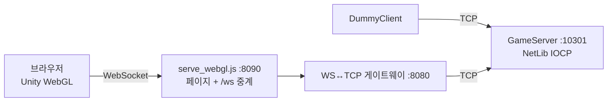

# escape_from_blockov

**브라우저에서 바로 하는 2.5D 탑다운 대규모 인원(현재 방 하나에 300명, 확장 가능) PvP 슈팅 게임.** 직접 만든 IOCP 컨텐츠 서버 라이브러리(NetLib) 위에 게임 서버를 올렸고, 클라이언트는 Unity WebGL로 만들었습니다.

로비가 없습니다. 이름만 입력하면 바로 방에 들어가서, 1500×1500m 맵을 돌아다니며 다른 플레이어와 싸웁니다. 적을 처치하면 점수를 얻고, 죽으면 점수를 잃고 처음부터 다시 시작합니다(slither.io 방식).


플레이 장면:


서버 콘솔 대시보드:


---

## 문서

- [GAME_SPEC.md](GAME_SPEC.md) — 게임 규칙, 패킷 프로토콜, 서버·클라이언트 설계, 검증 규칙, 실행·운영 등의 스펙 명세서.
- [AUTHORSHIP.md](AUTHORSHIP.md) — 개발 분담. 직접 구현한 부분과 AI를 사용한 부분을 명시한 문서.
- [CONTENT_SERVER_LIBRARY.md](server/ContentEchoServer/CONTENT_SERVER_LIBRARY.md) — 직접 개발한 컨텐츠 서버 라이브러리 구조와 사용법.
---

## 특징

| 영역 | 내용 |
|---|---|
| 서버 엔진 | Win32 IOCP 기반 자체 라이브러리. 게임 로직은 고정 틱으로 도는 **Content** 단위로 나누고, 한 Content는 한 번에 한 스레드에서만 실행되어 내부 상태를 락 없이 다룬다. lock-free 송신 큐, TLS 오브젝트 풀, 참조 카운트 기반 세션 수명 관리 |
| 동시 접속 | 방(Content)당 300명, 방 여러 개 자동 배정. 로컬 1대 측정에서 5,000명 동시 접속(이동만) 시 서버 CPU 23%, 평균 RTT 48ms |
| 시야(AOI) | 50m 섹터 격자에서 주변 3×3 섹터만 보이고, 패킷도 그 범위에만 브로드캐스트 |
| 피격 판정 | **오토타게팅**: 사수 클라이언트가 명중을 판정해 모아서 보고하면, 서버가 발사 시각 기준으로 대상의 **과거 위치를 되감아** 거리·각도·시간을 검증 |
| 이동 | 클라이언트 권위 + 서버 검증(속도, 맵 경계, 엄폐물). 위반하면 위치를 보정 |
| 네트워크 | 클라이언트는 WebSocket만 사용. 현재는 WS↔TCP 게이트웨이가 서버까지 중계하고, 확장이 필요하다면 NetLib에 WebSocket을 직접 넣는 것을 고려 |
| 게임 요소 | 권총·샷건·저격총(내구도), 붕대, 구르기, 달리기, 에어드랍, 사망 시 가방, 벽·낮은 엄폐물·파괴 가능한 엄폐물, 상위 3위 랭킹 |


### 조작

| 입력 | 동작 |
|---|---|
| WASD / Shift | 이동 / 달리기 |
| 마우스 / 좌클릭 | 조준 / 사격 |
| Space | 구르기 |
| 1 / 2 / 3 | 특수 무기 / 권총 / 붕대 |
| F (누르고 있기) | 가방·에어드랍 열기 |
| M | 전체 맵 |
| F3 | 레이턴시 표시 |

---

## 구성



```
escape_from_blockov/
├─ start_server.bat / stop_server.bat   서버 실행·종료
├─ GAME_SPEC.md                         게임 명세 (규칙·프로토콜·서버/클라 설계·운영)
├─ AUTHORSHIP.md                        직접 구현한 부분과 AI를 사용한 부분
├─ map/                                 엄폐물 맵(BMP, 1픽셀 = 1m)과 예시 맵 생성기
├─ client/escape_from_blockov/          Unity 6 클라이언트 (Builds/WebGL = 빌드 결과물)
└─ server/
   ├─ ContentEchoServer/                NetLib 서버 라이브러리 + 유틸리티 + 예제 Echo 서버
   │   └─ CONTENT_SERVER_LIBRARY.md     라이브러리 구조·스레딩·송신 규칙 가이드
   ├─ GameServer/                       게임 서버 (x64/Release/GameServer.exe 포함)
   ├─ gateway/                          WS↔TCP 게이트웨이 (Node.js, 의존성 없음)
   └─ DummyClient/                      부하·플레이 테스트용 더미 클라이언트
```

---

## 개발 환경

| 대상 | 도구 |
|---|---|
| 게임 서버 · 라이브러리 · 더미 클라이언트 | Visual Studio 2022 (C++20, v143), Windows x64 |
| 클라이언트 | Unity 6000.6.3f1, WebGL 빌드 |
| 게이트웨이 · 웹서버 · 테스트 봇 | Node.js 18+ |

- 서버 설정: `server/GameServer/game_config.txt`, 무기표: `server/GameServer/weapons.txt`
- 테스트: `server/GameServer/test/` (Node.js 시나리오 봇), 부하 테스트: `server/DummyClient/README.md`

---


## 바로 실행하기 (서버)

저장소에 서버 실행 파일과 WebGL 빌드가 들어 있어서, 빌드 없이 실행할 수 있습니다.

### 필요한 것 (Windows)

- [Node.js](https://nodejs.org) 18 이상 — 게이트웨이와 웹서버
- [Visual C++ 재배포 패키지 x64](https://aka.ms/vs/17/release/vc_redist.x64.exe) — 서버 실행 파일
- Git LFS — 효과음·텍스처 일부가 LFS로 저장되어 있음 (Git for Windows에 기본 포함)

### 실행

```bat
git clone https://github.com/ChokeOutCho/escape_from_blockov.git
cd escape_from_blockov
start_server.bat web
```

게임 서버, 게이트웨이, 웹서버가 각각 새 창으로 뜨고 브라우저에서 `http://localhost:8090/`이 열립니다. 이름을 입력하면 바로 입장합니다.

| 명령 | 동작 |
|---|---|
| `start_server.bat` | 서버 3종 실행 |
| `start_server.bat web` | 실행 후 브라우저 열기 |
| `start_server.bat build` | 서버를 Release x64로 다시 빌드한 뒤 실행 (Visual Studio 2022 필요) |
| `stop_server.bat` | 모두 종료 |

같은 공유기의 다른 기기에서는 `Blockov WebGL` 창에 표시되는 LAN 주소로 접속하면 됩니다. 인터넷으로 열려면 8090 포트만 포워딩하면 됩니다([GAME_SPEC.md](GAME_SPEC.md) 17.4).