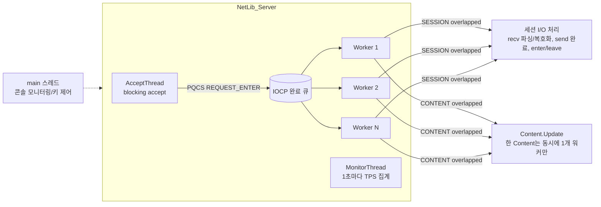
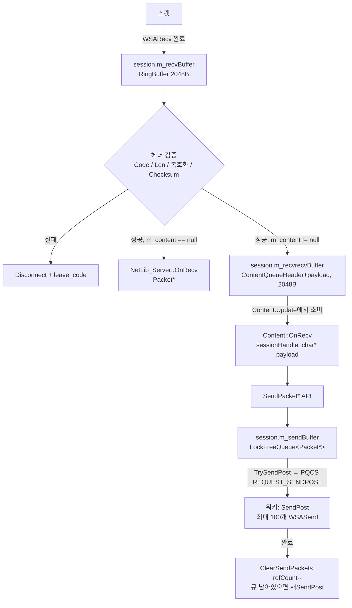
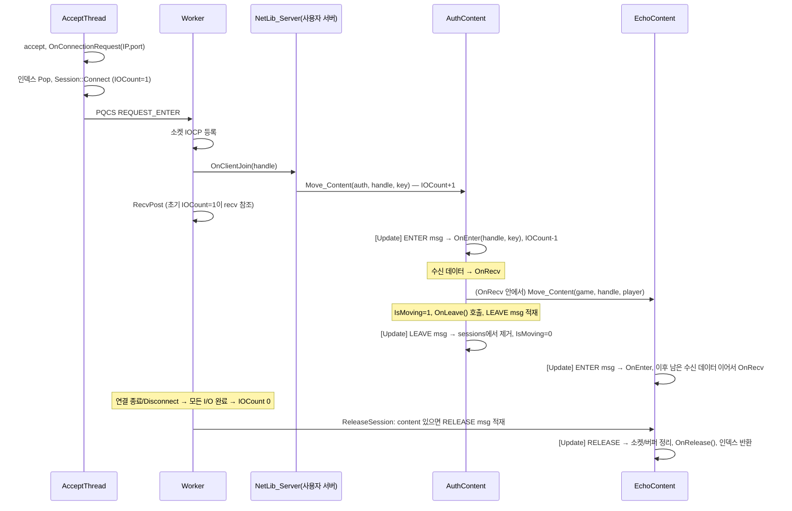

# ContentServer 라이브러리 (NetLib) 가이드

> 위치: `server/ContentEchoServer/` (라이브러리 본체는 `NetLib/`, `Utils/`)
> 플랫폼: Windows / Win32 IOCP / MSVC (C++20 — `[[likely]]`, `inline static` 사용)
> 소스 인코딩: CP949(EUC-KR) + CRLF. 편집 시 인코딩을 유지할 것 (`NetLib_Server.cpp`만 UTF-8 BOM).
> 최종 분석: 2026-09-30 기준 소스 (패킷 512B·암호화 옵션·Ping/하트비트 변경 반영)

**이 문서의 목적**: escape_from_blockov 게임 서버는 이 라이브러리 위에 구현한다. 서버 작업(새 컨텐츠 추가, 패킷 추가, 세션 처리 변경 등)을 하기 전에 반드시 이 문서의 *스레딩 규칙*, *송신 API 소유권 규칙*, *제약 사항*을 먼저 확인한다. 라이브러리 코드를 수정했다면 이 문서도 함께 갱신한다.

---

## 1. 한눈에 보기

- **IOCP 기반 TCP 서버 라이브러리**. 세션 I/O는 워커 스레드 풀이 처리하고, 게임 로직은 **Content(컨텐츠)** 라는 단위로 분리해 **고정 틱(ms) 단위 Update 루프**로 실행한다.
- 세션은 한 시점에 **최대 하나의 Content**에 소속된다. `Move_Content()`로 Content 간 이동(예: Auth → Echo/Game)한다.
- **Content 하나는 항상 한 번에 한 워커 스레드에서만 실행**된다 → Content 내부 상태(멤버 map 등)는 락 없이 사용 가능.
- 수신 패킷은 워커가 헤더 검증·복호화 후 세션별 **컨텐츠 수신 링버퍼**에 쌓고, Content의 Update에서 꺼내 `OnRecv()`로 전달한다.
- 송신은 세션별 **Lock-free 송신 큐** + `WSASend` scatter-gather(최대 100 패킷 묶음).
- 세션 수명은 **IOCount(참조 카운트) + Release 플래그**로 관리. 세션 식별은 64비트 `sessionHandle`(상위 16bit 인덱스 + 하위 48bit 고유 ID) — 재사용된 슬롯의 오접근을 막는다.
- 경량 암호화(XOR 체인 + 체크섬) 옵션. **현재 게임 서버는 사용하지 않는다** (생성자에 `nullptr` 전달).

---

## 2. 디렉터리 / 구성 요소

### 2.1 라이브러리 (`NetLib/`)

| 파일 | 역할 |
|---|---|
| `NetLib_Server.h/.cpp` | 서버 본체. IOCP 생성, Accept/Worker/Monitor 스레드, 세션 배열·인덱스 풀, 송신 API, 세션 해제, Content 등록·이동 |
| `NetLib_Content.h/.cpp` | Content 베이스 클래스. 메시지 큐(ENTER/LEAVE/RELEASE) 처리, 세션별 수신 버퍼 소비 → `OnRecv`, `OnUpdate` 호출 |
| `Session.h` | 세션 객체. 소켓, recv 링버퍼(2048B), 컨텐츠 수신 링버퍼(2048B), 송신 lock-free 큐, overlapped들, IOCount, `SendPost/RecvPost` |
| `Packet.h/.cpp` | `SerializeBuffer`(직렬화 `<<`/`>>`) + `Packet`(TLS 오브젝트 풀, refCount, 네트워크 헤더 예약) |
| `NetLibraryProtocol.h` | `NetHeader`(5B), `Opt_Encryption`, `ContentMSG`, `ContentQueueHeader` |
| `NetLibDefine.h` | `CUSTOM_OVERLAPPED`(SESSION/CONTENT 타입 구분), `TPS_SET`, 버퍼 크기 상수 `SESSION_RECV_BUFFER_SIZE`/`SESSION_CONTENT_BUFFER_SIZE` |
| `NetLib_Helper.h` | IP→문자열, xorshift32 `FastRand()` |
| `NetLib_Client.h/.cpp` | 단일 연결 IOCP 클라이언트 (서버간 통신용, 예: 모니터 서버 접속) |

### 2.2 유틸 (`Utils/`)

| 파일 | 역할 |
|---|---|
| `TLSObjectPool.h` | TLS 로컬 풀(스레드별 청크 2개: 사용 중 `m_top` / 반납용 `m_rtop`) + 공용 청크 저장소(`std::stack<ObjectSet>` + SRWLOCK, 청크 기본 512개). 로컬이 비면 공용에서 청크를 받거나 새로 만들고, 반납 청크가 차면 공용에 넘긴다. `Packet`, `Player`, `WaitingSession`, 큐 노드에서 사용. (이전 lock-free Treiber 스택은 Pop에서 다른 스레드가 재사용한 노드의 `next`를 읽는 ABA 문제로 교체됨) |
| `LockFreeQueue.h` / `LockFreeStack.h` / `LockFreePool.h` | 카운터 태깅(ABA 방지) lock-free 자료구조 |
| `ObjectPool.h` | 단일 스레드 오브젝트 풀 |
| `RingBuffer.h/.cpp` | 바이트 링버퍼 (용량 = size-1). SPSC 용도 |
| `SimpleEncoder.h` | 패킷 인코딩/디코딩 + 체크섬 |
| `Logger.h` | `LOG(type, level, fmt, ...)` → `{dir}\YYYYMM_{type}.txt` 파일 로그 (`syslogs/`) |
| `Profiler.h/.cpp` | `PROFILING(tag)` 스코프 프로파일러, `Profiler::FlushToFile()` |
| `Parser.h` | 간이 JSON 설정 파서 (`echo_config.txt`, 최대 10 키) |
| `SystemMonitor.h` | PDH 기반 CPU/메모리/네트워크 모니터 |
| `CrashDump.h` | 미니덤프 생성 (전역 인스턴스로 자동 설치) |

### 2.3 예제 애플리케이션 (Echo 서버)

| 파일 | 역할 |
|---|---|
| `main.cpp` | 설정 로드 → `ContentServer` 생성/Start → 모니터 서버 접속 → 1초마다 콘솔/모니터 서버로 지표 전송, 키 입력 제어 |
| `ContentServer.h/.cpp` | `NetLib_Server` 상속. Auth/Echo Content 생성·등록, `OnClientJoin`에서 Auth로 이동, 로드밸런싱 `Move_*_LoadBalance` |
| `AuthContent.h/.cpp` | 로그인 대기 세션 관리, 로그인 타임아웃(20s), 중복 로그인 처리(샤딩 map 10개 + mutex), 로그인 성공 시 Echo로 이동 |
| `EchoContent.h/.cpp` | 에코 응답, `CS_PING`→`SC_PONG` 레이턴시 응답, 하트비트 타임아웃(3분), Release 시 Player 삭제를 Auth에 위임 |
| `Player.h` / `WaitingSession.h` | TLS 풀 기반 플레이어/대기 세션 객체 |
| `MonitorClient.h` | `NetLib_Client` 상속, 모니터 서버 로그인/재접속 |
| `CommonProtocol.h` | 패킷 타입 enum (Game 1000~, Echo 5000~, Monitor 20000~) |
| `GameProtocol.h` | 게임 프로토콜(3000~3199): 현재 `CS_PING`, `CS_HEARTBEAT`, `SC_PONG`, `GetServerTimeMs()` |
| `Define.h` | 타임아웃·서버 번호 상수 |
| `echo_config.txt` | 실행 설정 (아래 7장) |

### 2.4 게임 서버 (`server/GameServer/`)

이 라이브러리를 사용하는 실제 게임 서버. 별도 VS 솔루션(`GameServer.sln`)이 `../ContentEchoServer/NetLib`, `Utils` 소스를 직접 컴파일한다. 구성·실행은 `server/GameServer/README.md`, 설계는 프로젝트 문서 `claude/game-spec.md` 9~10장.
- 패킷 타입 상수는 `PT_` 접두사를 쓴다 (`SC_MOVE` 등이 windows.h의 `WM_SYSCOMMAND` 매크로와 충돌).
- `NOMINMAX` 정의 필수 (`std::min/max` 사용).
- `test/`: 리눅스 스텁 NetLib(`GAME_STUB_NETLIB`)로 게임 로직을 g++ 빌드해 Node 봇으로 검증하는 하네스.

---

## 3. 아키텍처

### 3.1 스레드 구조



- 워커 수: `workerTH_Pool_size` (최대 16, `m_threadPool[16]`), IOCP 동시 실행 수: `concurrentTH_size`.
- **Content도 IOCP 위에서 돈다**: `RegistContent()` → `REQUEST_CONTENT_BEGIN` 포스트 → 워커가 `OnBegin()` 후 `REQUEST_CONTENT_UPDATE`를 포스트. UPDATE 처리 시 경과 시간만큼 고정 delta(`tick/1000`)로 `Update()`를 반복(catch-up) 호출하고 **즉시 다시 UPDATE를 포스트**한다. Content당 update overlapped는 1개뿐이므로 동일 Content가 두 워커에서 동시에 실행되지 않는다.
- `SchedulerThread`는 구버전 스케줄러로 현재 미사용.

### 3.2 데이터 흐름 (수신 → 컨텐츠 → 송신)



### 3.3 세션 수명 주기 & Content 이동



- **Content 소속이 없는 세션**의 해제는 워커에서 정리 후 `OnClientLeave()`가 호출된다. **Content 소속 세션**은 `OnClientLeave`가 호출되지 않고, 소속 Content의 `OnRelease()`가 호출된다 (예제에서 `ContentServer::OnClientLeave`가 "여기오면안됨"인 이유).
- `IsMoving` 플래그 동안 새 Content는 해당 세션의 수신 버퍼를 읽지 않는다 → **이동 중에도 패킷 순서가 보존**되고, 이전 Content가 LEAVE를 처리한 뒤 새 Content가 이어서 읽는다.
- Content 안의 세션은 그 Content가 RELEASE 메시지를 처리하기 전까지 해제되지 않는다 → Content 콜백 안에서는 자기 소속 세션에 대해 `SendPacketFastWithoutIOCount` 사용이 안전하다.

### 3.4 세션 핸들 / IOCount

- `sessionHandle = (index << 48) | (id & 0xFFFFFFFFFFFF)`. `FindSession()`은 IOCount를 올린 뒤 핸들이 일치하는지 확인 → 불일치(재사용된 슬롯)면 nullptr.
- `IOCount`(16bit): 상위 8bit = Release 플래그(0xEE), 하위 8bit = 참조 수. `Increment_IOCount`가 true를 반환하면 해제 중인 세션이므로 **이후 아무 것도 건드리지 않는다**.
- `FindSession()`으로 얻은 세션은 반드시 `ReturnSession()`으로 반환.
- `Disconnect(handle)`: `requestDisconnect=1` + `CancelIoEx` → 진행 중인 I/O가 취소되며 IOCount가 0이 될 때 해제된다(즉시 해제 아님).

---

## 4. 와이어 프로토콜

```
| Code(1) | Len(2) | RandKey(1) | CheckSum(1) | Payload(Len) |
  NetHeader (pack 1, 5 bytes)                  Payload = WORD Type + 본문
```

- `Code`: 암호화 옵션이 있으면 `encryption_header_code`, **`nullptr`이면 기본값 119(0x77)**. 암호화 여부와 관계없이 항상 검사하며 불일치 시 즉시 끊음.
- `Len`: 페이로드 길이. **`PAYLOAD_LEN_DEFAULT`(512) 초과 시 끊음.**
- 암호화 미사용(`nullptr`) 시: `RandKey`/`CheckSum` = 0, 페이로드 평문. 수신측은 체크섬을 검사하지 않는다. **현재 게임 서버 설정.**
- 암호화 사용 시: 송신측이 `CheckSum = Σpayload & 0xFF` 계산 후 `[CheckSum..Payload]`(Len+1 바이트)를 `SimpleEncoder`로 인코딩. `RandKey`는 평문. 키는 `fixed_key`(설정) + `RandKey`.
  - 인코딩: `P_i = D_i ^ (P_{i-1} + RK + i + 1)` (i=0이면 `RK+1`), `E_i = P_i ^ (E_{i-1} + K + i + 1)` (i=0이면 `K+1`).
- 페이로드 첫 2바이트는 패킷 타입(`WORD`, `CommonProtocol.h`). 엔디안은 리틀 엔디안(x86 raw memcpy).
- 수신 안전장치: 완성된 패킷 없이 recv 완료가 연속 10회(`max_recvPostCnt`)면 끊음.

### 예제 게임 프로토콜 (CommonProtocol.h)

| 타입 | 값 | 본문 |
|---|---|---|
| `en_PACKET_CS_GAME_REQ_LOGIN` | 1001 | INT64 AccountNo, char SessionKey[64], int Version |
| `en_PACKET_CS_GAME_RES_LOGIN` | 1002 | BYTE Status, INT64 AccountNo |
| `en_PACKET_CS_GAME_REQ_ECHO` | 5000 | INT64 AccountNo, LONGLONG SendTick |
| `en_PACKET_CS_GAME_RES_ECHO` | 5001 | (REQ 그대로) |
| `en_PACKET_CS_GAME_REQ_HEARTBEAT` | 5002 | 없음 (구버전, 호환용) |
| `CS_PING` (GameProtocol.h) | 3004 | UINT32 ClientTimeMs |
| `CS_HEARTBEAT` (GameProtocol.h) | 3005 | 없음. 클라가 60초마다 전송 |
| `SC_PONG` (GameProtocol.h) | 3113 | UINT32 ClientTimeMs(그대로), UINT32 ServerTimeMs |

하트비트: EchoContent는 패킷 수신 시각(`lastRecv`)을 갱신하고, 3분(`HEARTBEAT_TIME_OUT = 180000`) 동안 아무 패킷도 없으면 끊는다. 클라는 60초마다 `CS_HEARTBEAT`를 브라우저 타이머/스레드 타이머로 보내 탭이 백그라운드여도 유지된다.

---

## 5. 핵심 인터페이스

### 5.1 `NetLib_Server` (상속해서 사용)

```cpp
NetLib_Server(const WCHAR* openIP, unsigned short openPort,
              int workerThreads, int concurrentThreads,
              int maxOfSession, bool zeroCopy,
              Opt_Encryption* enc /* nullptr이면 인코딩·체크섬 off, 헤더 Code는 0x77 */,
              int maxOfSendPackets /* 세션 송신큐 한도, 초과 시 SEND_FULL로 끊음 */);

void Start();        // Accept + Monitor 스레드 시작 (워커는 생성자에서 이미 시작)
void AcceptPause();  // listen 소켓 닫기
void Stop();

// 오버라이드 포인트 (워커/Accept 스레드에서 호출됨 → 스레드 안전하게 작성)
virtual bool OnConnectionRequest(unsigned long IP, unsigned short port); // 기본 false! 반드시 오버라이드해서 true 반환
virtual void OnClientJoin(unsigned long long h, unsigned long IP, unsigned short port);
virtual void OnClientLeave(unsigned long long h, SESSION_LEAVE_CODE code, unsigned long IP, unsigned short port); // content 미소속 세션만
virtual void OnRecv(unsigned long long h, Packet* packet);               // content 미소속 세션만

// Content
void RegistContent(NetLib_Content* content);   // 등록 즉시 워커에서 OnBegin → Update 루프 시작
bool Move_Content(NetLib_Content* content, unsigned long long h, void* completionKey = nullptr);

// 제어/조회
bool Disconnect(unsigned long long h);
void DisconnectAll();
int  GetSessionCount(); int GetPacketUseSize();
int  GetTPS_Accept(); int GetTPS_Recv(); int GetTPS_Send(); int GetTotal_Accept();
long long GetBPS_Recv(); long long GetBPS_Send();   // 초당 송수신 바이트 (MonitorThread가 1초마다 갱신)
```

### 5.2 송신 API — 패킷 소유권 규칙 (중요)

| API | 넘기는 패킷 | 호출 후 소유권 | IOCount | 사용 위치 |
|---|---|---|---|---|
| `SendPacket(h, pkt)` | `Packet::Alloc()` (헤더 없음) | **호출자가 `Packet::Free(pkt)`** (내부에서 NetAlloc에 복사) | 획득/반환 | 어디서나 |
| `SendPacketMulticast(hs, n, pkt)` | `Packet::Alloc()` | **호출자가 Free** (1회 복사 후 refCount n으로 공유) | 세션별 획득 | 어디서나, 브로드캐스트 |
| `SendPacketFast(h, pkt)` | `Packet::NetAlloc()` (헤더 예약) | **라이브러리가 해제** — 호출 후 pkt 사용·Free 금지 | 획득/반환 | 어디서나, 복사 없음 |
| `SendPacketFastWithoutIOCount(h, pkt)` | `Packet::NetAlloc()` | 라이브러리가 해제 | **없음** | **해당 세션이 소속된 Content의 콜백 안에서만** |

- 멀티캐스트는 한 번만 인코딩되므로 모든 대상이 같은 `RandKey`를 받는다(정상 동작).
- 송신 큐 사이즈가 `maxOfSendPackets`(설정 `sendbuf`)를 넘으면 해당 세션을 `SEND_FULL`로 끊는다.

### 5.3 `NetLib_Content` (상속해서 게임 로직 작성)

```cpp
class MyContent : public NetLib_Content {
public:
    MyContent(int msTick) : NetLib_Content(msTick) {}
    void OnBegin() override;                                     // 등록 직후 1회
    void OnUpdate(float dt) override;                             // 매 틱 (dt = tick/1000 고정)
    void OnRecv(unsigned long long h, char* payload, int payloadLen) override; // 수신 1패킷 (payload: WORD type부터, 길이 포함) ← 권장
    // (구버전) void OnRecv(unsigned long long h, char* payload) — 3인자 기본 구현이 이것을 호출 (Echo/Auth 호환)
    void OnEnter(unsigned long long h, void* completionKey) override; // 이 Content로 들어옴
    void OnLeave(unsigned long long h) override;                  // 다른 Content로 나감
    void OnRelease(unsigned long long h, SESSION_LEAVE_CODE code,
                   unsigned long IP, unsigned short port) override; // 연결 종료로 해제
};
// 멤버: m_server(NetLib_Server*), GetSessionCount(), GetID(), GetTick()
```

Update 한 번의 처리 순서: ① 메시지 큐(ENTER/LEAVE/RELEASE) 처리 → ② 소속 세션 전체를 돌며 수신 버퍼의 패킷을 `OnRecv`로 모두 전달 → ③ `OnUpdate(dt)`.

**스레딩 규칙**
1. `OnBegin/OnUpdate/OnRecv/OnEnter/OnRelease`는 해당 Content 단독 실행 → Content 멤버는 락 불필요.
2. 서로 다른 Content는 **병렬 실행**된다. Content 간 공유 데이터(static, 서버 멤버)는 락 또는 lock-free 큐로 보호 (예: `AuthContent::sloginPlayers` 샤딩 mutex, `AuthContent::sRequestQueue`).
3. `OnLeave`는 `Move_Content`를 **호출한 스레드**에서 실행된다. 따라서 `Move_Content`는 (a) 세션이 현재 소속된 Content의 콜백 안에서, 또는 (b) 아직 소속이 없는 세션에 대해 `OnClientJoin`에서 호출한다.
4. `OnRecv`의 `payload`는 스택 버퍼로 **콜백 동안만 유효**하다. 3인자 버전의 `payloadLen`(Type 포함)으로 타입별 길이를 반드시 검증할 것.
5. `completionKey`는 `Move_Content` 시 넘긴 사용자 데이터(예: `WaitingSession*`, `Player*`)로 Content 간 객체를 넘기는 통로다. 소유권 관리는 Content가 책임진다.

### 5.4 `Packet` / `SerializeBuffer`

```cpp
Packet* p = Packet::Alloc();     // 일반 버퍼 (SendPacket/Multicast/Client용)
Packet* n = Packet::NetAlloc();  // 앞 5바이트 NetHeader 예약 (SendPacketFast용)
*p << (WORD)TYPE << (INT64)acc << (BYTE)1 << 1.0f;   // 쓰기
*p >> type >> acc;                                   // 읽기
p->PutData(src, len); p->GetData(dst, len);
Packet::Free(p);
```
- 버퍼 크기 `PACKET_BUFFER_SIZE` = 512 + 5 = 517바이트 (`NetAlloc`은 앞 5바이트를 헤더로 쓰므로 페이로드 최대 512). 넘치는 쓰기는 **조용히 무시**된다(에러 없음).

### 5.5 `NetLib_Client`

```cpp
class MyClient : public NetLib_Client {
    void OnEnterJoinServer() override; // Connect 성공 직후 (로그인 패킷 등)
    void OnLeaveServer() override;     // 연결 끊김 (재접속 루프 등)
    void OnRecv(Packet* p) override;
};
MyClient c(L"127.0.0.1", port, 2, 2, zeroCopy, useMonitor, &enc);
c.Connect(); c.SendPacket(pkt /* Alloc(), 호출자가 Free */); c.IsConnect();
```

---

## 6. 사용법: 새 게임 서버 / 컨텐츠 만들기

1. **서버 클래스**: `NetLib_Server` 상속. `OnConnectionRequest`에서 `true` 반환(블랙리스트 등 필터), `OnClientJoin`에서 첫 Content(보통 Auth)로 `Move_Content`.
2. **Content 클래스**: `NetLib_Content` 상속, 틱(ms) 지정. 생성자에서 `new` 후 `RegistContent()`.
3. **패킷 처리**: `OnRecv`에서 `WORD type` 스위치. 모르는 타입은 `m_server->Disconnect(h)`.
4. **Content 전환**: 인증 완료 등 조건 만족 시 `OnRecv` 안에서 `((MyServer*)m_server)->Move_Content(next, h, userObj)`.
5. **정리**: 연결 종료는 `OnRelease`에서 사용자 객체 해제. 다른 Content 소유 자원이면 lock-free 큐로 넘겨 소유 Content에서 해제(예: Echo → `AuthContent::sRequestQueue`).

```cpp
// 최소 예시
class GameServer : public NetLib_Server {
public:
    BattleContent* battle;
    GameServer(...) : NetLib_Server(...) { battle = new BattleContent(33); RegistContent(battle); }
    bool OnConnectionRequest(unsigned long, unsigned short) override { return true; }
    void OnClientJoin(unsigned long long h, unsigned long, unsigned short) override { Move_Content(battle, h, nullptr); }
};

void BattleContent::OnRecv(unsigned long long h, char* payload) {
    WORD type = *(WORD*)payload; payload += sizeof(WORD);
    switch (type) {
    case PKT_MOVE: {
        float x = *(float*)payload; /* ... */
        Packet* p = Packet::NetAlloc();
        *p << (WORD)PKT_MOVE_RES << x;
        m_server->SendPacketFastWithoutIOCount(h, p);   // 소유권 이전
        break; }
    default: m_server->Disconnect(h);
    }
}
```

**부하 분산**: 같은 종류 Content를 여러 개 두고 `GetSessionCount()`가 가장 적은 곳으로 이동(`ContentServer::Move_*_LoadBalance`). 방(룸) 단위 게임이면 방 = Content 인스턴스로 두는 구조가 자연스럽다.

---

## 7. 설정 (`echo_config.txt`, 실행 파일 작업 디렉터리)

| 키 | 예제 값 | 의미 |
|---|---|---|
| `port` | 10301 | 리슨 포트 (0.0.0.0) |
| `workerTH_Pool_size` | 4 | 워커 스레드 수 (≤16) |
| `concurrentTH_size` | 4 | IOCP 동시 실행 스레드 수 |
| `maxofsession` | 10000 | 최대 세션 (≤32767) |
| `encryption` | false | false면 생성자에 `nullptr` 전달 → 인코딩 미사용 |
| `encryption_header_code` | 119 | NetHeader.Code (encryption=true일 때만 적용. false면 기본 119) |
| `encryption_fixed_key` | 50 | 고정 키 |
| `zerocopy` | true | SO_SNDBUF=0 (커널 송신 버퍼 우회) |
| `sendbuf` | 1000 | 세션당 송신 큐 최대 패킷 수 |

예제 고정값: Content 틱 34ms, 로그인 타임아웃 20s, 하트비트 타임아웃 3분, 모니터 서버 `127.0.0.1:21107`(암호 코드 109/키 30), SERVER_NO 30.
콘솔 제어: `U` 잠금 해제 후 `Q` 종료, `F` 모니터 출력 토글, `P/R` 프로파일 저장/리셋, `W` 전체 끊기, `C` 크래시 덤프, `B` 블랙리스트 초기화.

---

## 8. 제약 사항 & 주의 (게임 서버 작업 시 필독)

1. **패킷 최대 크기 = 페이로드 512B** (헤더 5B 별도, 한 패킷 ≤ 517B). 넘는 목록은 반드시 분할. 한도를 다시 바꿀 때는 `Packet.h`의 `PAYLOAD_LEN_DEFAULT`, `SimpleEncoder.h`의 `MAX_PACKET_SIZE`(= 페이로드 + 1), `NetLibDefine.h`의 버퍼 크기를 **함께** 조정한다. (수신 스택 버퍼 `iobuf`/`serializeBuf`는 `PAYLOAD_LEN_DEFAULT`에서 자동 계산)
   - 소켓 recv 링버퍼 `SESSION_RECV_BUFFER_SIZE` = 2048 (최대 패킷 약 3.9개).
   - 컨텐츠 수신 링버퍼 `SESSION_CONTENT_BUFFER_SIZE` = 2048. **한 Content 틱 동안 한 세션에서 쌓인 패킷(각 2B 헤더 + 페이로드)이 2047B를 넘으면 그 세션은 끊긴다.** 512B 패킷이면 틱당 3개. 큰 패킷을 자주 보내는 C→S 프로토콜(예: 피격 보고)이 생기면 이 값을 늘릴 것.
2. **Content Update는 바쁜 루프**: UPDATE를 처리하자마자 재포스트하므로 Content 수만큼 워커가 계속 IOCP를 돈다(틱 사이에도 CPU 소모). Content 수가 워커 수에 근접하면 세션 I/O 지연 가능.
3. `OnConnectionRequest` 기본 구현은 `false` → 오버라이드 안 하면 모든 접속 거부.
4. `SendPacketFastWithoutIOCount`는 소속 Content 밖에서 쓰면 해제된 세션 접근 위험.
5. 직렬화 오버플로는 무음 실패 → 크기 계산 필수.

### 알려진 이슈 (소스 기준, 수정 전까지 유의)

| 위치 | 내용 |
|---|---|
| `Packet::NetFree` | refCount 0일 때 `pool.Free` 후 함수 끝에서 **무조건 한 번 더 Free** → 이중 해제. 현재 호출처 없음, 사용 금지 |
| `NetLib_Server::Stop` | 워커 종료용 `PQCS(0,0,0)`을 보내지만 워커가 `overlapped->type`을 null 역참조(종료 분기 주석 처리됨) → 종료 시 크래시 가능 |
| `NetLib_Server::AcceptThread` | 포트 bind/listen 실패 시 `bind err`/`listen err`만 출력하고 프로세스는 계속 실행(접속을 받지 못하는 서버가 떠 있게 됨). 재시작 직후 포트가 아직 해제되지 않았을 때 발생 → 반환값으로 실패를 알리고 종료하도록 개선 권장 |
| `DisconnectAll` | 인덱스 0..(현재 세션 수-1)만 순회 → 뒤쪽 슬롯의 세션 누락 |
| `UnRegistContent` / `OnEnd` | 선언만 있고 구현/호출 없음. Content 제거 불가 |
| `SendPacket/SendPacketFast` | RandKey에 `rand()` 사용 (WithoutIOCount 버전만 `FastRand()`) |
| `ContentServer::Login_Timeout/InsertWaiting` | 구버전 코드, 미사용 (`waiting` 무잠금 erase 포함) |
| `main.cpp` | `processorUser`에 `ProcessorKernel()` 대입 (표시 오류) |
| `TLSObjectPool::Alloc` | 로컬 풀이 비면 **매번 배타 락**을 잡는다. 공용 저장소도 비어 있는 워밍업 구간에는 할당마다 락 + `new` → 경합. 또 자기 반납 목록(`m_rtop`)에 노드가 있어도 쓰지 않고 새로 만든다(스레드당 최대 chunkSize-1개가 놀게 됨). 권장: 락 전에 `m_rtop`을 `m_top`으로 옮겨 쓰기 |
| `TLSObjectPool::GetUseSize` | 사용 중 수가 아니라 **새로 만든 노드 수**이며, 스레드별로 chunkSize개 단위로 모아 더하므로 최대 (chunkSize-1)×스레드 수만큼 적게 보인다 |
| `TLSObjectPool::~TLSObjectPool` | TLS 슬롯(`LocalSlot*`)을 `ObjectPool_TLSPoolComponent<T>*`로 캐스팅해 delete(타입 불일치 UB, 첫 멤버라 주소는 같음). 소멸자를 호출한 스레드의 슬롯만 정리되고 노드는 해제되지 않는다(전역 풀이라 프로세스 종료 시에만 문제). `m_totalSize` 미사용 |

---

## 9. 변경 이력
- 2026-09-30: 최초 작성 (ContentEchoServer 소스 분석).
- 2026-09-30: `NetLib_Content::OnRecv(h, payload, payloadLen)` 3인자 가상함수 추가 (Update가 이것을 호출, 기본 구현은 기존 2인자 호출). GameServer 추가.
- 2026-09-30: 패킷 페이로드 127→512B, 소켓 recv 링버퍼 128→2048B(`NetLibDefine.h` 상수화), 수신 스택 버퍼가 헤더 크기만큼 넘치던 문제 수정, `SimpleEncoder` temp 513B. 암호화 옵션 `nullptr` 시 헤더 Code 기본값(0x77) 초기화 + RandKey/CheckSum 0 송신(이전엔 미초기화), `echo_config.txt`의 `encryption` 반영. `GameProtocol.h` 추가(CS_PING/SC_PONG/CS_HEARTBEAT), 하트비트 타임아웃 40s→3분. 수정된 이슈: `Player::CreatePlayer` sessionHandle 미설정, WRONG_HEADER_CODE 오기록.
- 2026-09-30: `NetLib_Server`에 송수신 바이트 카운터 추가(`GetBPS_Recv/GetBPS_Send`, send/recv 완료 시 `InterlockedAdd64`, MonitorThread에서 1초마다 교환). `TLSObjectPool.h`를 사용자가 SRWLOCK + `std::stack` 공용 저장소로 변경(멀티스레드 재사용 문제 해결) — 검토 결과는 2.2 참고.
